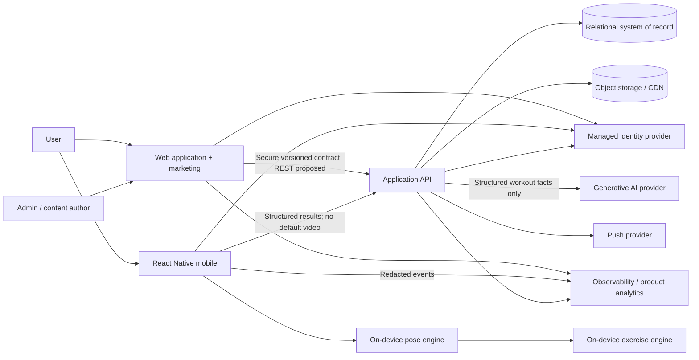
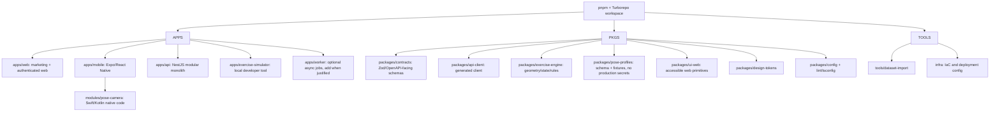
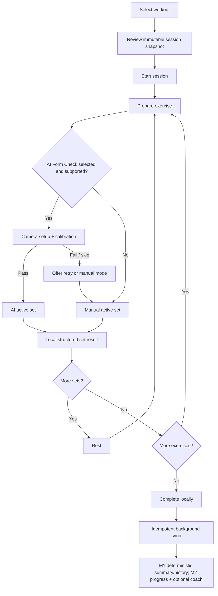
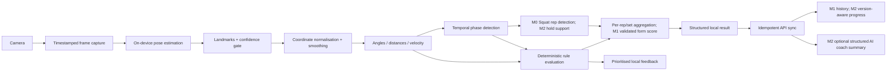
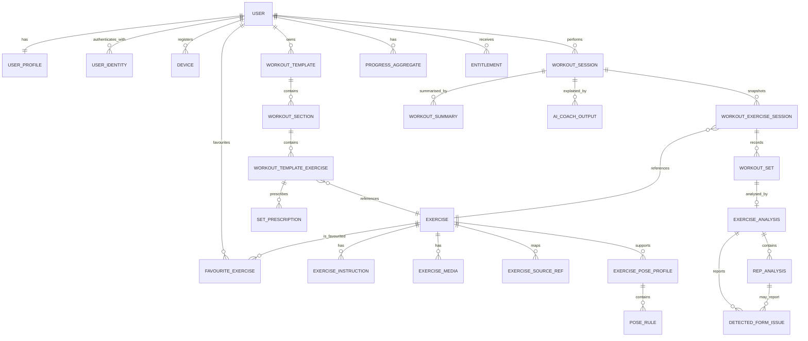
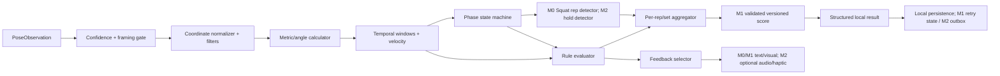
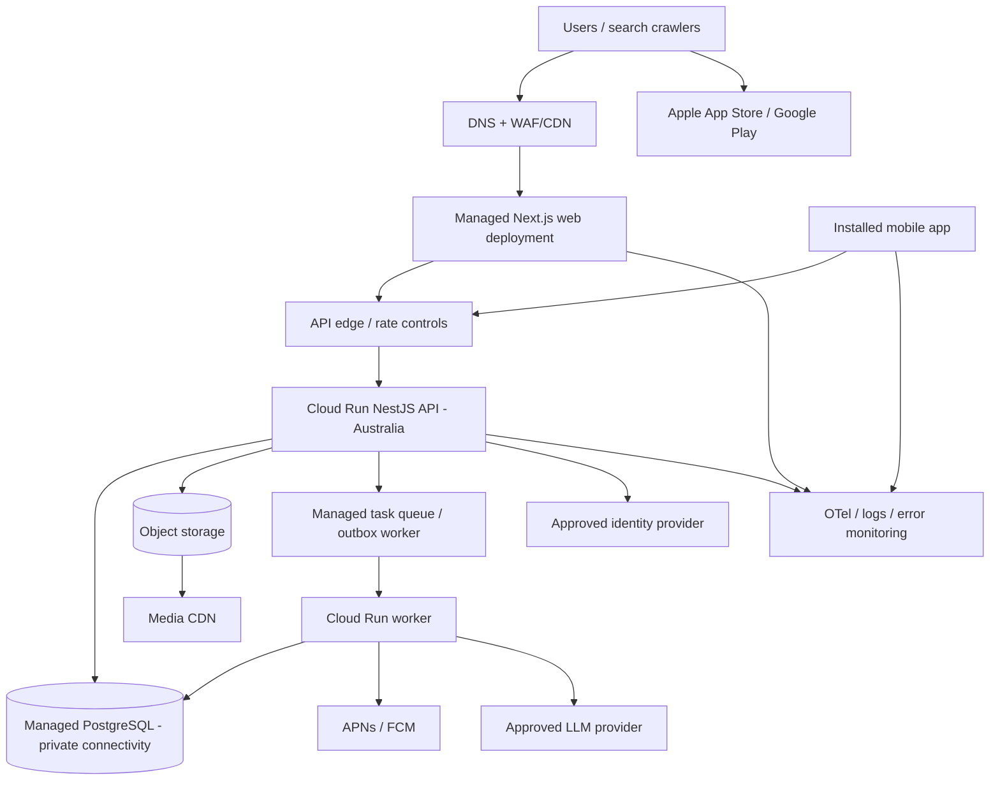
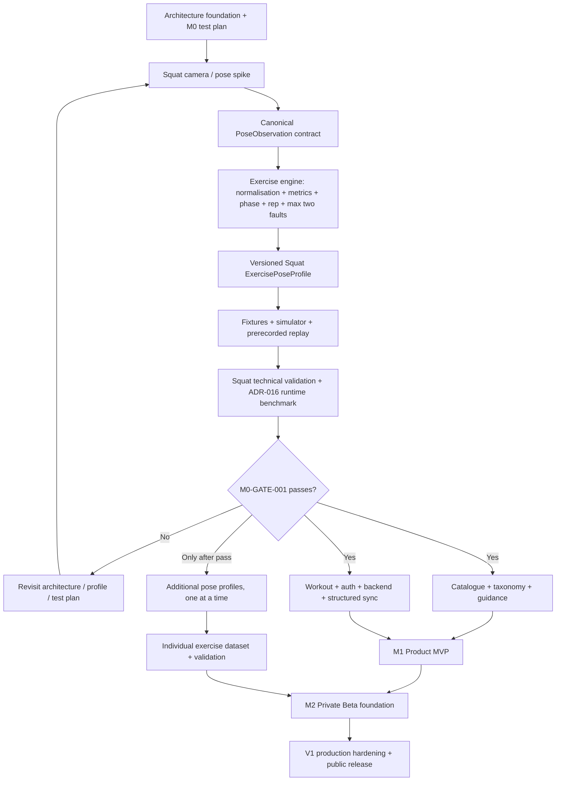

# Software Requirements Specification

## AI Fitness Coaching Platform

| Field | Value |
| --- | --- |
| Document ID | SRS-AIFIT-001 |
| Version | 0.2.0 |
| Status | Draft — Implementation Planning Review |
| Date | 2026-08-07 |
| Initial market | Australia |
| Classification | Internal engineering specification |

> Normative language: **SHALL** means mandatory for the requirement's assigned delivery milestone, **SHOULD** means recommended unless a documented exception is approved, and **MAY** means optional. Anything labelled **TBD / ADR REQUIRED** must be resolved through an Architecture Decision Record (ADR) before dependent implementation starts.

---

## 1. Document Control

### 1.1 Purpose

This Software Requirements Specification (SRS) is the primary product and engineering contract for an AI-powered fitness coaching platform. It defines the product boundaries, system architecture, client and service responsibilities, domain model, real-time computer-vision pipeline, data handling, interfaces, quality attributes, delivery sequence, and acceptance criteria.

It is intended to let independent teams design APIs and data stores, build the React/TypeScript web experience, React Native mobile application and marketing site, implement and validate pose-based exercise analysis, establish milestone-appropriate infrastructure, and plan delivery without inferring critical behaviour from marketing language. The web framework remains a proposal until ADR-001.

### 1.2 Audience

- Product management and founders.
- Solution, software, mobile, data and cloud architects.
- Web, mobile, backend, AI/CV, platform and QA engineers.
- Exercise-content authors and qualified fitness-domain reviewers.
- Security, privacy, accessibility and legal reviewers.
- Design and research teams.

### 1.3 Status and change control

This document is a review draft. Approval requires sign-off from product, engineering, qualified exercise-domain review, privacy/security, and legal/content licensing. Changes to an approved mandatory requirement SHALL include impact analysis, linked work items, and a version increment. Changes affecting stored analysis semantics SHALL also increment the relevant model, profile, ruleset or scoring version.

#### Change log

| Version | Date | Summary |
| --- | --- | --- |
| 0.1.0 | 2026-08-07 | Initial comprehensive engineering specification. |
| 0.2.0 | 2026-08-07 | Restructured delivery into M0/M1/M2/V1; added implementation interpretation rules, Exercise Guidance, AI Form Check lifecycle, pose-runtime transport spike, threshold protections, pose-validation dataset workflow, taxonomy normalisation, entity/requirement milestone tagging and Codex development constraints. |

### 1.4 Assumptions

- The first release targets adults performing general fitness exercise; age eligibility and any minor-user experience are **TBD / ADR REQUIRED** (`TBD-ELIGIBILITY-001`, ADR-014).
- The service is a general fitness product, not a medical device, diagnostic tool, physiotherapy service or emergency service.
- One person is analysed at a time with a monocular RGB phone camera.
- The mobile application is the primary AI Form Check surface. Web camera analysis is an optional FUTURE capability, not an M0/M1 dependency.
- Raw camera frames are processed locally and discarded by default.
- Bodyweight squat is the only M0 AI exercise. Push-up, forward/reverse lunge, plank and bicep curl are M2 candidates that must each pass an independent validation path; their availability does not gate M1.
- Product copy and threshold configuration will be reviewed by appropriately qualified fitness professionals before public release.
- Exact supported OS/device/browser matrices (`TBD-DEVICE-001`), vendors (applicable ADR), budgets/load (`TBD-LOAD-001`/`TBD-SLO-001`), age policy (`TBD-ELIGIBILITY-001`) and data-retention periods (`TBD-PRIVACY-001`) remain **TBD / ADR REQUIRED**.

### 1.5 Source-of-truth hierarchy

If sources conflict, precedence is: approved ADRs and regulatory obligations; this SRS; versioned API contracts and pose-profile schemas; approved design specifications; backlog stories. External datasets are imports, never domain truth.

### 1.6 Technical decision states

Every named technology or implementation approach in this SRS has one of these states:

| State | Meaning for implementation |
| --- | --- |
| `DECIDED` | The project has intentionally fixed the decision. It is mandatory within the milestones to which it applies until superseded by an approved ADR/SRS change. |
| `PROPOSED` | This is the current recommendation or a spike candidate, not a production implementation mandate. A scoped technical spike MAY evaluate it; production dependency requires an accepted ADR. |
| `TBD / ADR REQUIRED` | No implementation choice exists. An implementation agent SHALL stop the dependent work item and obtain an ADR; it SHALL NOT select or infer a value. |

Product `SHALL` requirements define outcomes and constraints. A technology name appearing in rationale, a diagram, example code, reference topology or future architecture does not make it mandatory unless the decision register marks it `DECIDED`.

## Implementation Interpretation Rules

These rules are normative for human and AI-assisted implementation:

1. `SHALL` functional and non-functional requirements are mandatory only for their assigned milestone.
2. Later-milestone requirements SHALL NOT be proactively implemented.
3. `PROPOSED` technology is not a final implementation mandate; it MAY be used only within an explicitly scoped evaluation until its ADR is accepted.
4. `TBD / ADR REQUIRED` values SHALL NOT be invented, guessed or silently converted into defaults.
5. Numerical examples marked `NON-NORMATIVE EXAMPLE` SHALL NOT become production defaults.
6. An implementation agent SHALL NOT scaffold future modules, tables, queues, providers or infrastructure merely because they appear in this SRS.
7. Architecture decisions SHALL be resolved through ADRs before dependent production implementation.
8. Current-milestone scope takes precedence over future completeness or speculative extensibility.
9. The next milestone SHALL begin only after the previous milestone exit gate passes; within M2, each additional exercise follows its own validation gate.
10. When requirement text and milestone mapping appear to conflict, the narrower current milestone and its explicit exclusions win, and the ambiguity SHALL be raised for correction before implementation.

---

## 2. Product Vision

Enable a user to understand what exercise to do next, perform it with clear guidance, and receive immediate, privacy-preserving form feedback using the camera already available on their phone. The differentiated capability is explainable movement analysis—pose landmarks, geometry, temporal phases and deterministic rules—not generic workout logging or opaque generative-AI judgement.

The product consists of:

1. A public, SEO-oriented marketing and exercise-content website.
2. An authenticated responsive web application for discovery, planning, history and progress.
3. An iOS and Android application for the complete experience, including on-device camera coaching.
4. A Node.js/TypeScript backend and PostgreSQL system of record.
5. A versioned on-device pose and exercise engine.
6. A post-workout generative coach that consumes structured results, with safety controls.

---

## 3. Goals

| ID | Goal | Success signal |
| --- | --- | --- |
| G-001 | Prove useful AI form analysis on bodyweight squat first, then expand independently | M0 engineering gate passes; each later exercise meets its own validation gate |
| G-002 | Preserve privacy by design | No continuous video upload or default raw-video/landmark storage |
| G-003 | Make workout execution incrementally resilient | M1 preserves/checkpoints work and retries idempotently; M2 adds robust outbox/conflict handling |
| G-004 | Build an extensible proprietary exercise-analysis domain | New exercises are added through versioned profiles, fixtures and validation rather than UI code changes |
| G-005 | Deliver a premium, accessible experience | Clear hierarchy, useful motion, distance-readable coaching, WCAG-aligned web and accessible mobile flows |
| G-006 | Make results reproducible | Every persisted analysis identifies all responsible model/configuration versions |
| G-007 | Maintain catalogue independence | External catalogue records can be replaced without changing workout or analysis identifiers |

---

## 4. Non-Goals

- Medical diagnosis, injury diagnosis, treatment, rehabilitation prescription or guaranteed injury prevention.
- Clinical-grade biomechanics, force, load distribution, muscle activation, joint torque or internal-tissue measurement from a monocular RGB camera.
- Autonomous real-time coaching by an LLM or LLM-vision service.
- Continuous raw-video streaming to the backend.
- Multi-person pose tracking or group-class analysis in M0/M1.
- AI Form Check support for the complete imported catalogue in any current milestone.
- Social feeds, competitions, wearable integrations, personalised medical constraints or advanced subscriptions in M0/M1/M2/V1 unless separately promoted.
- Pixel comparison between a user camera frame and an exercise GIF.
- Permanent storage of every pose landmark frame in PostgreSQL.

---

## 5. Personas

| Persona | Primary need | Constraints |
| --- | --- | --- |
| Guided beginner | Confidence that a movement broadly follows the demonstrated pattern | Unfamiliar terminology; needs setup guidance and restrained cues |
| Independent exerciser | Structured workouts, rep counting and progress with minimal friction | May train offline; phone is several metres away |
| Technique-focused user | Repeatable feedback on range, alignment and tempo | Expects transparent limits and trends rather than clinical claims |
| Content editor | Maintain exercises, instructions, media and programmes | Must not change live analysis semantics accidentally |
| Exercise-analysis author | Define phases, rules, scoring and fixtures | Needs simulation, versioning, review and staged rollout |
| Support/admin operator | Diagnose account/session issues without viewing sensitive camera content | Least privilege and auditable access |
| Product/data analyst | Understand funnel, reliability and aggregate feature use | No raw camera frames or sensitive landmark streams in analytics |

---

## 6. User Journeys

### 6.1 Registration and first workout

1. User installs mobile app or opens web app.
2. User creates an account, verifies required identity claims and accepts current terms/privacy notices.
3. User chooses units, experience level, broad goals and available equipment; health-sensitive fields are not required.
4. Dashboard presents a single recommended next action and a short product-safety explanation.
5. User selects a starter workout, reviews exercises and starts.
6. Non-AI exercises use manual rep/time controls. AI-supported exercises offer Form Check.
7. First camera use requests permission contextually; denial leaves manual execution available.
8. Session completes, is stored locally first, synchronises, and appears in history.

### 6.2 AI-assisted set

1. User selects an AI-supported exercise and supported camera view.
2. App shows orientation, distance, view and full-body framing guidance.
3. Calibration verifies required landmarks, confidence, framing, orientation and approximate scale.
4. A countdown starts; camera frames stay in the native on-device pipeline.
5. The UI displays camera/skeleton, large rep/hold state and at most one prioritised cue.
6. Pose loss pauses analysis rather than inventing reps; the app instructs the user to reposition.
7. Phase transitions create completed/incomplete reps and versioned issue observations.
8. User may pause, mute, hide the overlay, correct a rep count or terminate safely.
9. At set end, ephemeral frames are discarded and an aggregate/per-rep result is persisted locally.
10. In M1, the backend receives a structured idempotent result and the product presents a deterministic summary; optional generative AI coaching is M2 only.

### 6.3 Offline completion and sync (M2 target journey)

M1 implements only durable workout/set checkpoints, retryable structured upload and idempotent completion. The ordered mutation outbox and conflict behaviour below are M2 target behaviour and SHALL NOT be built during M0/M1 solely to complete this journey.

1. User starts with a cached workout/profile/model compatibility set.
2. Network disappears; active workout and on-device analysis continue.
3. Each state-changing event is committed to the local database and outbox in one local transaction.
4. Completion creates an immutable client session identifier and idempotency key.
5. On reconnection, ordered mutations are retried with exponential backoff and jitter.
6. Server creates or returns the existing session, responds with canonical revision and timestamps, and the client marks outbox records acknowledged.
7. Conflicts are shown only when automatic field-level rules cannot safely resolve them.

### 6.4 Build a workout on web and execute on mobile

1. User searches/filter exercises on web, distinguishing `AI Form Check` from `Guide Only`.
2. User creates ordered sections, exercises and sets, then saves a template.
3. API validates ownership and exercise references, increments the template revision and returns it.
4. Mobile refreshes/caches the template and creates a session snapshot so later template edits cannot alter an active workout.
5. User completes on mobile; result appears on both clients after sync.

### 6.5 Pain or injury statement

1. User reports pain in a coach conversation or selects a pain/stop action.
2. The system does not diagnose or suggest exercising through pain.
3. It advises stopping the movement and seeking qualified professional advice where appropriate.
4. No workout adaptation based on a suspected diagnosis occurs.

---

## 7. Product Scope

### 7.1 Capability map

| Capability | M0 | M1 | M2 / later |
| --- | --- | --- | --- |
| Identity/profile | Not implemented | Managed production authentication and basic profile | Advanced identity only when justified |
| Exercise catalogue/guidance | Squat test content only | Canonical catalogue, import, guidance and details | Alternatives, substitutions, richer constraints |
| Workout execution | Technical set harness only | Basic builder, manual execution, checkpoints and history | Robust offline/multi-device reconciliation and programmes |
| AI Form Check | Squat only; at most two faults | Validated Squat product experience | Push-up, lunge, plank and curl independently promoted `NONE → BETA → SUPPORTED` |
| Progress | Technical benchmark output only | Basic structured set/workout history | Version-aware trends and richer progress |
| AI coach | Not implemented | Not required; deterministic summary only | Optional structured post-workout summary; conversation/planning later |
| Website | Not implemented | Minimum Home, Features, Form Check, Exercises, How It Works, Download, Privacy, Terms | Blog, pricing/CMS and advanced SEO as justified |
| Monetisation/admin/notifications | Not implemented | Not required except minimum operational controls | Notifications/admin in M2; monetisation future |

### 7.2 AI support matrix

| Exercise | Earliest milestone | Candidate view | Candidate signals after validation | Not reliably claimed from monocular RGB |
| --- | --- | --- | --- | --- |
| Bodyweight squat | M0 | Side; front remains later/experimental | Phase/rep and maximum two initial faults such as depth proxy and torso lean, only as validated | Joint load, foot pressure, exact spinal loading |
| Push-up | M2 | Side | Rep, depth/lockout proxies, hip high/sag, body-line proxy | Shoulder impingement or tissue risk |
| Lunge | M2 | Side per variant; front experimental | Rep, depth proxy, torso lean, gross stability/track loss | Ground reaction force, balance mechanism |
| Plank | M2 | Side | Hold duration, hip high/low, shoulder alignment proxy | Core activation or pain/injury risk |
| Bicep curl | M2 | Side or front profile-specific | Rep, ROM, elbow drift, gross shoulder movement, side-to-side timing | Load suitability, tendon stress |

Any `potential` signal SHALL remain disabled until its view-specific validation threshold and fitness-domain review pass.

---

## 8. System Context

This is a cross-milestone context view, not a directive to create every integration. M0 uses the mobile, on-device pose and exercise-engine boundaries only; M1 adds the core web/API/database/identity/content path; generative AI and push are M2 options, and full administration is V1/FUTURE.



### 8.1 Architectural boundary

`Exercise Content != Pose Detection != Exercise Analysis != AI Coach`.

- Exercise content answers what the exercise is and how it is presented.
- Pose detection answers where estimated landmarks are and with what confidence.
- Exercise analysis converts a timestamped landmark sequence into phases, reps, faults and scores.
- AI coach explains structured outcomes and proposes non-medical next steps; it does not establish live facts.

### 8.2 Trust boundaries

- Client input, client-computed analysis and client-reported entitlements are untrusted at the API.
- Pose analysis is useful product data, not an authoritative measurement.
- Identity tokens are verified by signature, issuer, audience, expiry and server-side authorisation.
- Admin, provider webhook and model/configuration publication endpoints have separate stronger controls.

---

## 9. Application Architecture

### 9.1 Proposed application style

**State: `PROPOSED` (ADR-001/ADR-002).** A modular monolith and monorepo are the current recommendations. A microservice architecture is prohibited unless an approved ADR identifies a measured isolation, scaling or team-ownership need. The M2 transactional outbox is target architecture, not an M0/M1 scaffolding requirement.

Backend layers:

1. Transport: contract handlers, auth guards, validation and representation mapping; REST controllers are the ADR-002 proposal.
2. Application: use cases, transaction boundaries, idempotency and authorisation policy calls.
3. Domain: entities, value objects, invariants and domain events; no framework/ORM imports.
4. Infrastructure: persistence and provider adapters selected through the applicable ADR.

Client layers:

1. Route/screen composition.
2. Feature UI and interaction state.
3. API client and query cache where required by the milestone.
4. Local persistence; an outbox is M2.
5. Platform capability adapters.
6. Native camera/pose boundary and the ADR-016-approved exercise-engine transport/runtime; portable TypeScript semantics do not require a TypeScript hot path.

### 9.2 Marketing and authenticated web proposal

**State: `PROPOSED` (ADR-001).** One web deployment for M1, with strict public/authenticated feature boundaries, is recommended. Shared navigation, accessibility primitives, exercise pages, authentication callbacks, deployment and design tokens may outweigh an early split. Regardless of framework, public routes SHALL not ship authenticated dashboard code through their client bundles.

ADR-001 SHALL decide the framework and whether website/authenticated web are one or two deployments before M1 web implementation. Revisit at M2 only if independent teams/deploy cadence, CMS isolation, security boundaries or measured public performance cannot be maintained.

### 9.3 Engine placement constraints and open decision

- `DECIDED`: M0 inference is on device; raw frames are not sent to a backend by default; the canonical `PoseObservation`, `ExercisePoseProfile` and deterministic rule semantics remain portable.
- `TBD / ADR REQUIRED` (ADR-016): transport and runtime placement across native, bridge/JSI/worklet and TypeScript/native hot paths.
- `PROPOSED`: native/GPU-friendly overlay fed a bounded result stream. Full-resolution frames SHALL NOT cross into a general JavaScript/application event stream.
- M1 profile bundles: signed/versioned configuration cached on device and checked against engine compatibility; M0 may load local candidate artefacts for the spike.
- Backend responsibilities are milestone-gated: none in M0; core catalogue/workout/result persistence in M1; progress/offline/AI additions in M2.

---

## 10. Technology Stack

### 10.1 Decision register and proposals

| Area | State | Current decision or proposal | Constraint / ADR |
| --- | --- | --- | --- |
| Mobile language/framework | `DECIDED` | React Native + TypeScript technical shell | Required by M0 scope; native modules/hot paths remain allowed |
| Live inference/data handling | `DECIDED` | On-device live inference; discard raw frames; structured results only by default | Privacy and latency constraint; ADR-006 documents it |
| Web language/library | `DECIDED` | React + TypeScript | Required when M1 web begins |
| Backend runtime | `DECIDED` | Node.js + TypeScript | Required when M1 backend begins |
| Primary database | `DECIDED` | PostgreSQL | Required for M1 product backend; access library remains open |
| Package/build | `PROPOSED` | pnpm workspaces + Turborepo | ADR-001; no full future workspace scaffolding in M0 |
| Web framework/deployment boundary | `PROPOSED` | Current supported Next.js; one deployment for public/authenticated M1 surfaces | ADR-001 |
| Styling/UI | `PROPOSED` | Tailwind CSS + accessible headless primitives + CSS-variable tokens | Resolve as part of ADR/design-system implementation planning |
| Web server/client state | `PROPOSED` | TanStack Query and minimal Zustand/local reducers | Resolve before M1 web implementation |
| Mobile application tooling | `PROPOSED` | Expo development builds/Prebuild; Expo Router | ADR-012; Expo is not an M0 product mandate until spike evidence |
| Camera integration | `TBD / ADR REQUIRED` | Evaluate a camera library, VisionCamera, or local native/Expo module | ADR-012 and ADR-016 |
| Pose provider | `PROPOSED` | MediaPipe Pose Landmarker in native live-stream mode for M0 evaluation | ADR-005 after device benchmark; provider conformance required |
| Pose observation transport/engine runtime | `TBD / ADR REQUIRED` | Compare bridge, JSI/equivalent, worklet/native hot path and native analysis | ADR-016; M0 gate dependency |
| Backend framework/HTTP adapter | `PROPOSED` | NestJS + Fastify adapter | ADR-002 before M1 backend implementation |
| API style/contract tooling | `PROPOSED` | REST JSON `/api/v1`, OpenAPI 3.1, generated clients | Resolve in ADR-002 or a dedicated API ADR before M1 |
| Validation/contracts | `PROPOSED` | Zod-based runtime contracts mapped to API/profile schemas | Validate tool integration during M0/M1 |
| ORM/migrations | `PROPOSED` | Prisma plus reviewed SQL migrations | ADR-003; Drizzle/direct SQL remain alternatives |
| Mobile local persistence | `PROPOSED` | SQLite-compatible persistence | ADR-013; M0 may use only technical fixture/result files, M1 needs checkpoints |
| Identity solution | `DECIDED` | Managed identity supporting secure web/mobile authentication | Vendor is `PROPOSED`: Supabase Auth; ADR-004 decides vendor before M1 |
| Storage/CDN | `PROPOSED` | Managed object storage + CDN | ADR-011 before licensed M1 media delivery |
| Generative AI provider | `TBD / ADR REQUIRED` | None selected | ADR-010; not implemented M0/M1, optional M2 |
| Observability implementation | `PROPOSED` | OpenTelemetry-compatible signals plus managed crash/error reporting | ADR-009; M1 only minimum monitoring |
| CI/CD vendor/tooling | `PROPOSED` | GitHub Actions and affected-workspace tasks | Decide before M1 production pipeline; M0 needs only benchmark/test automation |
| Cloud provider/topology | `TBD / ADR REQUIRED` | Google Cloud Run reference proposal only | ADR-011 before M1 environment deployment |

Versions SHALL be pinned by lockfile and native runtime compatibility matrix; this SRS intentionally does not freeze rapidly changing package numbers.

### 10.2 Pose runtime constraints and M0 spike

`DECIDED` constraints:

- Live pose inference occurs on device and off the main UI thread.
- Frame backpressure is bounded; superseded frames are dropped rather than queued.
- The engine consumes a provider-neutral, timestamped canonical `PoseObservation`.
- Raw camera frames are not sent to the backend or a general analytics pipeline by default.
- A pose-provider change SHALL not change portable `ExercisePoseProfile` or fault semantics without explicit versioning.

`PROPOSED` M0 evaluation baseline: a native MediaPipe live-stream provider in a React Native technical shell. Expo development builds are one candidate build path. These choices are not production mandates.

`TBD / ADR REQUIRED` (ADR-016): how observations reach the exercise engine and where hot-path normalisation, metrics, rules and overlay processing run. TypeScript portability is desirable, but measurements MAY require JSI/equivalent, worklet/native processing or a native hot analysis path. WebView and backend live inference are excluded from M0 because they conflict with the local latency/privacy goal; any later reconsideration requires an ADR and privacy review.

### 10.3 Design direction

The interface SHALL be modern, premium, energetic, minimal and responsive, with clear state changes, gesture-aware mobile interactions, deliberate transitions and strong visual hierarchy. Motion SHALL explain continuity, status or cause/effect; reduced-motion settings SHALL remove non-essential motion. The team SHALL not copy a named product or introduce decorative animation that delays task completion.

Interaction craft requirements, informed by the referenced Emil Kowalski design-engineering principles:

| ID | Requirement |
| --- | --- |
| NFR-UX-001 | Every animation SHALL have a documented usability purpose, expected frequency and reduced-motion behaviour; frequently repeated actions SHOULD use shorter/subtler motion than rare transitions. |
| NFR-UX-002 | Motion duration/easing SHALL use a small token set and SHALL be tuned in the real interaction context rather than selected independently for each component. |
| NFR-UX-003 | Press, selection, save, sync, error, permission, calibration and tracking states SHALL provide immediate perceivable feedback without waiting for server completion. |
| NFR-UX-004 | Spatial UI such as popovers/sheets SHOULD animate from its interaction origin where this clarifies continuity; transform/opacity SHOULD be preferred when it avoids layout jank. |
| NFR-UX-005 | Gestures SHALL support cancellation, bounded resistance and an accessible non-gesture equivalent. Velocity-aware completion MAY be used only for an approved fling/dismiss interaction and SHALL have deterministic tested thresholds. |
| NFR-UX-006 | Hover-only information is prohibited; touch, keyboard and assistive-technology users SHALL receive an equivalent path. |
| NFR-UX-007 | Loading and optimistic states SHALL preserve layout, identify pending/failed outcomes and never imply that unsynchronised workout data is lost. |
| NFR-UX-008 | The active coaching surface SHALL favour legibility and status certainty over visual flourish; decorative motion SHALL not compete with physical movement cues. |

---

## 11. Monorepo Structure

**State: `PROPOSED` (ADR-001).** This diagram is a possible end-state layout, not permission to create every application/package in M0. M0 SHALL create only the technical shell, pose/engine/profile code, simulator/fixtures and benchmark support required by its scope. Later paths are created only when their milestone starts.



Proposed milestone-gated layout:

```text
apps/
  api/
  exercise-simulator/
  mobile/
  web/
packages/
  api-client/
  config/
  contracts/
  design-tokens/
  exercise-engine/
  pose-profiles/
  testing/
  ui-web/
modules/
  pose-camera/          # native Expo module: Swift/Kotlin
tools/
  dataset-import/
  fixture-validation/
infra/
docs/
  architecture/adr/
```

Boundary rules:

- Apps MAY depend on packages; packages SHALL not depend on apps.
- If ADR-001 adopts this layout, domain packages SHALL not import UI, application framework, ORM or camera SDK dependencies; named tools in the diagram are proposals.
- `contracts` contains wire/config shapes, not database models.
- If ADR-002 selects generated clients, `api-client` SHALL be generated from the committed machine-readable contract and SHALL not be hand-edited; OpenAPI remains the proposal.
- Web and native UI primitives are not forcibly shared; tokens, icons and pure domain logic MAY be shared.
- Native pose/camera code remains platform-specific behind a narrow interface.
- A dependency-boundary linter SHALL fail prohibited imports in CI.

---

## 12. Web Application Requirements

| ID | Requirement |
| --- | --- |
| FR-WEB-001 | The M1 authenticated web application SHALL provide sign-in, the bounded next-action dashboard in FR-WEB-008, exercise discovery/details, workout builder, history and profile/settings; progress trends are M2. |
| FR-WEB-002 | The web application SHALL distinguish AI Form Check-supported exercises from guide-only exercises at list and detail level. |
| FR-WEB-003 | The workout builder SHALL support ordered sections, rep-based and duration-based sets, target reps/duration, rest, load, RPE and notes. |
| FR-WEB-004 | Web and mobile SHALL use the same ADR-002-selected versioned contract; REST is `PROPOSED`. Web-only server handlers SHALL not bypass domain authorisation. |
| FR-WEB-005 | Public routes SHALL expose crawlable core content and navigation without requiring client-side or authenticated-application JavaScript; the selected framework MAY satisfy this through server or static rendering. |
| FR-WEB-006 | The responsive layout SHALL support the approved modern browser matrix; the matrix is `TBD-DEVICE-001` under ADR-014 and SHALL NOT be guessed. |
| FR-WEB-007 | Destructive actions SHALL provide clear confirmation or recoverable undo according to consequence. |
| FR-WEB-008 | The M1 dashboard SHALL show one primary start/resume-workout action and recent workout history. Programme state and trend insights SHALL NOT appear until M2 requirements are implemented. |
| FR-WEB-009 | Web workout execution MAY support manual tracking in M1; browser camera Form Check is FUTURE unless explicitly promoted through ADR and validation. |

Web state SHALL be divided by ownership: server resources, route state, form state and sparse cross-route UI state. TanStack Query and Zustand are `PROPOSED` implementations. Persisted domain state SHALL not live only in an ephemeral UI store.

---

## 13. Mobile Application Requirements

| ID | Requirement |
| --- | --- |
| FR-MOB-001 | The app SHALL support iOS and Android versions in the approved device/OS matrix. |
| FR-MOB-002 | M1 primary navigation SHALL provide Today, Explore, Coach, History and Profile. In M1, Coach means deterministic exercise guidance/Form Check, not generative AI Coach. M2 MAY extend or relabel History as Progress when trend requirements are implemented. Coach SHOULD be visually prominent within a standard accessible bottom-tab model; a centre floating action SHALL be adopted only if it does not impair labels, safe areas or accessibility. |
| FR-MOB-003 | The M1 app SHALL support account flows, a Today surface with one start/resume-workout action and recent history, catalogue/guidance, workout execution, Squat camera analysis, full history and settings; programmes, trends and notifications are M2. |
| FR-MOB-004 | The M0/M1 active-set UI SHALL remain legible at the approved coaching-distance test condition using large type, high contrast and minimal text/visual controls. Optional audio cues are M2 and SHALL NOT be an M0/M1 dependency. |
| FR-MOB-005 | The M0 technical set and M1 workout SHALL continue local AI analysis through network loss when required models/profiles are available locally. This does not require account sync in M0. |
| FR-MOB-006 | The app SHALL handle backgrounding by persisting session/checkpoint state, pausing unsafe camera processing and presenting an explicit resume state. |
| FR-MOB-007 | Camera permission SHALL be requested only when the user invokes a camera feature, with pre-permission purpose text and manual fallback after denial. |
| FR-MOB-008 | Auth secrets/refresh credentials SHALL use OS-protected secure storage; the M1 workout cache and bounded structured-upload retry state SHALL use transactional local storage. A general mutation outbox is M2. |
| FR-MOB-009 | M0/M1 SHALL expose toggle-skeleton, pause and stop controls without requiring fine motor precision. If audio coaching is introduced in M2, a readily available mute control SHALL be added before and during the set. |
| FR-MOB-010 | The app SHALL not depend on a WebView for the mobile pose-inference loop. |
| FR-MOB-011 | Native model/profile compatibility SHALL be checked before a Form Check starts; incompatible updates SHALL fail safely to guide/manual mode. |

---

## 14. Marketing Website Requirements

The M1 minimum website SHALL provide `/`, `/features`, `/form-check` (AI Coach / Form Check explanation), `/exercises`, `/how-it-works`, `/download`, `/privacy` and `/terms`. Exercise detail routes MAY be included where approved content exists. `/pricing`, `/blog`, CMS, sophisticated SEO/content programmes and a standalone help centre are later unless an approved M1 product requirement promotes them. The website does not block M0.

| ID | Requirement |
| --- | --- |
| FR-SITE-001 | The site SHALL clearly explain camera capture → skeleton/landmarks → deterministic analysis → feedback without claiming medical accuracy. |
| FR-SITE-002 | The site SHALL provide app-store links, current availability, safety/privacy summaries and accurate AI-supported-exercise lists. Pricing claims are governed by future requirement FR-SITE-006 and are not an M1 dependency. |
| FR-SITE-003 | Where M1 publishes exercise landing pages, they SHALL use canonical URLs, structured metadata, unique approved copy and licensed media. |
| FR-SITE-004 | Marketing consent and product account consent SHALL be separate; non-essential tracking SHALL follow applicable consent rules. |
| FR-SITE-005 | Core pages SHALL remain usable without animation, autoplay video or non-essential client JavaScript. |
| FR-SITE-006 | When pricing is implemented after M1, claims SHALL be driven by an approved source and SHALL not imply an entitlement until the backend confirms it. |
| FR-SITE-007 | Public demonstrations SHALL use synthetic/licensed media and SHALL not expose real user camera data. |

The intended visual demonstration is camera → skeleton tracking → joint detection → movement analysis → restrained feedback. Animation SHALL be pausable, respect reduced motion and avoid implying detection abilities outside the validated support matrix.

---

## 15. Backend Requirements

**Technology state: Node.js + TypeScript `DECIDED`; framework `PROPOSED` (NestJS + Fastify, ADR-002).** The M1 backend SHALL provide bounded capabilities for Identity/Profile, Catalogue/Content, Workout Templates/Sessions, structured Analysis and minimum Audit. Plans, Progress, Notifications and optional AI Coach are M2; Entitlements and full Admin are future unless explicitly promoted. A future capability list SHALL NOT cause an implementation agent to scaffold its module in M0/M1.

| ID | Requirement |
| --- | --- |
| FR-API-001 | The M1 API SHALL expose a versioned, machine-readable contract suitable for web/mobile clients; REST `/api/v1` with OpenAPI 3.1 is `PROPOSED` pending ADR-002. |
| FR-API-002 | Every request SHALL receive or generate a correlation ID; error responses SHALL use the common envelope defined in Section 33. |
| FR-API-003 | All input SHALL be runtime validated and output SHALL be mapped to explicit representations rather than serialising ORM entities. |
| FR-API-004 | State-changing retryable endpoints SHALL support idempotency keys scoped to actor, route and payload hash. |
| FR-API-005 | The API SHALL enforce object- and function-level authorisation independently of client-provided user identifiers. |
| FR-API-006 | When a milestone introduces identity, media, push, analytics or LLM vendors, the API SHALL isolate them behind provider-neutral application boundaries. |
| FR-API-007 | In M2, external effects that must follow a database commit SHALL use the approved transactional outbox/retry design; no outbox is required in M0/M1. |
| FR-API-008 | When a milestone introduces long-running work, it SHALL not block HTTP requests; a worker/managed task SHALL be introduced only for a concrete approved job. |
| FR-API-009 | Catalogue, profile and ruleset publication SHALL be immutable/versioned and auditable. |
| FR-API-010 | The backend SHALL accept structured client analysis but SHALL label its provenance and validate schema, versions, ranges, ownership and session state. |
| FR-API-011 | When entitlements are implemented in a future milestone, the backend SHALL resolve them centrally and SHALL not trust mobile/web purchase flags. |
| FR-API-012 | When admin APIs are implemented, they SHALL use separate scopes, stronger authentication policy and audit logging. |

No separate Redis, event bus or microservice is required initially. Add Redis only for measured cross-instance coordination/cache/rate-limit needs; use managed task queues or an outbox worker for asynchronous jobs.

---

## 16. Authentication and Authorization

### 16.1 Architecture

`DECIDED`: M1 uses a managed identity solution supporting secure web/mobile authentication and avoids custom password security. `PROPOSED`: Supabase Auth. ADR-004 SHALL select the vendor before M1 identity implementation by comparing Auth0, Clerk and Supabase on Australian data location, cost, social login, export/deletion, MFA roadmap, incident controls and vendor exit.

The API owns the application `User` record keyed by an immutable internal UUID and maps external `(issuer, subject)` identities. Provider user IDs SHALL not be exposed as domain ownership keys.

### 16.2 Requirements

| ID | Requirement |
| --- | --- |
| FR-AUTH-001 | A user SHALL be able to register, sign in, sign out, reset a password and complete email verification when enabled. |
| FR-AUTH-002 | Access-token lifetime and refresh rotation/revocation SHALL follow the approved ADR-004 identity/security policy; implementation agents SHALL NOT substitute common provider defaults without review. Mobile refresh credentials SHALL use protected storage. |
| FR-AUTH-003 | The API SHALL validate token signature, algorithm, issuer, audience, expiry and required claims on every protected request. |
| FR-AUTH-004 | The system SHALL support global session revocation after password reset, account compromise or deletion. |
| FR-AUTH-005 | Login, reset and verification endpoints SHALL have enumeration-resistant responses and rate limits. |
| FR-AUTH-006 | Users SHALL be authorised by ownership and role at the application use-case/repository boundary, not merely controller route guards. |
| FR-AUTH-007 | Roles SHALL be introduced only with their milestone capability; permissions SHALL be explicit and deny by default. M1 requires `user` and only the minimum operational role approved for launch. |
| FR-AUTH-008 | When admin/ruleset publication is introduced for V1 or an approved beta need, it SHALL require MFA before production access. |
| FR-AUTH-009 | Social login MAY be added after redirect/deep-link and account-linking threat review; Apple requirements SHALL be checked when other social login is offered on iOS. |
| FR-AUTH-010 | Account linking SHALL require proof of control of both identities and SHALL prevent email-address-only takeover. |

Web SHOULD use secure, `HttpOnly`, `Secure`, appropriate `SameSite` cookies for browser sessions where supported by the provider integration. Mobile SHALL use system browser/OIDC PKCE for federated flows, never an embedded credential WebView.

---

## 17. Exercise Catalogue Domain

### 17.1 Model and invariants

`Exercise` is the internal canonical definition. Imported IDs are stored in `ExerciseSourceRef` and never used as foreign keys from workout/analysis domains. Slugs are presentation identifiers and MAY change through redirects; UUIDs are stable.

Major fields: `id`, `slug`, `canonicalName`, `status`, `movementType`, `difficulty`, `primaryBodyPartId`, `equipmentRequirements`, `aiSupportStatus`, timestamps and optional replacement exercise. Localised instructions and media are separate versioned records. Muscle relationships identify `primary`, `secondary` or `stabiliser` without claiming measured activation.

Lifecycle: `draft → review → published → retired`. Published exercises are not hard-deleted if referenced by history. Retirement hides new selection while preserving session snapshots.

### 17.2 Requirements

| ID | Requirement |
| --- | --- |
| FR-EXERCISE-001 | Users SHALL browse and paginate published exercises. |
| FR-EXERCISE-002 | Users SHALL search by approved name/alias and filter by body part, muscle, equipment, difficulty and AI support. |
| FR-EXERCISE-003 | Exercise details SHALL show instructions, licensed media/attribution, target muscles, equipment, safety copy and AI-supported views when applicable. |
| FR-EXERCISE-004 | In M2, users SHALL be able to favourite/unfavourite a published exercise idempotently. |
| FR-EXERCISE-005 | `aiSupportStatus` SHALL be one of `NONE`, `BETA`, `SUPPORTED`, `SUSPENDED`; catalogue presence SHALL not imply AI support. |
| FR-EXERCISE-006 | Instructions and media SHALL retain source, licence, locale, approval and version metadata. |
| FR-EXERCISE-007 | Retired content referenced by a past workout SHALL remain resolvable as a historical snapshot. |

Proposed indexes: unique active slug; trigram/full-text index on names and aliases; filters on status/body part/difficulty/AI status; join indexes on exercise/muscle and exercise/equipment. PostgreSQL full-text/trigram search is the current M1 proposal; the requirement is that approved catalogue search works without introducing a separate service absent measured need.

---

## Exercise Guidance Experience

**Milestone: M1.** Exercise Guidance is the core product capability that helps a user understand and perform an exercise. It exists independently of AI Form Check and SHALL remain available for `Guide Only` exercises.

### Guidance flow

`Exercise selected → overview → licensed demonstration → numbered instructions → primary technique cues → muscles/equipment → AI support status → supported camera view → phone placement → user positioning → calibration → countdown → active set → live feedback → set result → deterministic improvement summary`.

For a Guide-Only or manually selected exercise, the flow branches after AI support status directly to manual countdown/active set and result. Absence, suspension or failure of AI support SHALL NOT make exercise guidance unavailable.

### Requirements

| ID | Requirement |
| --- | --- |
| FR-GUIDE-001 | The product SHALL provide an exercise overview and guidance experience for every published exercise, including Guide-Only exercises. |
| FR-GUIDE-002 | Guidance SHALL show an approved demonstration animation/video where commercially licensed; if no approved media exists, it SHALL use approved text/static guidance rather than an unlicensed placeholder. |
| FR-GUIDE-003 | Guidance SHALL present ordered exercise instructions and prioritised primary technique cues in the selected locale. Count and copy length SHALL conform to the approved M1 content template; an implementation agent SHALL not invent a truncation/count limit. |
| FR-GUIDE-004 | Guidance SHALL identify relevant muscles, equipment, exercise type/difficulty where available, and current AI support state without implying measured muscle activation. |
| FR-GUIDE-005 | AI-capable guidance SHALL identify each supported camera view and SHALL not offer an unvalidated view. |
| FR-GUIDE-006 | AI-capable guidance SHALL provide an accessible phone-placement illustration/text, device orientation, full-body visibility and profile-validated positioning guidance. |
| FR-GUIDE-007 | Approximate distance, angle or body-position values SHALL be shown only when validated for the active profile; otherwise guidance SHALL remain qualitative and SHALL not invent precision. |
| FR-GUIDE-008 | The user SHALL be able to replay the demonstration before a set and from preparation/paused states without losing recorded workout state. |
| FR-GUIDE-009 | The user SHALL be offered manual tracking and, only when supported/available, AI Form Check; manual mode SHALL remain available after permission, calibration, tracking or model failure. |
| FR-GUIDE-010 | The product SHALL provide an accessible countdown that may be cancelled or paused before active tracking begins. |
| FR-GUIDE-011 | The active set SHALL present current exercise, set/rep-or-time status, essential controls and applicable feedback at coaching distance. |
| FR-GUIDE-012 | Set completion SHALL present performed result, corrections/faults with coverage caveats, and a deterministic improvement summary; generative text is not required. |
| FR-GUIDE-013 | A Guide-Only exercise SHALL never enter camera permission, positioning or calibration solely because it exists in the catalogue. |

### Acceptance criteria

| ID | Given / when | Then |
| --- | --- | --- |
| AC-GUIDE-001 | Given a published Guide-Only exercise, when a user opens and performs it | Overview, licensed/approved demonstration or fallback guidance, numbered steps, cues, equipment/muscles, countdown, manual active set and set result are available; no camera request occurs. |
| AC-GUIDE-002 | Given an AI-supported Squat profile and camera permission, when the user chooses Form Check | Guidance shows only a validated view/setup, proceeds through positioning/calibration/countdown and permits replay or manual fallback without losing the set. |
| AC-GUIDE-003 | Given media whose commercial rights are not approved | The media is not rendered; approved fallback content is shown and the guidance journey remains usable. |
| AC-GUIDE-004 | Given an unavailable/suspended profile or repeated calibration failure | AI Form Check is not represented as available; the user can continue the same workout in manual mode. |

---

## 18. Workout Domain

### 18.1 Aggregate

`WorkoutTemplate` owns ordered `WorkoutSection` records, each owning ordered `WorkoutTemplateExercise` records and ordered `SetPrescription` records. Set prescriptions support `REPS`, `DURATION` and, later, `DISTANCE`; fields not applicable to the selected type SHALL be null and rejected if contradictory.

Template changes use optimistic concurrency (`revision`). Starting a session creates an immutable workout snapshot containing names, exercise IDs, order, targets and applicable pose-profile reference, so subsequent editing cannot mutate history.

### 18.2 Requirements

| ID | Requirement |
| --- | --- |
| FR-WORKOUT-001 | A user SHALL create, name, edit, duplicate, archive and delete an unreferenced personal workout template. |
| FR-WORKOUT-002 | A template SHALL contain ordered sections, exercises and sets with target reps/duration, rest, weight/load, RPE and notes where applicable. |
| FR-WORKOUT-003 | The API SHALL reject empty required names, negative targets, invalid set types, unknown/retired new exercise references and stale revisions. |
| FR-WORKOUT-004 | Users SHALL reorder sections/exercises/sets and the server SHALL persist deterministic integer positions without duplicates. |
| FR-WORKOUT-005 | When published programmes are introduced in M2, their templates SHALL be immutable by end users; users MAY instantiate a personal copy. |
| FR-WORKOUT-006 | M1 weight values SHALL store decimal magnitude plus unit and preserve the entered unit; M2 progress comparison SHALL use an approved canonical conversion. |
| FR-WORKOUT-007 | Deleting a template SHALL not delete completed session snapshots. |

---

## 19. Workout Session Domain

### 19.1 State model

`PLANNED → IN_PROGRESS ↔ PAUSED → COMPLETED | ABANDONED`. Completed and abandoned are terminal for execution; metadata corrections create revisions/audit events rather than reopening the live session.



### 19.2 Requirements

| ID | Requirement |
| --- | --- |
| FR-SESSION-001 | Starting a workout SHALL create a client UUID, immutable template snapshot and locally durable `IN_PROGRESS` session before execution. |
| FR-SESSION-002 | Users SHALL pause/resume, skip a set/exercise, edit load, correct reps, add notes and abandon with confirmation. |
| FR-SESSION-003 | Backgrounding or process termination SHALL not silently complete or lose the session; the next launch SHALL offer resume or abandon. |
| FR-SESSION-004 | Completed sets SHALL store performed reps/duration/load/RPE plus source (`MANUAL`, `POSE_ENGINE`, `USER_CORRECTED`). |
| FR-SESSION-005 | Manual correction SHALL retain original engine count and corrected value with reason/audit metadata. |
| FR-SESSION-006 | Server completion SHALL be idempotent and SHALL reject ownership mismatch or structurally impossible session transitions. |
| FR-SESSION-007 | A session SHALL record client-start, client-end, server-received and timezone/offset metadata; server time remains audit authority. |

---

## 20. Camera System

### 20.1 Responsibilities

The camera system owns permission, lens selection, orientation, frame acquisition, timestamping, lifecycle, preview and frame delivery to the native pose provider. It does not decide exercise correctness.

Native pipeline:

`Camera buffer → rotate/mirror metadata → bounded latest-frame gate → pose inference → landmark/result event → overlay + exercise engine`.

The preview may be mirrored for user comprehension, but analysis coordinates SHALL have an explicit canonical orientation; left/right labels SHALL be mapped consistently and tested for front/back cameras.

### 20.2 Requirements

| ID | Requirement |
| --- | --- |
| FR-CAMERA-001 | Mobile SHALL acquire live frames only after contextual camera permission and only while an active camera experience is visible. |
| FR-CAMERA-002 | The camera system SHALL attach monotonic timestamps, dimensions, rotation, lens and mirror metadata to each accepted frame. |
| FR-CAMERA-003 | Frame backpressure SHALL discard superseded frames rather than queue unbounded work. |
| FR-CAMERA-004 | Raw frames SHALL remain on device and SHALL be released after inference/render use unless explicit opt-in recording is later implemented. |
| FR-CAMERA-005 | The app SHALL show profile-specific portrait/landscape, distance, full-body visibility and side/front setup instructions. |
| FR-CAMERA-006 | For checks supported by the active provider/profile, the app SHALL report missing required landmarks, low confidence, out-of-frame body, unsuitable scale and tracking loss with machine-readable status. An unavailable check SHALL be declared unsupported and SHALL not be guessed. |
| FR-CAMERA-007 | Camera interruption, phone call, thermal pressure or backgrounding SHALL pause inference and surface a recoverable state. |
| FR-CAMERA-008 | The system SHALL not switch lens/camera during an active calibrated set without invalidating calibration. |
| FR-CAMERA-009 | A user SHALL be able to continue in manual mode after permission denial, unsupported device or repeated calibration failure. |

### 20.3 Calibration

Calibration duration, confidence, framing, distance, angle, dwell and scale bounds are validation/test-plan inputs. Implementation agents SHALL NOT infer them. Any numeric value shown in a profile or UI example is a `NON-NORMATIVE EXAMPLE` unless the published profile identifies its validation evidence.

Calibration SHOULD complete within the approved M0 engineering target under controlled spike conditions and SHALL:

1. Verify the expected single-person pose and all required landmarks over a stable window.
2. Validate view/orientation and body bounding-box margins.
3. Estimate hip/shoulder centre, torso scale and optional neutral reference.
4. Reject implausible confidence/scale changes.
5. Return `READY`, a specific recoverable guidance code, or `UNSUPPORTED`.

Calibration data is session-local unless a future opt-in personal calibration has a documented privacy and accuracy case.

---

## AI Form Check Lifecycle

**Milestone: M0 technical lifecycle; M1 product integration.** This state machine controls the user/session lifecycle of AI Form Check. It is separate from the exercise engine's internal phase machine (`STANDING`, `DESCENDING`, `BOTTOM`, `ASCENDING`, and equivalent exercise phases). Product code SHALL NOT use exercise phases as camera/session lifecycle states or vice versa.

### States

| State | Meaning |
| --- | --- |
| `UNAVAILABLE` | Exercise/view/profile/device capability is absent, suspended or incompatible; this is not a runtime error. |
| `READY_TO_SETUP` | Form Check can begin but camera setup has not started. |
| `REQUESTING_PERMISSION` | Contextual camera permission flow is active. |
| `POSITIONING` | Preview/setup guidance is active; required user/device placement is not yet validated. |
| `CALIBRATING` | A bounded stability/quality assessment is in progress. |
| `READY` | Valid setup is available and the set may begin. |
| `COUNTDOWN` | Cancellable pre-set countdown; no rep/hold is recorded. |
| `ACTIVE` | Pose and exercise engines may advance phases/reps and emit local feedback. |
| `TRACKING_LOST` | Required evidence is temporarily inadequate; phase/rep advancement is suspended. |
| `PAUSED` | User/system pause; phase/rep advancement and active camera work are suspended as applicable. |
| `SET_COMPLETE` | Set is terminal, ephemeral frames are released and a structured local result is available. |
| `ERROR` | A recoverable or terminal technical failure has a machine-readable cause. |
| `MANUAL_FALLBACK` | AI analysis is inactive; the same workout/set continues with manual tracking. |

### Permitted transitions

```mermaid
stateDiagram-v2
    [*] --> UNAVAILABLE: unsupported / suspended / incompatible
    [*] --> READY_TO_SETUP: supported profile available
    UNAVAILABLE --> MANUAL_FALLBACK
    READY_TO_SETUP --> REQUESTING_PERMISSION: permission not granted
    READY_TO_SETUP --> POSITIONING: permission already granted
    READY_TO_SETUP --> MANUAL_FALLBACK: user chooses manual
    REQUESTING_PERMISSION --> POSITIONING: granted
    REQUESTING_PERMISSION --> MANUAL_FALLBACK: denied / restricted
    REQUESTING_PERMISSION --> ERROR: permission subsystem failure
    POSITIONING --> CALIBRATING: setup quality eligible
    POSITIONING --> MANUAL_FALLBACK
    POSITIONING --> ERROR: unrecoverable camera/model error
    CALIBRATING --> READY: validation passes
    CALIBRATING --> POSITIONING: recoverable setup failure
    CALIBRATING --> MANUAL_FALLBACK
    CALIBRATING --> ERROR: timeout or technical failure
    READY --> COUNTDOWN: user starts
    READY --> POSITIONING: setup invalidated
    READY --> MANUAL_FALLBACK
    COUNTDOWN --> ACTIVE: countdown completes and quality remains valid
    COUNTDOWN --> PAUSED: cancel / pause
    COUNTDOWN --> POSITIONING: quality lost
    ACTIVE --> TRACKING_LOST: evidence below loss policy
    TRACKING_LOST --> ACTIVE: stable reacquisition
    ACTIVE --> PAUSED: user / lifecycle interruption
    TRACKING_LOST --> PAUSED
    PAUSED --> COUNTDOWN: resume requested
    ACTIVE --> SET_COMPLETE: set completion
    TRACKING_LOST --> SET_COMPLETE: user ends set; open attempt incomplete
    PAUSED --> SET_COMPLETE: user ends set
    ACTIVE --> ERROR: technical failure
    TRACKING_LOST --> ERROR: reacquisition/engine failure
    ERROR --> READY_TO_SETUP: retryable reset
    ERROR --> MANUAL_FALLBACK
    SET_COMPLETE --> [*]
    MANUAL_FALLBACK --> [*]
```



No other transition is permitted. A next set creates a new lifecycle instance; it MAY reuse validated setup data only when the profile explicitly allows it and camera/device conditions have not materially changed.

### Requirements

| ID | Requirement |
| --- | --- |
| FR-AIFC-001 | The client SHALL implement the lifecycle as an explicit state model with a single current state and machine-readable transition cause. |
| FR-AIFC-002 | Phase/rep/rule advancement SHALL occur only in `ACTIVE`; it SHALL be suspended in every other lifecycle state. |
| FR-AIFC-003 | `TRACKING_LOST` SHALL remove stale corrective cues, retain set state, and require stable reacquisition before return to `ACTIVE`. |
| FR-AIFC-004 | Permission denial, unavailable capability, recoverable setup failure and terminal AI error SHALL offer `MANUAL_FALLBACK` without losing the workout set. |
| FR-AIFC-005 | `COUNTDOWN` SHALL not record reps or hold duration and SHALL return to setup/pause if quality is invalidated. |
| FR-AIFC-006 | Entering `SET_COMPLETE`, `MANUAL_FALLBACK` or a terminal `ERROR` SHALL release raw frame resources and stop inference. |
| FR-AIFC-007 | Recovery persistence SHALL be limited to session/set identifiers, lifecycle state/cause, checkpoint time, selected exercise/view and compatible engine/model/profile/rules versions. It SHALL not persist raw frames or an unapproved landmark stream. |
| FR-AIFC-008 | State and transition analytics SHALL use allowlisted codes and SHALL not include image or landmark-stream payloads. |
| FR-AIFC-009 | Tests SHALL cover every permitted transition and SHALL prove that every unspecified transition is rejected. |

> **M0 scope (confirmed by M0-R0 reconciliation, 2026-08-10):** All FR-AIFC-001–009 are mandatory M0. The M0 implementation SHALL cover the full explicit lifecycle state model; any specific state deferred to a later milestone MUST be documented with explicit SRS/ADR rationale.

---

## 21. Pose Estimation System

### 21.1 Separation of concerns

Pose estimation answers: “Where are the user’s body landmarks, and how confident is the model?” It SHALL NOT emit a rep, error, score or coaching sentence. The exercise engine consumes pose observations through a provider-neutral contract:

```ts
type PoseObservation = {
  frameId: number;
  timestampMs: number;       // monotonic session time
  imageSize: { width: number; height: number };
  rotationDegrees: 0 | 90 | 180 | 270;
  mirrored: boolean;
  people: Array<{
    trackingId?: string;
    imageLandmarks: Landmark[]; // canonical x/y, optional z
    worldLandmarks?: Landmark[];
    posePresence: number;
  }>;
  provider: {
    name: string;
    modelVersion: string;
    delegate: "CPU" | "GPU" | "NPU" | "UNKNOWN";
    inferenceMs: number;
  };
};

type Landmark = {
  name: LandmarkName;
  x: number;
  y: number;
  z?: number;
  visibility?: number;
  presence?: number;
};
```

Coordinates SHALL be documented per provider and converted once into a canonical right-handed engine convention. Provider `z` or “world” coordinates are estimates and SHALL not be represented as clinically measured depth.

### 21.2 End-to-end AI pose analysis pipeline



### 21.3 Requirements

| ID | Requirement |
| --- | --- |
| FR-POSE-001 | The mobile application SHALL estimate a single user’s pose on device during supported AI Form Check exercises. |
| FR-POSE-002 | A pose provider SHALL expose every landmark required by the active profile through the canonical landmark enum; the proposed MediaPipe M0 adapter maps its 33-landmark output but MediaPipe naming SHALL NOT leak into rule semantics. |
| FR-POSE-003 | Every observation SHALL include monotonic timestamp, orientation/mirroring metadata, landmark confidence and model version. |
| FR-POSE-004 | Inference SHALL execute off the UI/JS main thread and SHALL use a bounded latest-frame policy. |
| FR-POSE-005 | Required landmarks below profile confidence for longer than the configured grace period SHALL set tracking state to `LOST` and suspend phase/rep advancement. |
| FR-POSE-006 | The provider SHALL emit health counters for accepted/dropped frames, inference latency, tracking loss and model load failure without camera pixels. |
| FR-POSE-007a | The canonical conformance fixture suite SHALL exist for M0 and the active M0 pose provider SHALL pass it as part of M0 technical validation. |
| FR-POSE-007b | Any provider replacement SHALL pass the canonical conformance fixture suite before production release. |
| FR-POSE-008 | If the approved provider offers multiple model tiers, the app SHALL select only a device-validated tier and SHALL record that selection in analysis results. |
| FR-POSE-009a | Model files SHALL be versioned and integrity-checked against their profile manifest, failing safely to manual mode on mismatch. |
| FR-POSE-009b | Model files SHALL be compatible with and verified against the signed application manifest at release. |

### 21.4 Degradation

- Model load failure: apply the approved bounded retry policy, then disable Form Check for the session and offer manual mode.
- Sustained low frame rate: reduce requested inference rate/model tier; maintain timestamps rather than assuming fixed FPS.
- Pose lost: freeze rep/phase progression, remove stale corrective cues, show reposition guidance, and require a stable reacquisition window.
- More than one plausible person: pause with “Only one person in view” when reliable; never arbitrarily score another person.
- Unsupported/thermal-limited device: guide-only/manual mode with a transparent reason.

---

## Pose Observation Transport and Exercise Engine Runtime Spike

**Milestone: M0. Decision: `TBD / ADR REQUIRED` (ADR-016).** The desired portability of TypeScript rule/profile semantics does not establish that every hot-path numeric operation must run in TypeScript. M0 SHALL benchmark the boundary before selecting a production runtime.

### Alternatives to evaluate

| Option | Path | Key hypothesis |
| --- | --- | --- |
| A | Native camera/pose → React Native bridge → TypeScript exercise engine | Simplest maintenance path may be adequate at a bounded observation rate. |
| B | Native camera/pose → JSI or equivalent low-overhead path → TypeScript exercise engine | Lower serialisation overhead may preserve portable engine code. |
| C | Native/worklet hot-path processing → reduced semantic events → JavaScript application | Moving high-frequency transforms off the application JS thread may improve latency/GC/overlay behaviour. |
| D | Native pose + native hot analysis → shared declarative `ExercisePoseProfile` | Maximum hot-path control may justify duplicated platform runtime code if semantics/conformance remain portable. |

The spike SHALL use equivalent input sequences and profile semantics across viable candidates. It SHALL compare effective observation FPS, p95 observation-to-engine-result latency, JS thread load/responsiveness, garbage-collection pauses/allocations, bridge serialisation cost, thermal behaviour, overlay smoothness, maintainability and cross-platform consistency.

### Requirements

| ID | Requirement |
| --- | --- |
| FR-TRANSPORT-001 | M0 SHALL perform a documented feasibility evaluation of options A–D and benchmark option A plus every viable B–D candidate on the provisional M0 iOS/Android physical-device matrix approved through ADR-014. Excluding a candidate SHALL require recorded technical evidence, not schedule preference alone. |
| FR-TRANSPORT-002 | Every candidate SHALL consume the same canonical observation fixtures and SHALL produce semantically equivalent phase/rep/rule outputs within explicitly approved numeric tolerances. |
| FR-TRANSPORT-003 | The benchmark SHALL instrument queue depth, observation drops, effective FPS, p50/p95 latency, JS responsiveness, allocations/GC where observable, overlay smoothness and thermal trend. |
| FR-TRANSPORT-004 | No candidate SHALL maintain an unbounded frame/observation queue; superseded work SHALL be dropped or coalesced according to documented backpressure semantics. |
| FR-TRANSPORT-005 | The selected runtime SHALL preserve one versioned `ExercisePoseProfile` schema and one conformance suite across platforms even if hot-path implementations differ. |
| FR-TRANSPORT-006 | ADR-016 SHALL document measured evidence, rejected alternatives, maintenance/cross-platform consequences and the trigger for revisiting the decision. |

M0 implementation MAY build disposable benchmark adapters necessary for comparison. It SHALL NOT scaffold M1 backend/web/catalogue modules as part of this spike.

---

## 22. Landmark Normalization

Raw pixel or normalized image coordinates SHALL not be directly compared to profile thresholds. The normalizer emits both smoothed canonical coordinates and quality metadata while retaining unsmoothed samples for velocity filters designed to handle noise.

### 22.1 Candidate pipeline

1. Canonicalise rotation and mirroring.
2. Reject or mark landmarks below required presence/visibility.
3. Select the tracked person and calculate a robust body bounding box.
4. Calculate hip centre `H = (leftHip + rightHip) / 2` and shoulder centre `S` when available.
5. Translate coordinates by an origin chosen by profile, normally `H`.
6. Scale by robust torso length `||S-H||`; if unavailable, use inter-shoulder width or body-box height only when the profile allows that fallback.
7. Optionally rotate the 2D coordinate basis by the shoulder/hip line for camera-roll compensation, within a safe maximum.
8. Apply a timestamp-aware low-pass/One-Euro filter with per-joint configuration.
9. Calculate quality: required-landmark coverage, scale stability, bounding-box margin, confidence and view-fit.

World landmarks MAY inform depth-relative rules after validation, but M0/M1 rules SHOULD prefer view-specific 2D geometry because provider depth accuracy varies.

### 22.2 Requirements

| ID | Requirement |
| --- | --- |
| FR-NORM-001 | Normalisation SHALL compensate for image size, orientation, mirror state, user scale and image-plane translation. |
| FR-NORM-002 | The profile SHALL declare origin, scale, smoothing and permitted fallback strategy; the engine SHALL not silently substitute another strategy. |
| FR-NORM-003 | Degenerate scale, missing anchors or non-finite coordinates SHALL produce a quality error and SHALL not advance the phase machine. |
| FR-NORM-004 | Smoothing SHALL be timestamp-aware and SHALL not introduce enough lag to violate feedback latency; parameters SHALL be versioned. |
| FR-NORM-005 | The normalizer SHALL output quality diagnostics used by calibration and rule confidence. |
| FR-NORM-006 | Normalisation unit tests SHALL cover height/distance scaling, translation, rotation, mirroring, missing joints and zero-length anchors. |

---

## 23. Joint Angle Engine

> **Threshold protection:** Mathematical constants in the angle formula and the geometric 0–180 degree domain are normative mathematics. Exercise-specific angle thresholds, tolerances, velocity bounds, smoothing parameters and dwell values are `<VALIDATION_REQUIRED>` until approved in a versioned profile; they SHALL NOT be inferred from illustrations.

For points `A`, `B`, `C`, the angle at `B` is:

`theta = acos(clamp(dot(A-B, C-B) / (|A-B| |C-B|), -1, 1)) * 180/pi`.

If either vector magnitude is below epsilon or a required point is invalid, the result is `UNAVAILABLE`, never zero. Angle definitions are named configuration:

```json
{
  "id": "leftKneeFlexion",
  "kind": "THREE_POINT",
  "points": ["leftHip", "leftKnee", "leftAnkle"],
  "space": "NORMALIZED_2D",
  "range": [0, 180],
  "smoothing": "defaultJointAngle"
}
```

M0 reusable metric kinds SHALL include only those required by the approved Squat profile—such as three-point angle, segment-to-vertical/horizontal angle, normalised distance, axis displacement, angular/linear velocity and range over a window. Later profiles MAY add signed planar angle, left/right difference or hold duration when their milestone and validation require them. Profiles SHALL specify the coordinate space and view for which a metric is valid.

| ID | Requirement |
| --- | --- |
| FR-ANGLE-001 | The engine SHALL calculate named metrics from profile definitions rather than exercise-specific UI code. |
| FR-ANGLE-002 | Every metric SHALL carry value, timestamp, validity and contributing minimum confidence. |
| FR-ANGLE-003 | Angle calculations SHALL clamp floating-point input and handle zero-length/missing vectors without NaN propagation. |
| FR-ANGLE-004 | Velocity SHALL use actual elapsed time and SHALL reject non-monotonic or implausibly large timestamp gaps. |
| FR-ANGLE-005 | When an M2 or later profile requires symmetry, it SHALL compare homologous, simultaneously valid metrics and SHALL not infer a hidden joint. |
| FR-ANGLE-006 | M0 SHALL expose deterministic pure functions and golden fixtures for the knee, hip, torso-inclination, ROM and velocity metrics required by the Squat profile. Elbow, body-line and other later-exercise metrics SHALL wait for the relevant M2 profile. |

Canonical target examples are elbow = shoulder–elbow–wrist; knee = hip–knee–ankle; hip = shoulder–hip–knee; body line = shoulder–hip–ankle. Only metrics required by the active milestone/profile are implemented. Anatomical labels are mathematical proxies, not clinical measurements.

---

## 24. Exercise Phase Engine

The phase engine is a deterministic timestamped finite-state machine configured by the active `ExercisePoseProfile`. Frame predicates may use metric ranges, direction, velocity, dwell time and confidence. Transitions are evaluated in declared priority order. One observation can cause at most one transition unless the profile explicitly enables a tested epsilon transition.

Example squat statechart:

`CALIBRATED → STANDING → DESCENDING → BOTTOM → ASCENDING → STANDING`.

Each transition contains:

- source/destination;
- an `all`/`any` predicate tree over named metrics;
- entry and exit hysteresis thresholds;
- minimum dwell and maximum gap;
- required tracking quality;
- actions such as open rep, mark bottom, complete rep or invalidate rep.

| ID | Requirement |
| --- | --- |
| FR-PHASE-001 | Each supported exercise/view SHALL define explicit initial, movement, completion, paused and tracking-lost behaviour. |
| FR-PHASE-002 | Transitions SHALL require configured minimum confidence and dwell time and SHALL use hysteresis where thresholds can chatter. |
| FR-PHASE-003 | The engine SHALL reject illegal transitions and log a redacted diagnostic code rather than force progress. |
| FR-PHASE-004 | A tracking-loss gap longer than the profile grace period SHALL invalidate or pause the open rep according to profile policy. |
| FR-PHASE-005 | Phase output SHALL include state, entered timestamp, transition reason, confidence and profile/ruleset version. |
| FR-PHASE-006 | When Plank/hold support enters M2, its profiles SHALL use hold-state duration rather than artificial repetition phases. |

---

## 25. Rep Counting Engine

A repetition is a validated temporal cycle, not a threshold crossing or frame count. The rep engine listens to phase transitions, opens a rep at a profile-defined transition, accumulates metrics/issues, and completes exactly once only after the declared completion transition.

### 25.1 Noise and interruption controls

- Entry/exit threshold hysteresis.
- Minimum state and full-rep duration.
- Direction/velocity confirmation over a window.
- Debounce after completion.
- Stable reset phase before another rep can open.
- A maximum inter-observation gap and tracking-loss policy.
- Incomplete-rep classification on reversal, timeout, pause or set termination.
- Unique local `repId` generated at open and immutable sequence number assigned at completion.

| ID | Requirement |
| --- | --- |
| FR-REP-001 | A rep SHALL be counted only after the complete profile phase sequence returns to its completion/reset state. |
| FR-REP-002 | Landmark noise or repeated frames in one phase SHALL not create duplicate reps. |
| FR-REP-003 | Incomplete, paused or interrupted attempts SHALL be retained as incomplete attempts when configured but SHALL not increment completed reps. |
| FR-REP-004 | The M1 product SHALL support user correction while retaining raw engine count and correction provenance. |
| FR-REP-005 | M0 rep results SHALL include start/end, duration, relevant ROM metrics, issues, confidence summary and engine/profile/rule versions. M1 SHALL add score and `formScoreVersion` only after score validation. |
| FR-REP-006 | Rep count accuracy SHALL be validated per exercise, view, device tier and representative user cohort before `SUPPORTED` release. |

**Acceptance criteria for FR-REP-001:** Given valid calibration and a squat profile, when the valid phase sequence is `STANDING → DESCENDING → BOTTOM → ASCENDING → STANDING`, exactly one completed rep is recorded. Samples oscillating inside a phase or crossing only an entry threshold do not add a rep. If tracking is lost beyond the configured grace period before return to `STANDING`, the attempt is incomplete and not counted.

---

## 26. Exercise Rule Engine

The M0/M1 rule engine SHALL be deterministic, configuration-driven and sandboxed to a limited expression vocabulary. It SHALL not execute arbitrary JavaScript from a profile. Rules evaluate named metrics/phase/window facts and emit machine-readable observations.

> **Threshold protection:** The following block is a `NON-NORMATIVE EXAMPLE`. Every numeric threshold, window, sample count, confidence, cooldown and score penalty in it is unvalidated and SHALL NOT be copied into a production ruleset. A production value is `<VALIDATION_REQUIRED>` until profile validation records its evidence and approval.

### 26.1 Rule schema proposal

```json
{
  "exampleStatus": "NON-NORMATIVE EXAMPLE — ALL NUMERIC VALUES REQUIRE PROFILE VALIDATION",
  "id": "squat.insufficient-depth.v1",
  "faultCode": "INSUFFICIENT_DEPTH",
  "enabled": true,
  "views": ["SIDE_LEFT", "SIDE_RIGHT"],
  "evaluateOn": { "event": "PHASE_ENTERED", "phase": "BOTTOM" },
  "when": {
    "all": [
      { "metric": "workingKneeFlexion", "op": "GT", "value": 105 },
      { "quality": "requiredLandmarkCoverage", "op": "GTE", "value": 0.9 }
    ]
  },
  "temporal": { "windowMs": 300, "minSamples": 3, "aggregation": "MEDIAN" },
  "severity": "IMPORTANT",
  "confidence": { "minimum": 0.7, "strategy": "MIN_INPUT" },
  "dedupe": { "scope": "REP", "cooldownMs": 0 },
  "feedbackKey": "squat.depth.increase",
  "scorePenalty": { "dimension": "ROM", "points": 12, "capPerRep": 12 }
}
```

Allowed operators: comparisons, inclusive range, change/direction, duration, percentage-of-window, `all`, `any`, `not`, and profile-declared derived metrics. Units SHALL be explicit. Schema validation rejects unknown metrics, phases, fault codes, views or feedback keys.

### 26.2 Requirements

| ID | Requirement |
| --- | --- |
| FR-RULE-001 | Exercise rules SHALL be configuration outside React components and SHALL conform to a versioned JSON Schema. |
| FR-RULE-002 | Rules SHALL be deterministic for identical ordered observations, profile, ruleset and engine version. |
| FR-RULE-003 | Each emitted fault SHALL include code, severity, confidence, phase/rep, evidence metric IDs and rule version. |
| FR-RULE-004 | Rule evaluation SHALL fail closed for coaching: invalid/missing evidence produces no form assertion and a diagnostic status. |
| FR-RULE-005 | Rule bundles SHALL be signed or integrity protected, compatibility checked, staged and rollback-capable. |
| FR-RULE-006 | Publishing a changed threshold/semantic SHALL create a new immutable ruleset version; historical sessions SHALL retain the old reference. |
| FR-RULE-007 | Every M0 candidate rule SHALL have positive, negative, boundary, low-confidence and noise fixtures; enabling it in the M1 product SHALL additionally require linked validation and domain-review approval. |

---

## 27. Form Error Detection

Faults are evidence-backed observations, not diagnoses. The engine SHALL distinguish:

- `DETECTED`: validated rule and required view/quality met.
- `POTENTIAL`: experimental signal; may be shown only in explicitly consented beta and not included in authoritative trends by default.
- `NOT_OBSERVABLE`: required view/landmarks are unavailable.
- `NOT_SUPPORTED`: no validated rule exists.

Examples and boundaries follow. This is a cross-milestone candidate catalogue: M0 enables no more than two approved Squat faults. Rows for other exercises do not authorise their implementation before each M2 exercise gate.

| Exercise | Candidate deterministic faults | Conditions/limitations |
| --- | --- | --- |
| Squat | `INSUFFICIENT_DEPTH`, `EXCESSIVE_FORWARD_LEAN`, `ASYMMETRY` (front only after validation), `UNSTABLE_TEMPO` | Knee valgus is a 2D alignment proxy and view-sensitive; never infer joint stress |
| Push-up | `INSUFFICIENT_DEPTH`, `HIPS_HIGH`, `HIPS_SAGGING`, `INCOMPLETE_LOCKOUT`, `BODY_MISALIGNMENT` | Elbow flare requires a compatible view and visible joints |
| Lunge | `INSUFFICIENT_DEPTH`, `EXCESSIVE_TORSO_LEAN`, `ASYMMETRY`/`INSTABILITY` proxies | Occlusion and stance/view strongly affect availability |
| Plank | `HIPS_HIGH`, `HIPS_LOW`, `SHOULDER_MISALIGNMENT`, `TRACKING_INTERRUPTED` | Static duration/line only; not core activation |
| Bicep curl | `INCOMPLETE_RANGE`, `ELBOW_DRIFT`, `EXCESSIVE_SHOULDER_MOVEMENT`, `ASYMMETRY` | Hidden arm or wrist rotation may make a signal unobservable |

| ID | Requirement |
| --- | --- |
| FR-FAULT-001 | Fault codes SHALL be stable machine identifiers separated from localised feedback copy. |
| FR-FAULT-002 | The UI SHALL not state a fault when required evidence is missing or below confidence. |
| FR-FAULT-003 | Every fault type SHALL document supported exercise, view, phase, evidence, known confounders and validation status. |
| FR-FAULT-004 | Fault frequency SHALL use an explicit denominator such as valid reps or valid observation time. |
| FR-FAULT-005 | The system SHALL not present force, pain, injury, muscle activation or clinical alignment claims from unsupported camera evidence. |

---

## 28. Form Scoring

The display scale is `0–100`, where 100 means no configured penalties were observed under adequate tracking for that ruleset. It is a product feedback index, not a medical, biomechanical or cross-product standard.

The display scale is a product decision. All score weights, penalties, caps, coverage/confidence thresholds and aggregation cut-offs are `<VALIDATION_REQUIRED>` until approved as part of an immutable `formScoreVersion`; examples SHALL NOT become defaults.

`PROPOSED` scoring shape (not mandatory until `TBD-PROFILE-001` is approved; formula structure is illustrative and contains no production thresholds):

`repScore = clamp(weightedMean(ROM, alignment, control, completion) - cappedFaultPenalties, 0, 100)`

`setScore = confidenceQualifiedWeightedMean(repScore)`, excluding unscorable reps and exposing `scoreCoverage`. Low pose confidence SHALL reduce coverage/reliability, not reward or punish form. A score SHALL be withheld when coverage is below profile minimum.

| ID | Requirement |
| --- | --- |
| FR-SCORE-001 | Scoring inputs, weights, caps, aggregation and minimum coverage SHALL be configuration and SHALL have an immutable `formScoreVersion`. |
| FR-SCORE-002 | A score SHALL be accompanied by coverage/reliability and SHALL be omitted rather than fabricated when insufficient. |
| FR-SCORE-003 | UI copy SHALL describe scores as coaching feedback and SHALL not imply medical or clinical authority. |
| FR-SCORE-004 | Historical scores from different score versions SHALL not be plotted as directly comparable unless a documented compatibility transform exists. |
| FR-SCORE-005 | User-corrected rep counts SHALL not silently recompute engine evidence; any recomputation SHALL preserve provenance. |

---

## 29. Real-Time Feedback System

The selector converts fault/positive events into at most one primary live cue plus non-verbal state indicators. Priority is: safety/system stop → critical posture cue → important technique cue → minor improvement → positive reinforcement.

Selection considers severity, confidence, recency, persistence, whether a cue is actionable in the current phase, per-fault cooldown, global minimum interval, session repetition cap and whether the user has acknowledged/corrected it. Do not speak every frame.

| ID | Requirement |
| --- | --- |
| FR-FEEDBACK-001 | Live feedback SHALL be generated locally from deterministic events and SHALL not require a network or LLM. |
| FR-FEEDBACK-002 | The UI SHALL display no more than one primary corrective text cue at a time. |
| FR-FEEDBACK-003 | Repeated cues SHALL obey per-code cooldown and, when audio exists, a global audio interval. Values are `TBD-PROFILE-001` until approved in versioned profile/configuration evidence; no fallback number SHALL be inferred. |
| FR-FEEDBACK-004 | M0/M1 feedback SHALL support localisable text and visual joint/segment highlighting. M2 MAY add optional speech and haptic patterns after accessibility and device validation. |
| FR-FEEDBACK-005 | If audio coaching is introduced in M2, it SHALL be muteable before and during a set; essential status SHALL have a visual alternative and audio cues SHALL have text. |
| FR-FEEDBACK-006 | Positive feedback SHALL not suppress a newly detected higher-priority correction. |
| FR-FEEDBACK-007 | If tracking quality is inadequate, the system SHALL issue setup/tracking guidance instead of form judgement. |

Copy SHALL be short, specific and non-alarming: e.g., “Try going slightly lower” rather than “Dangerous squat.” Safety copy for pain is a separate product-safety path.

---

## 30. AI Coach

### 30.1 Delivery status

- **M0:** `NOT IMPLEMENTED`.
- **M1:** `NOT REQUIRED`. A deterministic, non-generative workout/set summary SHALL exist first.
- **M2:** an optional structured post-workout summary MAY be implemented behind an approved provider ADR, safety policy and feature flag.
- **Future:** conversational planning/adaptation requires separate safety and product approval.

The real-time product SHALL be complete without an LLM. No AI Coach requirement authorises work during M0/M1.

### 30.2 Role and flow

The coach is an asynchronous generative layer around workouts. It consumes a minimised structured `CoachContext`, never a continuous video stream. The following payload is a `NON-NORMATIVE EXAMPLE`: its durations, counts, scores, coverage values and version strings are illustrative result data, not production defaults or validation thresholds.

```json
{
  "purpose": "POST_WORKOUT_SUMMARY",
  "userPreferences": { "experience": "BEGINNER", "units": "METRIC" },
  "workout": { "durationSec": 1680, "completedSets": 10 },
  "exerciseSummaries": [
    {
      "exerciseId": "uuid",
      "exerciseName": "Bodyweight squat",
      "validReps": 20,
      "score": 84,
      "scoreCoverage": 0.92,
      "issues": [{ "code": "INSUFFICIENT_DEPTH", "repsAffected": 3 }],
      "versions": { "ruleset": "squat-side@1.2.0", "score": "form@1.0.0" }
    }
  ],
  "safety": { "painReported": false, "medicalAdviceDisallowed": true }
}
```

Provider output SHALL conform to a schema such as `{headline, summary, priorities[], encouragement, safetyNotice?}` and pass policy/grounding checks before display. Generated text is stored with input fact hash, provider/model, prompt/policy version, locale and generation status.

| ID | Requirement |
| --- | --- |
| FR-COACH-001 | If implemented in M2 or later, the LLM SHALL not participate in pose estimation, phase detection, rep counting, live fault detection or live scoring. |
| FR-COACH-002 | Coach prompts SHALL use structured, versioned and minimised facts and SHALL not include raw video by default. |
| FR-COACH-003 | Generated claims SHALL be constrained to supplied facts; unsupported medical, diagnostic or guaranteed-outcome content SHALL be blocked/replaced. |
| FR-COACH-004 | If pain/injury is reported, the coach SHALL use the approved safety-policy response: stop the movement, seek qualified professional advice, and provide no diagnosis or instruction to continue. |
| FR-COACH-005 | Provider timeout/unavailability SHALL not block workout completion; a deterministic summary SHALL remain available. |
| FR-COACH-006 | Users SHALL be able to identify AI-generated content and report unhelpful/unsafe output. |
| FR-COACH-007 | Personalised plan adaptation is FUTURE and SHALL require its own safety, explainability and approval requirements before promotion. |

Provider, model, data-processing region and retention are **TBD / ADR REQUIRED** (ADR-010). No provider shall be selected by an implementation agent without that ADR.

---

## 31. Progress Tracking

**Milestone: M2.** M1 stores structured history sufficient for later aggregation but SHALL NOT implement trend dashboards merely because this target model is documented.

Progress is derived from completed, non-deleted sessions and version-aware analysis. Aggregates SHALL be rebuildable from canonical session/analysis records.

| ID | Requirement |
| --- | --- |
| FR-PROGRESS-001 | Users SHALL see workout frequency, duration, completed exercises and total reps over selectable periods. |
| FR-PROGRESS-002 | Where load data is present, the system SHALL calculate volume using documented units and SHALL not mix incompatible set types. |
| FR-PROGRESS-003 | AI-supported exercises SHALL show score, ROM and issue-frequency trends only when version compatibility and minimum sample/coverage rules are met. |
| FR-PROGRESS-004 | Issue frequency SHALL state its denominator and excluded/unscorable samples. |
| FR-PROGRESS-005 | Corrected/manual and pose-engine values SHALL be distinguishable in detailed history. |
| FR-PROGRESS-006 | Streak rules SHALL be documented, timezone-aware and non-manipulative; missing sync SHALL not prematurely break a streak. |
| FR-PROGRESS-007 | Users SHALL be warned that form trends are camera/model-dependent estimates, not clinical measurements. |

Initial aggregation MAY be SQL/materialized views or application queries. Precomputed `ProgressAggregate` records SHOULD be introduced when measured query cost justifies them; they SHALL identify aggregation version and rebuild time.

---

## 32. Database Design

**Decision state:** PostgreSQL is `DECIDED` for M1. The logical model below is milestone-scoped; ORM, migration tool and some physical field/index choices are `PROPOSED` under ADR-003. M0 requires no product database.

### 32.1 Conventions

- PostgreSQL UUID primary keys generated server-side or validated UUIDv7/UUIDv4 client IDs where offline creation is required.
- `timestamptz` for instants; explicit timezone/offset captured where user-day semantics matter.
- Money, weight and numeric metrics use `numeric` or bounded integers, never binary floats where exactness matters.
- Every user-owned query includes an ownership predicate enforced in repository/application policy.
- Optimistic concurrency uses integer `revision` or `updatedAt` plus conditional update.
- Immutable analysis/configuration versions are never overwritten.
- Soft delete is used for user content/history requiring recovery/reference; ephemeral/outbox/idempotency records expire by retention job; immutable published configuration is retired, not deleted.

### 32.2 Entity catalogue

`Introduced In` is normative scope control, not a request to pre-create the table. For example, M0 profiles/rules are versioned files/configuration; their database persistence is not required until the stated later need. An implementation agent SHALL NOT create a future table because it appears below.

| Entity | Introduced In | Purpose and major fields | Relationships / ownership | Indexes, lifecycle and deletion |
| --- | --- | --- | --- | --- |
| User | M1 | Internal account: `id`, `status`, `emailHash?`, timestamps | Owns profile, templates, sessions, devices | Unique external mapping; deactivate then privacy workflow; deletion completed at V1 gate |
| UserIdentity | M1 | OIDC mapping: `issuer`, `subject`, provider metadata | Many-to-one User | Unique `(issuer,subject)`; delete with user |
| UserProfile | M1 | Display name, units, experience, goals, equipment preferences | One-to-one User | User-owned; update revision; minimise sensitive fields |
| NotificationPreference | M2 | Category, channel, enabled, quiet hours/timezone | User-owned | Unique `(user,category,channel)`; delete with user |
| Device | M2 | Push token hash/ref, platform, app version, last seen | User-owned | Unique provider token; revoke/expire; no advertising ID |
| Exercise | M1 | Canonical definition, slug, name, status, canonical taxonomy refs, AI status | Referenced by content, workout snapshots, profiles | Unique slug; filter/search indexes; retire, never hard-delete if referenced |
| ExerciseSourceRef | M1 | Source name/version/external ID/hash/import time and original values | Many-to-one Exercise | Unique `(source,externalId,sourceVersion)`; audit imports |
| ExerciseInstruction | M1 | Locale, ordered steps, version, approval/source | Many-to-one Exercise | Unique active `(exercise,locale)`; immutable published revision |
| ExerciseMedia | M1 | Kind, object key, dimensions, licence/attribution, status | Many-to-one Exercise | Quarantine → approved → retired; block unsafe publication |
| Canonical taxonomy tables | M1 | Body part, muscle group, equipment, movement pattern, difficulty, exercise type | Referenced by Exercise and joins | Stable unique code/slug; retire with explicit replacement |
| TaxonomyMapping | M1 | Source vocabulary/value, canonical target, mapper version, status/reviewer | Source adapter to canonical taxonomy | Unique per source/version/value/mapping version; ambiguous state reviewable |
| FavouriteExercise | M2 | User/exercise pair | User-owned | Composite unique; hard-delete on unfavourite/user deletion |
| ExercisePoseProfile | M0 file; M1 manifest/persistence as needed | Exercise/view/version, schema, status, compatibility, content hash | Exercise; owns rule/version references | Immutable versioned M0 artefact; persistence only when distribution/admin requires it |
| PoseRule | M0 file; M2 persistence only if authoring requires | Rule ID/version/config/fault code/evidence | Profile/ruleset | Immutable version; no database table required in M0/M1 |
| ExerciseMistake | M0 file; M1 content mapping | Fault code and approved metadata/copy keys | Exercise/profile | Stable code; retire rather than reuse semantics |
| FeedbackDefinition | M0 file; M1 content mapping | Locale/channel/copy/audio key/priority | Fault/version | Versioned approved content; persistence only if product distribution requires it |
| WorkoutTemplate / children | M1 | Template, sections, exercise placements and prescriptions | User-owned aggregate; sessions snapshot it | Owner/status/revision indexes; soft-delete/archive |
| WorkoutPlan / WorkoutPlanDay | M2 | Programme schedule and assigned templates | User or published content | Owner/status/date indexes; preserve completed assignments |
| WorkoutSession | M1 | Client ID, user, state, snapshot, start/end, revision, sync metadata | User-owned; owns exercise sessions | Unique `(user,clientSessionId)`; history/privacy lifecycle |
| WorkoutExerciseSession | M1 | Snapshot exercise/order/state | Session-owned; owns sets | `(session,position)`; cascade with session according to retention |
| WorkoutSet | M1 | Prescription snapshot, actual values, source, correction provenance | Exercise-session-owned | Unique position/local ID; audited correction after finalisation |
| ExerciseAnalysis | M1 | Set/session summary, coverage, score, provenance and versions | User/session-owned; owns reps/issues | Unique idempotent client analysis ID; delete with session/user |
| RepAnalysis | M1 | Sequence, timestamps, ROM, score, confidence, completion | Analysis-owned | Unique `(analysis,sequence)`; cascade |
| DetectedFormIssue | M1 | Fault code, severity, count/duration, rep/evidence summary | Analysis or rep | `(analysis,faultCode)`; no raw image |
| WorkoutSummary | M1 deterministic | Deterministic aggregates; optional later coach reference | One-to-one Session per version | Unique `(session,version)`; regenerable |
| AiCoachOutput | M2 optional | Purpose, facts hash, output and provider/prompt/policy versions | User/session-owned | Retention/delete with user; not created in M0/M1 |
| ProgressAggregate | M2 | Period/key/metrics/aggregation version | User-owned, derived | Unique metric/period/version; rebuildable |
| Subscription / Entitlement | FUTURE; M2 entitlement only if approved need | Provider refs, product/status/time window | User-owned | No table until monetisation/entitlement ADR requires it |
| FeatureFlagAssignment | M2/V1 | Flag, subject/cohort, variant, config version | User/device/environment | A simple static/local AI kill switch MAY exist earlier without this table |
| IdempotencyRecord | M1 | Actor/route/key/request hash/status/response pointer/expiry | API operational | Unique `(actor,route,key)`; TTL cleanup |
| OutboxEvent | M2 | Aggregate/event/payload/version/attempts | Backend operational | Dependency/retry/dead-letter lifecycle; do not create in M1 |
| AuditLog | M1 minimum; V1 full | Actor, action, target, correlation, redacted diff, time | Admin/security | Minimum auth/security audit in M1; full admin/data-access audit at V1 |
| DataExportRequest / DeletionRequest | V1 | User privacy workflow and status | User-owned operational | Audited completion; no tables before workflow implementation |

### 32.3 ER diagram

This is a cross-milestone logical relationship view. It does not override the `Introduced In` column and SHALL NOT be used to generate every table in M1.



### 32.4 High-volume pose data

The following data-classification rules are mandatory when the corresponding data exists. The opt-in diagnostic class is permitted but is not a requirement to build diagnostic collection or storage in M0/M1:

1. **Ephemeral:** frame buffers and most landmark observations exist only in process memory for the current set and are discarded.
2. **Aggregated:** per-rep/set metrics, issue evidence summaries, confidence and scores are stored relationally.
3. **Opt-in diagnostics:** consented, sampled landmark sequences (prefer landmarks over video) use compressed versioned files in isolated object storage with separate keys, access audit, purpose tag and short automatic retention. Raw video requires a distinct future consent and policy.

PostgreSQL SHALL not store every frame. Analytics/logging SDKs SHALL never receive raw camera data or full landmark sequences.

---

## 33. API Design

**Decision state: `PROPOSED` under ADR-002.** Product requirements require a secure, versioned web/mobile contract and idempotent structured-result upload; REST `/api/v1`, OpenAPI and the exact envelope are the current recommendation, not mandatory until the ADR is accepted. All identifiers, counts, scores, metric values, provider names and versions in sample payloads below are `NON-NORMATIVE EXAMPLE` data, not production configuration or validation thresholds.

### 33.1 Conventions

- Base path `/api/v1`; JSON UTF-8; ISO 8601 instants; camelCase fields.
- Cursor pagination: `?limit=20&cursor=opaque`; stable sort includes unique tie-breaker.
- Filters are allowlisted; unknown filter/sort fields return validation errors.
- `ETag`/`If-Match` or explicit `revision` protects concurrent template/profile edits.
- `Idempotency-Key` is required for session start/complete, analysis submission and other retryable creation; purchase validation is included only if its FUTURE capability is promoted.
- Responses include `X-Correlation-Id`; rate-limit headers are exposed where useful.
- Breaking wire changes require a new major API path; additive optional fields remain backward compatible.

Cross-milestone candidate resource groups are `/auth` provider callbacks only where needed, `/users/me`, `/exercises`, `/favourites`, `/workouts`, `/workout-plans`, `/workout-sessions`, `/analysis`, `/progress`, `/subscriptions`, `/ai-coach`, `/feature-config` and `/admin`. Only groups required by the active milestone SHALL be created; this list is not route-scaffolding authority.

### 33.2 Error envelope

```json
{
  "error": {
    "code": "REVISION_CONFLICT",
    "message": "The workout changed on another device.",
    "details": [{ "path": "revision", "reason": "expected 7, received 6" }],
    "correlationId": "01J...",
    "retryable": false
  }
}
```

Messages are safe for users/logs and SHALL not expose stack traces, SQL, secrets or cross-user existence. Stable `code` drives client behaviour.

### 33.3 Critical endpoints

| Method/path | Earliest milestone | Purpose | Notes |
| --- | --- | --- | --- |
| `GET /exercises` | M1 | Search/filter catalogue | Cursor; `q`, body part, muscle, equipment, difficulty, `aiSupport` |
| `GET /exercises/{id}` | M1 | Exercise detail and current approved media/content | Locale aware; entitlement-aware only if the FUTURE capability is promoted |
| `POST /workouts` | M1 | Create template | Idempotency; ownership from token |
| `PATCH /workouts/{id}` | M1 | Update aggregate | Revision/If-Match required |
| `POST /workout-sessions` | M1 | Start from template or ad hoc snapshot | Returns canonical IDs and upload revision |
| `PATCH /workout-sessions/{id}` | M2 | Apply general ordered session mutations | Idempotent mutation IDs; not required by M1 bounded upload |
| `POST /workout-sessions/{id}/complete` | M1 | Finalise session | Idempotency; immutable completion summary |
| `POST /workout-sessions/{id}/analysis` | M1 | Submit structured set analysis | Schema/version/range checks; no frame stream |
| `GET /progress` | M2 | Version-aware aggregates | Metric/period/timezone params |
| `POST /ai-coach/summaries` | M2 optional | Queue optional summary | Policy checked; entitlement only if separately introduced |
| `GET /feature-config` | M1 | Compatible flags/profile manifest | Signed/ETag cached response |

### 33.4 Start-session example

```http
POST /api/v1/workout-sessions
Authorization: Bearer <access-token>
Idempotency-Key: 018f...-start
Content-Type: application/json
```

```json
{
  "clientSessionId": "018f2b12-5ad8-7d62-a7fd-0df9d6b9d421",
  "sourceWorkoutTemplateId": "6f2c5dc9-46f2-43cd-966c-cd8f606cb3f2",
  "sourceRevision": 7,
  "startedAt": "2026-08-07T07:31:02.121Z",
  "timezone": "Australia/Sydney"
}
```

```json
{
  "data": {
    "id": "d9361267-6fd7-4991-954f-8394f43528ec",
    "clientSessionId": "018f2b12-5ad8-7d62-a7fd-0df9d6b9d421",
    "state": "IN_PROGRESS",
    "revision": 1,
    "snapshot": { "name": "Full body A", "sections": [] },
    "createdAt": "2026-08-07T07:31:03.004Z"
  }
}
```

### 33.5 Structured analysis submission

```json
{
  "clientAnalysisId": "018f2b40-5f8f-78ea-b0cc-5744d579052e",
  "workoutSetId": "018f2b31-159b-7d97-8bb5-4e86851535b2",
  "exerciseId": "a4fa8290-3ceb-4c17-8ad8-79c6f10519da",
  "view": "SIDE_LEFT",
  "completedAt": "2026-08-07T07:37:22.871Z",
  "counts": { "completed": 12, "valid": 10, "incomplete": 1, "userCorrected": 0 },
  "form": { "averageScore": 84, "scoreCoverage": 0.91, "scorableReps": 11 },
  "metrics": { "kneeFlexionMinDeg": 82.4, "tempoMeanSec": 3.1 },
  "issues": [
    { "code": "INSUFFICIENT_DEPTH", "repsAffected": 2, "severity": "IMPORTANT" }
  ],
  "versions": {
    "clientApp": "1.0.0+100",
    "poseProvider": "mediapipe",
    "poseModel": "pose-landmarker-full@x.y",
    "exerciseEngine": "1.0.0",
    "poseProfile": "squat-side@1.2.0",
    "ruleset": "squat-side@1.2.0",
    "formScore": "form@1.0.0"
  }
}
```

The server verifies the set/exercise belong to the authenticated user/session, accepts known compatible versions, enforces bounded numeric values and idempotently returns the canonical analysis. It does not pretend to re-derive live facts without landmarks/video.

### 33.6 API requirements

| ID | Requirement |
| --- | --- |
| FR-CONTRACT-001 | The machine-readable contract selected by ADR-002 SHALL be generated or validated in CI, and web/mobile clients SHALL be contract-tested against it. OpenAPI is `PROPOSED`, not mandatory until that ADR decides it. |
| FR-CONTRACT-002 | Collection endpoints SHALL implement bounded pagination and deterministic sorting. |
| FR-CONTRACT-003 | Mutations SHALL return the canonical resource and revision needed for offline reconciliation. |
| FR-CONTRACT-004 | Unknown enum values SHALL be handled safely by clients; server SHALL not reuse an enum value for different semantics. |
| FR-CONTRACT-005 | Analysis payload size and nested collection counts SHALL be bounded and rate limited. |

---

## 34. Client State Management

The technology names in this table are `PROPOSED`, not mandatory. The state ownership and hot-path isolation constraints are requirements; ADR-012/ADR-013 decide the libraries before dependent work.

| State class | Web | Mobile | Rule |
| --- | --- | --- | --- |
| Server resources | TanStack Query | TanStack Query backed by local hydration where useful | Cache is not authority; keys include user/filters/version |
| Auth | Provider SDK + server session | Provider SDK + secure token storage | Never duplicate refresh credentials into general state |
| Forms | Local form state + Zod | Local form state + Zod | Draft persistence only when user value justifies it |
| Navigation | URL/router | Expo Router | Share deep-link semantics, not route components |
| Workout execution | N/A/manual web flow | Explicit reducer/state machine + proposed durable local checkpoint store | Must survive process death; no React component as sole owner |
| Camera/pose hot state | N/A or worker later | Native state and bounded events | Do not put per-frame data in Zustand/Query |
| Ephemeral preferences | Zustand/local | Zustand/local | Use for overlays, selected tab, transient UI only |

Client caches SHALL be cleared or namespaced on account switch. PII SHALL not be written to debug persistence or unencrypted generic storage without review.

---

## 35. Offline Strategy

Robust offline behaviour is target architecture delivered incrementally:

- **M0:** local pose analysis, fixture/replay results and benchmark evidence only. No account or backend synchronisation.
- **M1:** local workout checkpoint; durable completed set/result; retryable structured upload; idempotent workout start/completion. Single-device last-write conflict handling is sufficient.
- **M2:** transactional mutation outbox, dependency ordering, conflict resolution, dead-letter handling and multi-device reconciliation.

M1 SHALL preserve stable client-generated identifiers and mutation-compatible payload versions so M2 can evolve without replacing domain IDs. It SHALL NOT build the M2 distributed synchronisation machinery early.

### 35.1 Target offline capability levels

- **Always local during active session:** pose inference, exercise engine, rep/hold state, feedback, session checkpoints.
- **Cached read:** selected workout snapshot, exercise text/media needed for the session, compatible pose profile/model manifest.
- **Queued write:** simple retry records for M1 session completion/results; a general dependency-ordered mutation outbox only in M2.
- **Online required:** registration/login refresh after credentials expire, catalogue-wide search not cached, AI coach generation, purchases, administrative publication.

| ID | Requirement |
| --- | --- |
| FR-OFFLINE-001 | In M1, mobile SHALL durably checkpoint active session state and every completed set/result before acknowledging user-visible completion. |
| FR-OFFLINE-002 | A session SHALL remain executable offline only if all required exercise content, profile and model compatibility data is locally available. |
| FR-OFFLINE-003 | The app SHALL display sync state without blocking local workout completion. |
| FR-OFFLINE-004 | M1 structured uploads SHALL use a bounded retry policy, preserve the idempotency key and stop/re-authenticate on non-retryable auth errors. |
| FR-OFFLINE-005 | Local data SHALL be schema migrated transactionally and recoverably across app versions. |
| FR-OFFLINE-006 | The local database SHALL have an approved retention/cleanup policy and SHALL be removed on secure sign-out where the product policy requires. |

---

## 36. Synchronisation

### 36.1 M1 minimum upload contract

M1 requires only the following. These requirements do not imply a general mutation outbox or multi-device merge engine.

| ID | Requirement |
| --- | --- |
| FR-UPLOAD-001 | A completed workout/set/analysis SHALL retain a stable client-generated identifier and idempotency key across retries. |
| FR-UPLOAD-002 | When connectivity returns, the client SHALL retry the structured result and the server SHALL return the existing canonical resource for a matching replay. |
| FR-UPLOAD-003 | A successful canonical response SHALL be durably associated with the local record; an unrecoverable response SHALL remain visible/actionable rather than discarding the workout. |
| FR-UPLOAD-004 | M1 SHALL handle one device’s retry/relaunch path; cross-device concurrent editing and ordered arbitrary mutations are M2. |

### 36.2 M2 target synchronisation architecture

The following sequence and conflict policy are M2. They are preserved as target design but SHALL NOT be scaffolded in M0/M1 merely for future completeness. `SQLite` and `REST API` are `PROPOSED` labels in the diagram; ADR-013 and ADR-002 select the actual implementations.

```mermaid
sequenceDiagram
    participant UI as Mobile UI
    participant DB as Local SQLite
    participant SYNC as Sync worker
    participant API as REST API
    participant PG as PostgreSQL

    UI->>DB: Transaction: update session + append mutation(UUID)
    DB-->>UI: Local commit / visible success
    SYNC->>DB: Read next pending mutation in dependency order
    SYNC->>API: Request + auth + Idempotency-Key
    API->>PG: Transaction: authorise, apply if new, store idempotency result
    PG-->>API: Canonical resource + revision
    API-->>SYNC: 200/201 with canonical IDs/revision
    SYNC->>DB: Transaction: merge canonical result + ACK mutation
    Note over SYNC,API: Retry transport/5xx/429 with backoff; never duplicate the domain action
```

### 36.3 M2 conflict policy

- Append-only session events with unique mutation IDs are unioned in sequence/dependency order.
- Same `clientSessionId` start/complete is idempotent; a different payload under one idempotency key returns `IDEMPOTENCY_CONFLICT`.
- A completed server session cannot return to `IN_PROGRESS`; late set events are accepted only if created before completion and permitted by the reconciliation window, otherwise flagged for user/support review.
- Template/profile settings use optimistic concurrency. Non-overlapping user preference fields MAY merge; workout graph edits require latest-revision rebase or user choice.
- Server is authority for identity, entitlement, publication and server timestamps. Device is source for offline-captured performed-set facts, subject to validation/provenance.

| ID | Requirement |
| --- | --- |
| FR-SYNC-001 | In M2, every queued mutation SHALL have immutable ID, aggregate ID, base revision, created time, payload version, dependency and retry state. |
| FR-SYNC-002 | In M2, the server SHALL return the same successful semantic response for a replayed idempotency key and matching payload. |
| FR-SYNC-003 | In M2, permanent failures SHALL move to a visible dead-letter/user-action state and SHALL not retry forever. |
| FR-SYNC-004 | In M2, sync logs SHALL include correlation/mutation IDs but SHALL exclude raw camera and sensitive free text. |

---

## 37. Content and Media

Content includes exercise instructions, safety/setup guidance, localisation, thumbnails/animations/video, blog/help and feedback copy. Every asset SHALL have provenance and rights metadata before publication.

Required media metadata: `source`, `owner`, `licenceType`, `licenceEvidenceRef`, `territories`, `commercialUse`, `derivativesAllowed`, `attributionText`, `attributionUrl`, `resolutionRestrictions`, `validFrom/Until`, reviewer and approval status. A missing/expired/ambiguous right sets status `QUARANTINED`, which cannot be served publicly.

| ID | Requirement |
| --- | --- |
| FR-CONTENT-001 | Production SHALL serve only approved media whose licence permits the actual commercial use, territory, resolution and transformation. |
| FR-CONTENT-002 | Required attribution SHALL appear with the media and persist through CDN/derivatives. |
| FR-CONTENT-003 | Media upload SHALL validate type/size, malware scan, strip unnecessary metadata and generate controlled derivatives. |
| FR-CONTENT-004 | Object storage SHALL be private by default; public delivery SHALL use approved CDN paths or signed URLs. |
| FR-CONTENT-005 | Published instructions and feedback copy SHALL be versioned, localised and subject to product/domain review. |
| FR-CONTENT-006 | Commercial release SHOULD use proprietary, commissioned or separately licensed exercise media rather than relying on prototype imports. |

---

## 38. Dataset Import

The reference `hasaneyldrm/exercises-dataset` repository is catalogue seed data only. Its current repository documentation describes 1,324 records, but importer behaviour SHALL not assume a fixed count. It does not contain the temporal skeleton sequences, normalised landmarks, validated thresholds, phases, common-fault evidence or reference trajectories needed for form analysis.

Current licensing review: repository code/data/instruction text is described as MIT-licensed, while `images/` and `videos/` are explicitly excluded; Gym visual retains media ownership, attribution and resolution terms apply, and cloning is not a media licence. Legal review and independent evidence remain release gates.

### 38.1 Import pipeline

1. Pin source URL and immutable commit SHA; fetch only in a controlled build/import job.
2. Verify file hash and validate records against a source adapter schema.
3. Normalise case, whitespace and controlled vocabularies without modifying the source archive.
4. Map/create canonical internal `Exercise`, `MuscleGroup` and `Equipment`; keep `ExerciseSourceRef`.
5. Quarantine media and licence metadata; do not automatically publish assets.
6. Produce a dry-run report: added/changed/unchanged/rejected/ambiguous/retired.
7. Require review for fuzzy matches, destructive changes and licence status.
8. Commit upserts transactionally with import run/audit metadata.
9. Run referential, duplicate, content and licence checks; publish separately.

| ID | Requirement |
| --- | --- |
| FR-IMPORT-001 | The importer SHALL be idempotent for the same source version and SHALL not expose source IDs as domain IDs. |
| FR-IMPORT-002 | Source schema changes SHALL fail validation with a report rather than silently dropping fields. |
| FR-IMPORT-003 | Imported catalogue status SHALL default to draft/quarantined until editorial and licence review. |
| FR-IMPORT-004 | The import SHALL never create an `ExercisePoseProfile` or AI support claim from catalogue media/instructions alone. |
| FR-IMPORT-005 | Import provenance SHALL include commit/version, source record ID, hashes, mapper version, time and reviewer. |

### 38.2 Exercise taxonomy normalisation

**Milestone: M1.** External vocabulary is provenance, not permanent product terminology. Every source adapter maps into the following internal controlled vocabularies:

- `CanonicalBodyPart`
- `CanonicalMuscleGroup`
- `CanonicalEquipment`
- `CanonicalMovementPattern`
- `CanonicalDifficulty`
- `CanonicalExerciseType`

The source record retains each original value verbatim alongside the mapping version. A mapping is a reviewable data/configuration artefact with source vocabulary, canonical target, rationale/status, mapper version and reviewer. Mapping changes SHALL produce a new mapping version and a dry-run impact report. An ambiguous or unknown value enters a review queue; the importer SHALL NOT guess from spelling, neighbouring fields or a language model.

| ID | Requirement |
| --- | --- |
| FR-TAXONOMY-001 | User-visible filters and domain rules SHALL use canonical vocabulary identifiers rather than arbitrary source strings. |
| FR-TAXONOMY-002 | Every mapped value SHALL retain source name/version, original value and mapping version so the import is reproducible. |
| FR-TAXONOMY-003 | Mapping tables SHALL be versioned, reviewable and testable; remapping SHALL not silently rewrite historical workout snapshots. |
| FR-TAXONOMY-004 | Unknown or ambiguous source values SHALL enter explicit review and SHALL not be assigned a canonical value automatically. |
| FR-TAXONOMY-005 | Canonical terms SHALL support retirement/replacement without reusing an identifier for different semantics. |

---

## 39. Exercise Pose Profile

### 39.1 Purpose and lifecycle

`ExercisePoseProfile` is the proprietary, versioned contract that makes an exercise/view analysable. It links semantic phases, metrics, rules, feedback and scoring to a canonical exercise without containing UI components or executable arbitrary code.

Lifecycle: `DRAFT → DOMAIN_REVIEW → TECHNICAL_VALIDATION → DEVICE_VALIDATION → BETA → PUBLISHED → SUSPENDED | RETIRED`. Publication requires signed content hash, compatibility range, fixtures and approval identities. A profile can be remotely suspended; the app SHALL fall back to guide/manual mode.

### 39.2 Detailed schema proposal

> **Threshold protection:** This entire object is a `NON-NORMATIVE EXAMPLE`. All numeric confidence, distance, framing, timing, smoothing, phase, rep, feedback and scoring values are unvalidated. They SHALL NOT be used as production defaults; every production numeric value is `<VALIDATION_REQUIRED>` until linked validation and domain approval exist.

```json
{
  "$schema": "https://product.example/schemas/exercise-pose-profile-1.0.json",
  "exampleStatus": "NON-NORMATIVE EXAMPLE — ALL NUMERIC VALUES REQUIRE PROFILE VALIDATION",
  "profileId": "bodyweight-squat.side",
  "exerciseId": "a4fa8290-3ceb-4c17-8ad8-79c6f10519da",
  "version": "1.2.0",
  "status": "PUBLISHED",
  "compatibility": {
    "exerciseEngine": ">=1.0.0 <2.0.0",
    "poseProviders": [{ "name": "mediapipe", "models": ["pose-landmarker-lite", "pose-landmarker-full"] }]
  },
  "views": [
    {
      "id": "SIDE_LEFT",
      "orientation": ["PORTRAIT", "LANDSCAPE"],
      "recommendedDistanceM": { "min": 2.0, "max": 3.5 },
      "bodyBoxHeightRatio": { "min": 0.55, "max": 0.9 },
      "setupMessageKey": "squat.setup.side"
    }
  ],
  "landmarks": {
    "required": ["leftShoulder", "leftHip", "leftKnee", "leftAnkle", "leftHeel", "leftFootIndex"],
    "optional": ["rightShoulder", "rightHip", "rightKnee", "rightAnkle"],
    "minimumConfidence": 0.65,
    "trackingLossGraceMs": 350
  },
  "normalization": {
    "space": "IMAGE_2D",
    "origin": "HIP_CENTER",
    "scale": "TORSO_LENGTH",
    "scaleFallback": "BODY_BOX_HEIGHT",
    "filter": { "kind": "ONE_EURO", "minCutoff": 1.2, "beta": 0.05, "dCutoff": 1.0 }
  },
  "calibration": {
    "stableWindowMs": 800,
    "requiredCoverage": 0.9,
    "neutralPhase": "STANDING",
    "maxDurationMs": 5000
  },
  "metrics": [
    {
      "id": "workingKneeFlexion",
      "kind": "THREE_POINT",
      "points": ["leftHip", "leftKnee", "leftAnkle"],
      "space": "NORMALIZED_2D",
      "unit": "DEGREE"
    },
    {
      "id": "torsoInclination",
      "kind": "SEGMENT_TO_VERTICAL",
      "points": ["leftHip", "leftShoulder"],
      "space": "NORMALIZED_2D",
      "unit": "DEGREE"
    }
  ],
  "phaseMachine": {
    "initial": "STANDING",
    "states": ["STANDING", "DESCENDING", "BOTTOM", "ASCENDING"],
    "transitions": [
      {
        "from": "STANDING",
        "to": "DESCENDING",
        "when": { "all": [
          { "metric": "workingKneeFlexion", "op": "LT", "value": 155 },
          { "metric": "workingKneeAngularVelocity", "op": "LT", "value": -8 }
        ] },
        "minimumDwellMs": 120,
        "action": "OPEN_REP"
      }
    ]
  },
  "repDetection": {
    "completionTransition": { "from": "ASCENDING", "to": "STANDING" },
    "minimumDurationMs": 900,
    "maximumDurationMs": 12000,
    "completionDebounceMs": 300,
    "interruptionPolicy": "MARK_INCOMPLETE"
  },
  "rules": [{ "ref": "squat.insufficient-depth.v1" }, { "ref": "squat.forward-lean.v1" }],
  "feedback": {
    "minimumGlobalIntervalMs": 1800,
    "maxRepeatsPerSet": 3,
    "priority": ["SYSTEM_STOP", "CRITICAL", "IMPORTANT", "MINOR", "POSITIVE"]
  },
  "scoring": {
    "version": "form@1.0.0",
    "dimensions": [
      { "id": "ROM", "weight": 0.4 },
      { "id": "ALIGNMENT", "weight": 0.35 },
      { "id": "CONTROL", "weight": 0.25 }
    ],
    "minimumCoverage": 0.75
  },
  "validation": {
    "fixtureSet": "squat-side-fixtures@1.2.0",
    "datasetVersion": "squat-consented-validation@TBD",
    "approvedBy": ["fitness-review:TBD", "cv-review:TBD"]
  },
  "contentHash": "sha256:TBD",
  "signature": "TBD"
}
```

Numeric values above are illustrative schema examples, not approved biomechanical thresholds. They SHALL remain non-production until validation.

### 39.3 Internal engine architecture



| ID | Requirement |
| --- | --- |
| FR-PROFILE-001 | Every AI-supported exercise/view SHALL have a published compatible profile; absence SHALL mean guide-only mode. |
| FR-PROFILE-002 | Profiles SHALL be schema validated, immutable after publication, integrity protected and rollback-capable. |
| FR-PROFILE-003 | Profile publication SHALL require fixture, recorded-sequence, device and qualified domain review evidence. |
| FR-PROFILE-004 | The client SHALL atomically activate a profile bundle only after all references and compatibility checks pass. |
| FR-PROFILE-005 | New profiles/rules SHALL use staged feature flags and kill switches. |

---

## 40. Analytics

M1 implements only the minimum allowlisted product/reliability events needed to operate Squat and structured sync. M2 may add richer beta analytics. V1 formalises retention/vendor governance. No milestone may weaken the camera-data exclusions. The event catalogue is cross-milestone reference material: an event type SHALL NOT be implemented before the capability that emits it is introduced (for example, coach events are M2 and subscription events are FUTURE).

### 40.1 Principles

Product analytics SHALL use an explicit allowlist schema, pseudonymous internal actor/session identifiers, consent state and environment. Raw video, images, full landmark sequences, access/refresh tokens, email, display name, free-text notes and AI prompts/outputs SHALL not be sent to the general analytics provider.

Common fields: `eventVersion`, `occurredAt`, `anonymousId` or internal pseudonymous `userId`, `sessionId`, `platform`, `appVersion`, `deviceTier`, `featureFlagVariants`, `consentState`, and coarse locale. Camera/pose events MAY include model/profile versions and bounded performance/error codes.

### 40.2 Event catalogue

| Event | Trigger | Required domain fields (in addition to common fields) |
| --- | --- | --- |
| `account_created` | Application user created after identity success | method category, referral category; no email |
| `workout_started` | Local session durably starts | client session ID, template/ad-hoc, exercise count |
| `workout_completed` | Local completion and separately server acknowledgment | duration bucket, set/exercise counts, offline flag |
| `workout_abandoned` | User confirms abandonment | stage, elapsed bucket, reason enum if provided |
| `exercise_started/completed` | Exercise boundary | internal exercise ID, AI support status, set count |
| `ai_form_check_started/completed` | Calibrated Form Check boundary | exercise ID, view, profile/model version, device tier |
| `pose_calibration_failed` | Calibration terminal/retry | exercise ID, view, reason code, attempt number |
| `pose_tracking_lost` | Loss exceeds grace period | exercise ID, phase, duration bucket, reason code |
| `form_issue_detected` | Aggregated after rep/set, not every frame | fault code, severity, exercise ID, ruleset version |
| `analysis_sync_completed/failed` | Analysis API result | schema version, retry count bucket, error code |
| `coach_summary_requested/completed/failed` | AI job lifecycle | purpose, provider alias/model version, policy outcome |
| `subscription_started/renewed/ended` | Verified provider webhook | product ID, store, country; no payment instrument |

| ID | Requirement |
| --- | --- |
| FR-ANALYTICS-001 | Every analytics event SHALL have an owner, purpose, schema version, allowed fields, retention category and test. |
| FR-ANALYTICS-002 | Event emission SHALL respect applicable consent/opt-out and SHALL not block core workout execution. |
| FR-ANALYTICS-003 | `form_issue_detected` SHALL be aggregated and sampled as approved; it SHALL not fire once per video frame. |
| FR-ANALYTICS-004 | Development/staging events SHALL be isolated from production datasets. |
| FR-ANALYTICS-005 | A CI/static or runtime allowlist SHALL reject prohibited analytics properties. |

Provider selection and whether analytics is hosted outside Australia are **TBD / ADR REQUIRED**.

---

## 41. Observability

M1 requires minimum crash/error reporting, backend health and pose/model-load diagnostics. Rich dashboards and beta anomaly segmentation are M2; formal SLO alerts, ownership and runbooks are V1.

### 41.1 Signals

- Backend structured logs: timestamp, severity, service/version, environment, correlation/trace IDs, route template, status/error code, latency and safe actor hash.
- Distributed traces: HTTP and database at M1, extended to job/outbox, object storage, push and AI-provider spans only as those capabilities are introduced; OpenTelemetry-compatible conventions are `PROPOSED` under ADR-009, not mandatory until decided.
- Metrics: request rate/error/latency, connection pool, query latency, outbox age/failures, job queues, provider latency/cost, cache/CDN, deployment health.
- Client: crash-free sessions, app start, JS/native exceptions, model load, inference latency/FPS, dropped frames, calibration and tracking-loss rates, sync age/dead letters.
- Business safety: unsupported coaching output reports, profile kill-switch activations and version-specific anomaly rates.

| ID | Requirement |
| --- | --- |
| NFR-OBS-001 | Production services SHALL emit structured logs, traces and metrics with consistent correlation identifiers. |
| NFR-OBS-002 | Logs SHALL exclude secrets, tokens, raw frames, landmark streams, passwords and unnecessary personal/free-text data. |
| NFR-OBS-003 | Alerts SHALL be actionable and cover SLO burn, elevated errors, database exhaustion, outbox lag, model-load regression and crash regression. |
| NFR-OBS-004 | Dashboards SHALL segment pose health by app/model/profile/device tier without exposing an individual’s camera content. |
| NFR-OBS-005 | Alert ownership, severity, response expectation and runbook link SHALL be defined before production launch. |

---

## 42. Security

Security controls are milestone-proportionate: M0 protects camera/local benchmark data and model/profile integrity; M1 establishes production identity/API/secrets/dependency baseline; V1 completes formal hardening, privileged administration, incident and penetration gates. Later controls SHALL NOT justify building later product modules early.

### 42.1 Baseline controls

- Threat modelling for identity, account linking, session ownership, offline mutation replay, analysis tampering, admin publication, provider webhooks, model/profile supply chain, media upload and privacy workflows.
- TLS 1.2+ in transit; provider-managed encryption at rest; key rotation and least-privilege IAM/service accounts.
- Secrets in managed secret storage; no production secrets in repository, app bundle, logs or client environment variables.
- Parameterised ORM/SQL; runtime validation; output encoding; CSP and secure headers; CSRF protection for cookie-authenticated mutations; strict CORS allowlist.
- Object- and function-level authorisation on every resource/action, aligned with OWASP API risks.
- Per-route/user/IP/device rate controls with careful shared-network handling; request/body/decompression limits and timeouts.
- Signed provider webhooks with timestamp/replay protection and idempotency.
- Dependency, secret, SAST, IaC and container scanning; SBOM/provenance for releases; pinned lockfile and reviewed native model/profile artefacts.
- Admin least privilege, MFA, audited sensitive actions and production access expiry.

| ID | Requirement |
| --- | --- |
| NFR-SEC-001 | All network communication containing user or operational data SHALL use HTTPS/TLS and reject invalid certificates. |
| NFR-SEC-002 | Password handling SHALL be delegated to the approved identity provider; the application SHALL not store plaintext or reversible passwords. |
| NFR-SEC-003 | The API SHALL enforce ownership for every user resource regardless of any user ID in path/body. |
| NFR-SEC-004 | Mobile refresh credentials SHALL use Keychain/Keystore-backed secure storage and SHALL be revocable. |
| NFR-SEC-005 | Production secrets SHALL use managed secret storage and separate environment identities with least privilege. |
| NFR-SEC-006 | Admin publication of profiles/rules/content SHALL require explicit permission, MFA, audit record and two-person approval for production analysis semantics. |
| NFR-SEC-007 | Profile/model manifests SHALL be integrity checked and SHALL fail safely when signature/hash or compatibility is invalid. |
| NFR-SEC-008 | Rate limits, body limits, pagination caps and timeouts SHALL protect public and authenticated APIs from resource exhaustion. |
| NFR-SEC-009 | High/critical exploitable findings SHALL block production release until fixed or formally risk accepted by an authorised owner. |
| NFR-SEC-010 | Security incidents SHALL follow a documented response plan including credential revocation, containment, evidence preservation and privacy-breach assessment. |

### 42.2 Secure deletion and backups

Logical deletion SHALL immediately remove normal application access. Physical deletion SHALL propagate to primary data, caches, object storage and derived aggregates within the approved SLA. Immutable backups expire according to documented schedules; deleted data SHALL not be restored into normal service without replaying deletion tombstones.

---

## 43. Privacy

M0 verifies local frame handling and consent/provenance for technical replay data. M1 implements minimum notices, minimisation and user history controls. V1 completes authenticated export/deletion, approved retention and public-release privacy operations.

### 43.1 Privacy posture

The initial legal baseline is the Australian Privacy Act 1988 and Australian Privacy Principles where applicable, including transparency, collection minimisation, purpose limitation, cross-border disclosure review, security, access/correction and destruction/de-identification when no longer needed. Applicability, small-business exceptions, health/sensitive information classification, minors, direct marketing, state laws, consumer law, GDPR/UK GDPR, CCPA/CPRA and other expansion-market obligations require qualified legal review; this SRS is not legal advice.

Camera-derived body landmarks, form issues and inferred fitness performance SHALL be treated as sensitive/high-risk product data even if a specific legal definition is uncertain. The architecture applies stricter controls by design.

### 43.2 Data inventory and default retention

| Data class | Purpose | Default storage | Retention decision |
| --- | --- | --- | --- |
| Camera frames | On-device pose inference/preview | Volatile device memory only | Discard immediately after processing/display |
| Landmark observations | Live geometry/phase/rules | Volatile set memory | Discard at set end by default |
| Per-rep/set analysis | History/progress/coaching | Local then PostgreSQL | Until account deletion or user-history deletion; exact inactive retention is `TBD-PRIVACY-001` |
| Workout/profile data | Core service | PostgreSQL/local cache | Account lifecycle plus approved backup expiry |
| Opt-in landmark diagnostics | Debug/model validation | Isolated encrypted object storage | Short purpose-specific TTL: `TBD-PRIVACY-001` pending approved privacy/validation purpose |
| Raw saved video | Future optional user feature | Not implemented in M0/M1/M2/V1 by default | Separate consent, encryption, access/delete controls and ADR required |
| Analytics | Product/reliability | Approved provider | Minimise and set contract/provider-specific TTL under `TBD-PRIVACY-001` and ADR-009 |
| Security/audit logs | Defence/accountability | Restricted log store | Risk/legal schedule; identifiers minimised |
| AI coach facts/output | User summary and safety QA | PostgreSQL/provider under DPA | User-visible/delete-linked; provider no-training/retention contract required |

### 43.3 Requirements

| ID | Requirement |
| --- | --- |
| NFR-PRIVACY-001 | Raw camera frames SHALL be processed locally and discarded; the backend SHALL not receive continuous video by default. |
| NFR-PRIVACY-002 | Camera permission SHALL be purpose-specific, just-in-time and revocable; manual workout mode SHALL remain available. |
| NFR-PRIVACY-003 | Collection SHALL be limited to data reasonably necessary for documented purposes and SHALL not require unnecessary health-sensitive fields. |
| NFR-PRIVACY-004 | Any diagnostic landmark/video collection SHALL require separate informed opt-in, purpose, access control, retention and deletion capability; consent withdrawal stops future collection. |
| NFR-PRIVACY-005 | Users SHALL be able to request a portable export and deletion of account-associated workout/analysis data through authenticated workflows. |
| NFR-PRIVACY-006 | A privacy notice SHALL identify categories, purposes, disclosures, retention, rights/contact and cross-border processing as legally required. |
| NFR-PRIVACY-007 | Vendors SHALL undergo data-processing, region, subprocessor, retention, security and AI-training review before production data is sent. |
| NFR-PRIVACY-008 | Standard analytics SHALL not contain raw images/video, landmark streams or exercise free text. |
| NFR-PRIVACY-009 | The system SHALL support correction of relevant profile data and deletion of individual workout sessions where policy permits. |
| NFR-PRIVACY-010 | A privacy impact assessment SHALL be approved before beta camera-data collection and revisited for saved video, learned temporal models or international expansion. |

### 43.4 Export/deletion workflows

- Export uses strong recent authentication, asynchronous generation, encrypted storage, expiring single-use download and audit events. It contains interoperable JSON/CSV plus media only when applicable.
- Deletion uses recent authentication, cooling-off only if legally/product justified, immediate access revocation, provider identity deletion, queued cascade, vendor deletion, aggregate rebuild and completion notification.
- Fraudulent deletion prevention SHALL not lead to indefinite retention. A minimum tombstone MAY remain only where necessary to prevent restore/re-creation issues and must not contain workout content.

---

## 44. Accessibility

M1 product journeys SHALL be designed and tested accessibly from first implementation; V1 makes the complete formal critical-path gate mandatory. M0 technical UI must keep essential camera permission, pause/stop and manual-fallback controls operable but is not the full product conformance audit.

The web and marketing applications SHALL target WCAG 2.2 AA. Native mobile SHALL follow platform accessibility guidance and test with VoiceOver and TalkBack. Accessibility is part of design and Definition of Done, not a post-release overlay.

| ID | Requirement |
| --- | --- |
| NFR-ACCESS-001 | All web functions SHALL be keyboard operable with visible focus and logical order; no keyboard trap is permitted. |
| NFR-ACCESS-002 | Text, controls and meaningful graphics SHALL meet WCAG AA contrast; colour SHALL not be the only status/error signal. |
| NFR-ACCESS-003 | Web SHALL expose semantic headings, landmarks, labels, names/roles/values and associated errors. Dynamic status/error changes not conveyed by a focus move SHALL use an accessible announcement mechanism. |
| NFR-ACCESS-004 | Mobile SHALL support Dynamic Type/font scaling without hiding workout controls or critical feedback. |
| NFR-ACCESS-005 | Motion SHALL respect reduced-motion preferences; flashing and vestibular-risk effects are prohibited. |
| NFR-ACCESS-006 | Audio cues SHALL have visual/text equivalents; instructional video SHALL provide captions/transcript and relevant audio description/text guidance. |
| NFR-ACCESS-007 | Camera setup SHALL provide visual/text framing and status guidance plus assistive-technology announcements for dynamic status changes. This is accessibility output, not M2 voice coaching. Form Check SHALL not be required to complete a workout. |
| NFR-ACCESS-008 | Active-session controls SHALL meet platform target-size guidance and remain usable from several metres through minimal actions/voice cues where enabled. |
| NFR-ACCESS-009 | Automated accessibility checks and manual assistive-technology tests SHALL be release gates for critical journeys. |

The skeleton overlay itself is supplementary. Rep count, phase/status and correction SHALL also be available as accessible text/audio/haptic signals. Users unable or unwilling to use the camera retain manual tracking.

---

## Engineering Spike Targets vs Production Validation Thresholds

### Engineering spike targets (M0)

Engineering targets determine whether the architecture is technically promising. They do not establish fitness correctness, clinical validity or public-release support. Latency, observation-rate, thermal and overlay targets SHALL be approved in the M0 benchmark plan/ADR-016 before measurement; implementation agents SHALL NOT choose them after seeing results.

| ID | M0 engineering target |
| --- | --- |
| M0-ENG-001 | Unbounded queue count SHALL be zero: at most one current inference/observation and an explicitly bounded latest replacement may exist; backlog growth over time fails. |
| M0-ENG-002 | Instrumented network capture SHALL show zero raw camera-frame/video bytes leaving the device during Form Check. |
| M0-ENG-003 | Replaying the same fixture with the same engine/profile/rules versions SHALL produce identical ordered phase, rep and fault outputs across repeated runs. Any experimental M0 score is non-gating; validated scoring begins in M1. |
| M0-ENG-004 | Controlled Squat sequences SHALL demonstrate one complete rep, threshold noise without a duplicate rep, an incomplete rep and no rep progression during tracking loss. This is a technical fixture check, not population accuracy validation. |
| M0-ENG-005 | After stable tracking reacquisition, the lifecycle SHALL recover without inventing a rep or replaying a stale corrective cue. |
| M0-ENG-006 | The approved M0 representative iOS and Android physical devices SHALL complete sustained tests without crash, runaway memory, unrecoverable camera state or unacceptable OS thermal condition as defined in the benchmark plan. |
| M0-ENG-007 | Effective observation rate, p95 end-to-end latency, JS responsiveness, overlay smoothness and thermal trend SHALL meet the pre-approved ADR-016 benchmark targets. |
| M0-ENG-008 | The selected runtime SHALL pass cross-platform profile conformance and have an accepted maintainability/diagnosability assessment. |

**M0-GATE-001 — Squat technical validation gate:** No additional AI-supported exercise SHALL be implemented until all mandatory M0 requirements are complete, ADR-005/ADR-012/ADR-016 have accepted decisions supported by measurements, M0-ENG-001 through M0-ENG-008 pass, basic privacy verification passes, and the Squat fixture/replay/physical-device evidence is reviewed. If accuracy, latency, thermal behaviour, reliability or maintainability is unacceptable, the architecture SHALL be revisited before exercise expansion. Passing M0 does not promote Squat to public `SUPPORTED`; M1/V1 validation and product gates still apply.

### Production validation thresholds

Production thresholds determine whether an exercise/view may be labelled `BETA` or `SUPPORTED`. They include rep-count accuracy, phase accuracy, per-fault precision/recall, false corrective cue rate, confidence/coverage, cohort/device disparity tolerance and sustained-device operating envelope. They are tracked by `TBD-VAL-001`, `TBD-VAL-002`, `TBD-DEVICE-001`, `TBD-OPERATING-001` and `TBD-PROFILE-001` and remain `TBD / ADR REQUIRED` until the Pose Validation Dataset Workflow produces sufficient evidence and authorised reviewers approve them. M0 engineering results SHALL NOT be represented as production fitness validation.

---

## 45. Performance Requirements

**State: proposed measurement obligations; numerical production budgets are `TBD / ADR REQUIRED` under `TBD-DEVICE-001`, `TBD-LOAD-001` and `TBD-SLO-001`.** Earlier illustrative service/FPS/latency values are not production defaults. The validated device/network/load matrix, percentile definitions, measurement tooling and target values SHALL be approved before the relevant milestone performance gate.

### 45.1 Requirements

| ID | Target |
| --- | --- |
| NFR-PERF-001 | M1 API reads/writes SHALL meet approved p95/p99 server-duration, error-rate and timeout budgets under the approved M1 load profile. |
| NFR-PERF-002 | Database query and connection-pool budgets SHALL be explicit and measured; an external AI call SHALL not be included in or block the core workout budget. |
| NFR-PERF-003 | M1 public web SHALL meet the approved current healthy Core Web Vitals targets on the agreed field/test population. |
| NFR-PERF-004 | M0 AI Form Check SHALL measure and meet the pre-approved effective observation-rate target on each representative physical device. |
| NFR-PERF-005 | M0 SHALL measure pose inference and observation-to-engine-result p50/p95 latency by candidate runtime and device. |
| NFR-PERF-006 | M0 local feedback SHALL meet the pre-approved p95 observation-to-display/audio target, excluding intentionally validated dwell/cooldown. |
| NFR-PERF-007 | Active camera UI SHALL not accumulate an unbounded frame/observation queue; dropped-frame counters MAY rise while latency remains bounded. |
| NFR-PERF-008 | Model/profile load SHALL meet the pre-approved M0 target and SHALL provide deterministic progress/fallback when it cannot. |
| NFR-PERF-009 | M1 cached workout opening SHALL meet the approved mobile responsiveness target on the supported device matrix. |

Device tiers are functional classifications, not implied numeric defaults:

- **Representative high:** current premium iOS/Android devices used to understand best-case headroom.
- **Candidate minimum:** oldest/lowest device proposed for support and required to pass approved accuracy, latency, thermal, memory and UX targets.
- **Unsupported:** fails an approved operating floor and therefore receives Guide-Only/manual mode instead of misleading degraded analysis.

The model/resolution/delegate are governed by ADR-005; supported devices and sustained conditions are `TBD-DEVICE-001`; the ambient/lighting protocol is `TBD-OPERATING-001`. They remain **TBD / ADR REQUIRED** until milestone evidence is approved.

---

## 46. Scalability

This section is a V1/FUTURE scale-out target. M1 SHALL implement only measured capacity needs and the constraints that prevent obvious dead ends; it SHALL not add caches, replicas, warehouses, queues or services speculatively.

The `PROPOSED` scale-out target uses stateless service instances, managed PostgreSQL and object storage/CDN; background workers exist only for approved jobs. The database is the first likely authoritative bottleneck; optimise indexes/queries and pools before splitting services.

| ID | Requirement |
| --- | --- |
| NFR-SCALE-001 | API instances SHALL be stateless between requests except external stores, allowing horizontal scale. |
| NFR-SCALE-002 | Database access SHALL use bounded connection pools compatible with autoscaling and the managed database connection limit. |
| NFR-SCALE-003 | Media SHALL be served from object storage/CDN, not API container filesystems. |
| NFR-SCALE-004 | Expensive exports, notifications and AI summaries SHALL use bounded asynchronous work with retry/dead-letter semantics. |
| NFR-SCALE-005 | Analytics/reporting queries SHALL not jeopardise transactional workload; replicas/warehouse are introduced when measured. |
| NFR-SCALE-006 | Landmark/video diagnostics SHALL use object storage and lifecycle rules, never scale the primary database linearly with frames. |

Initial capacity assumptions—monthly active users, concurrent API requests, workouts/day, analyses/day and media bandwidth—are **TBD / ADR REQUIRED** (`TBD-LOAD-001`). Load tests SHALL encode approved assumptions before beta.

---

## 47. Reliability

M1 implements local durability, idempotency, safe provider failure and basic deploy/restore controls. V1 formalises SLO/RPO/RTO, alert/runbook and restore evidence.

### 47.1 Service objectives

- M1/V1 API availability objective and maintenance exclusions are **TBD / ADR REQUIRED** (`TBD-SLO-001`); implementation agents SHALL not treat an illustrative percentage as an approved SLO.
- Core local workout/pose execution remains available during backend outage when prerequisites are cached.
- Recovery point/time objectives are `TBD-RECOVERY-001` pending the M1/V1 business-impact and provider review; implementation agents SHALL not infer values from common cloud defaults.
- Backups: automated point-in-time recovery where supported, encrypted, access controlled, and restore-tested at least quarterly before production maturity.

| ID | Requirement |
| --- | --- |
| NFR-REL-001 | User-visible completion SHALL be durable locally before success is shown and idempotent on backend retry. |
| NFR-REL-002 | Deployments SHALL include health/readiness checks, graceful shutdown and backward-compatible database rollout. |
| NFR-REL-003 | External provider failure SHALL use bounded timeout/circuit-breaker/retry policy and SHALL not cascade into the live workout loop. |
| NFR-REL-004 | Profile/model/rule releases SHALL have staged rollout, monitoring, immediate suspension and last-known-good fallback. |
| NFR-REL-005 | Restore procedures SHALL be exercised and evidence retained; an untested backup is not considered a recovery control. |
| NFR-REL-006 | The system SHALL prevent partial publication of interdependent profile/rule/feedback bundles. |

---

## 48. Testing Strategy

### 48.1 Test pyramid and ownership

This is a cross-milestone test catalogue. Each row applies only to capabilities introduced by the active milestone; references to outbox, webhooks, deletion, progress or other later features do not authorise early implementation.

| Level | Scope | Tools/approach (indicative) |
| --- | --- | --- |
| Unit | Geometry, normalisation, filters, metric validity, state transitions, reps, rules, score, domain invariants | Fast deterministic TypeScript/native tests; property-based tests for numerical invariants |
| Component | Accessible web/mobile components, reducers, setup/feedback states | Testing Library/platform harness; visual states and reduced motion |
| Integration | API + real PostgreSQL, repositories, auth claims, outbox, storage/provider adapters | Testcontainers/ephemeral DB; provider fakes; migration tests |
| Contract | ADR-selected request/response contract (OpenAPI proposed), generated clients, webhooks, profile JSON Schema | Compatible schema test tool plus consumer fixtures |
| E2E | Register, browse, build, start, execute/manual correct, offline complete/sync, review progress/delete | Browser automation and mobile device automation; stable test identity/provider sandbox |
| Security | SAST/SCA/secrets/IaC/container, authz matrix, abuse/rate tests, penetration testing | CI scanners plus manual threat-led assessment |
| Accessibility | Static checks plus keyboard, VoiceOver/TalkBack, zoom/type, contrast/reduced motion | Automated and manual checklist on critical journeys |
| Performance | API load/soak, web CWV lab/field, device inference/thermal/battery, sync backlog | Versioned benchmark scenarios and physical devices |

### 48.2 Pose-engine fixtures

```text
fixtures/
  squat/side/v1/
    correct.landmarks.json
    shallow.landmarks.json
    forward-lean.landmarks.json
    noisy-threshold.landmarks.json
    tracking-loss.landmarks.json
    incomplete-rep.landmarks.json
    expected.json
```

A fixture stores schema version, timestamps, canonical/provider landmarks, confidence, view, source/synthetic status and expected phase/rep/fault bounds; validated score bounds are added only from M1. Floating assertions use documented tolerances. Golden output changes require review; updating snapshots without explaining semantic change is prohibited.

### 48.3 Simulator

The exercise simulator (proposed monorepo path `apps/exercise-simulator`) SHALL replay landmark sequences at original, faster and step-through timing; visualise skeleton/metrics/phases; switch profile/ruleset versions; inject noise/dropout/mirror/scale transformations; and export a deterministic report:

```text
Rep 1 COMPLETE score=92 issues=[]
Rep 2 COMPLETE score=88 issues=[INSUFFICIENT_DEPTH]
Attempt 3 INCOMPLETE reason=TRACKING_LOST
```

The simulator SHALL run headless in CI and interactive locally. It SHALL not require an engineer to stand in front of a camera.

### 48.4 Recorded validation data

Full representative recorded validation is an M1 Squat/M2 per-exercise obligation; M0 uses only a small consented engineering replay set and makes no population-validity claim. For M1/M2, consented videos/landmark sequences SHALL represent body sizes/proportions, clothing, skin tones, lighting, backgrounds, device tiers, orientations, left/right views, movement speeds and common variations. Ground truth requires a documented labelling protocol and the approved qualified-reviewer protocol. Cohort reporting SHALL identify material performance disparities; do not hide them in a single average.

| ID | Requirement |
| --- | --- |
| NFR-TEST-001 | Every M0 candidate rule/transition SHALL have positive, negative, boundary, noise, missing-confidence and interruption tests; M1 production enabling adds the required validation/domain approval. |
| NFR-TEST-002 | Pose regression reports SHALL include rep accuracy, phase accuracy, precision/recall per enabled fault, tracking-loss rate and latency by device/cohort. |
| NFR-TEST-003 | Consented validation data SHALL have purpose, consent evidence, access restriction, retention and deletion procedure. |
| NFR-TEST-004 | Each exercise/view profile SHALL independently pass its prerecorded holdout validation and physical-device criteria before `SUPPORTED`; M1 applies this to Squat, and M2 repeats it per additional exercise. |
| NFR-TEST-005 | No production deployment SHALL depend only on mocked PostgreSQL or provider behaviour; realistic integration environments are required. |

---

## Pose Validation Dataset Workflow

The exercise catalogue dataset and the pose validation dataset are different assets. Catalogue data describes exercise content. The proprietary pose validation dataset is a separate governed project asset containing consented, versioned movement recordings/landmark sequences and reviewed temporal labels used to evaluate pose/profile/rule behaviour. Deterministic M1 rules still require validation data; a learned model is not a prerequisite for this workflow.

For every candidate exercise and supported camera view, the responsible team SHALL:

1. Define the camera setup that the profile claims to support, including view, framing and environmental operating assumptions.
2. Define a correct-performance capture protocol without treating one demonstrator as universal ground truth.
3. Define each targeted form-fault protocol, detectable evidence and known confounders/unsafe enactments.
4. Recruit consented participants under an approved eligibility, diversity, safety and withdrawal plan.
5. Capture representative devices, clothing, lighting, backgrounds, body proportions and movement speeds within the intended operating envelope.
6. Derive and retain landmark sequences instead of raw video where they meet the validation purpose; minimise raw-video retention.
7. Label complete/incomplete repetitions and exclusions.
8. Label phase boundaries with the approved temporal labelling protocol.
9. Label known fault events, observability and confidence/ambiguity rather than forcing a binary label.
10. Use qualified exercise-domain reviewers and record reviewer identity/role.
11. Resolve disagreement through a documented adjudication process; preserve original labels and agreement metrics.
12. Separate development/tuning and locked test/holdout data; if learned models are later introduced, also maintain train/validation/test/holdout separation with participant-level leakage prevention.
13. Version the dataset, label schema, capture protocol, transformations and split manifest with immutable hashes.
14. Record consent, purpose, provenance, licence, access and allowed-retention metadata for each source asset.
15. Measure performance by relevant cohort, device, view and environment with small-cell privacy controls.
16. Retain, withdraw and delete assets according to the approved purpose-specific policy and propagate withdrawals to future dataset versions where required.

### Requirements

| ID | Requirement |
| --- | --- |
| FR-VALDATA-001 | Each exercise/view validation release SHALL have an approved capture, labelling, adjudication and analysis protocol before participant recording begins. |
| FR-VALDATA-002 | Consent SHALL identify capture type, purpose, access, retention, withdrawal and any model-improvement use; general product terms SHALL not substitute for dataset consent. |
| FR-VALDATA-003 | Dataset records SHALL preserve participant/source pseudonym, device/environment metadata, view, protocol/version, provenance and consent status without exposing identity to routine engine development. |
| FR-VALDATA-004 | Raw video SHALL be retained only when necessary for an approved validation purpose; derived landmark sequences SHALL be preferred and independently versioned. |
| FR-VALDATA-005 | Rep, phase and fault labels SHALL permit `UNOBSERVABLE`, `AMBIGUOUS` and `EXCLUDED`; reviewers SHALL not invent ground truth when evidence is inadequate. |
| FR-VALDATA-006 | Inter-reviewer agreement and adjudication outcomes SHALL be measured and reported with validation results. |
| FR-VALDATA-007 | Locked holdout data SHALL not be used to tune deterministic thresholds, profile rules or learned models. |
| FR-VALDATA-008 | Participant-level and recording-session leakage across tuning/test/holdout splits SHALL be prevented and checked. |
| FR-VALDATA-009 | Dataset/version changes SHALL be reproducible from immutable manifests and SHALL trigger profile/rule revalidation where affected. |
| FR-VALDATA-010 | Catalogue imports SHALL never be treated as pose validation evidence unless a separately governed asset independently satisfies this workflow. |

M0 uses controlled technical sequences and a small consented engineering replay set only to validate architecture. M1 requires the approved Squat validation workflow before public product claims. M2 repeats the workflow independently for every candidate exercise/view.

---

## 49. CI/CD

### 49.1 Pull-request pipeline

1. Dependency-boundary, format, lint and TypeScript checks.
2. Unit/component tests and pose fixture regression.
3. ADR-selected contract validation (OpenAPI is proposed) and profile-schema validation.
4. Build affected apps/packages; native compile smoke checks as feasible.
5. Database migration lint, forward migration on empty and previous-version schema, destructive-change detection.
6. Security/secret/dependency scans plus IaC/container scans when those artefacts exist; generate the minimum approved dependency inventory/SBOM evidence for the milestone.
7. Web accessibility/performance budget and preview deployment checks.
8. Required reviewers for native, schema, security-sensitive, profile/rule and infrastructure paths.

### 49.2 Promotion

Merge produces immutable versioned artefacts. Development deploys automatically; staging promotes the same artefact and runs E2E/smoke/load subset; production requires approval and deployment checks. Database changes use expand/migrate/contract: deploy additive schema, backfill, switch application, then remove old schema in a later release.

| ID | Requirement |
| --- | --- |
| NFR-CICD-001 | Production artefacts SHALL be built once, integrity identified and promoted rather than rebuilt per environment. |
| NFR-CICD-002 | Main branch SHALL be protected by required checks/reviews with no direct production deployment from an unreviewed commit. |
| NFR-CICD-003 | Deployment SHALL support tested application rollback within the approved `TBD-RECOVERY-001` release objective; database and profile rollback SHALL have explicit forward-compatible procedures. |
| NFR-CICD-004 | Native over-the-air updates SHALL use runtime-version compatibility and SHALL not deliver JS expecting absent native pose APIs. |
| NFR-CICD-005 | Release notes SHALL identify app/API/schema/model/profile/rules/score changes and active feature flags. |

---

## 50. Deployment

### 50.1 Reference early-stage topology

**State: `TBD / ADR REQUIRED` (ADR-011).** The following is a `PROPOSED` reference topology only: one Australian-region data plane, a managed web deployment, Node.js API container (for example Cloud Run), managed PostgreSQL in the same region/network, object storage/CDN and managed secrets/logging. A worker is added only when an approved long-running job exists. Kubernetes and Redis are not justified by current milestones.

Final cloud, database/auth co-location, provider regions, egress, cost and operational skills require ADR-011. If a backend platform also exposes direct database APIs, direct client access SHOULD remain disabled for core domains; clients use the approved application API except identity flows.



### 50.2 Infrastructure requirements

| ID | Requirement |
| --- | --- |
| NFR-DEPLOY-001 | Infrastructure SHALL be defined as code, peer reviewed and separated by environment/account/project. |
| NFR-DEPLOY-002 | PostgreSQL SHALL not be publicly writable and SHOULD use private connectivity/proxy and least-privilege database roles. |
| NFR-DEPLOY-003 | If ADR-011 selects containers, they SHALL run non-root, use read-only/ephemeral filesystems and expose health/readiness endpoints. Any runtime-incompatibility exception SHALL be documented, threat assessed and formally risk accepted; equivalent hardening applies to another approved runtime. |
| NFR-DEPLOY-004 | Production SHALL use at least two API instances or an equivalent availability mechanism when traffic/cost permits; cold-start targets SHALL be validated. |
| NFR-DEPLOY-005 | Cost budgets/alerts SHALL cover compute, database, storage/CDN, observability, push and AI providers. |

---

## 51. Environments

| Environment | Purpose | Data and access | Deployment |
| --- | --- | --- | --- |
| Local | Fast isolated development, simulators and tests | Synthetic fixtures; local containers; no production secrets/data | Developer command with pinned dependencies |
| Development | Shared integration and feature previews | Synthetic/test accounts; provider sandboxes; broad engineering access with SSO | Automatic from main or preview branches as approved |
| Staging | Production-like release validation | Sanitised/synthetic dataset; no casual production copy; restricted access | Same immutable artefacts/config shape as production |
| Production | Real users and commercial content | Real data, least privilege, audited access, backups/SLOs | Approved promotion, canary/rolling and rollback |

| ID | Requirement |
| --- | --- |
| NFR-ENV-001 | Each environment SHALL have separate databases, object buckets, identity clients, secrets, analytics datasets and provider keys. |
| NFR-ENV-002 | Production data SHALL not be copied to non-production unless formally approved, minimised and de-identified with verification. |
| NFR-ENV-003 | Environment configuration SHALL be validated at startup and fail closed for missing security-critical values. |
| NFR-ENV-004 | Feature flags SHALL not be the only control preventing non-production services from using production data. |

---

## 52. Feature Flags

Flags control rollout, not permanent business logic. Flag evaluation requires a safe default, owner, purpose, targeting rule, start/expiry, variants and privacy review. Server authority controls entitlements and dangerous capabilities; a remotely cached mobile flag SHALL be signed/versioned where tampering matters.

Milestone scope:

- M0 uses local benchmark configuration and does not require a production flag service.
- M1 requires a simple global/Squat suspension or kill-switch path; a database-backed assignment system is not required.
- M2 adds one flag per candidate exercise/view/profile, pose/model/camera experiments, optional score/fault, voice and AI summary variants.
- FUTURE adds subscription/paywall flags only when monetisation exists.

| ID | Requirement |
| --- | --- |
| FR-FLAG-001 | New AI exercises, pose models and scoring/rules SHALL use staged flags before general availability. |
| FR-FLAG-002 | Safety/reliability kill switches SHALL default to disabling AI judgement while preserving guide/manual mode. |
| FR-FLAG-003 | Flag assignments affecting an analysis SHALL be recorded with the result or derivable from an immutable configuration version. |
| FR-FLAG-004 | Expired flags SHALL be reviewed and removed; permanent entitlements SHALL not depend on an abandoned experiment flag. |

---

## 53. Versioning

This is a cross-milestone version registry. A version field is introduced only with its owning capability—for example, score/content in M1 and coach/aggregation in M2—and SHALL NOT cause future modules or database fields to be scaffolded early.

| Version | Scope | Persist with |
| --- | --- | --- |
| `clientAppVersion` / native runtime | JS/native binary and bridge compatibility | Session/analysis/client diagnostics |
| `apiVersion` | Wire contract major and payload schema | Request/analysis provenance |
| `poseProviderVersion` | Native provider adapter | Analysis/diagnostics |
| `poseModelVersion` | Landmark model artefact/hash/tier | Every analysis |
| `exerciseEngineVersion` | Normaliser/metrics/state/rule runtime semantics | Every analysis |
| `poseProfileVersion` | Exercise/view configuration | Every analysis/rep |
| `rulesetVersion` | Fault rules/threshold semantics | Every analysis/fault |
| `formScoreVersion` | Score dimensions/weights/aggregation | Every score |
| `aiCoachPromptVersion` | Prompt template | AI output |
| `aiCoachPolicyVersion` | Safety/grounding/output policy | AI output |
| `contentVersion` | Published instruction/feedback/media manifest | Session snapshot where historical rendering matters |
| `aggregationVersion` | Progress query/materialisation semantics | Aggregate rows/API response |

Semantic versioning SHOULD express compatibility; immutable hashes SHALL identify exact artefacts. Compatibility matrices are explicit. Historical reprocessing SHALL create a new analysis revision linked to the source, never silently rewrite the original.

| ID | Requirement |
| --- | --- |
| FR-VERSION-001 | Every persisted AI analysis SHALL contain the exact versions required to reproduce its logic. |
| FR-VERSION-002 | The M1 client SHALL refuse incompatible model/profile/rules bundles and retain the last compatible approved bundle. |
| FR-VERSION-003 | Progress SHALL avoid direct comparison across incompatible score/rule versions or clearly segment the series. |
| FR-VERSION-004 | Version identifiers SHALL be queryable in support/observability without exposing user camera content. |

---

## 54. Delivery Scope: M0, M1, M2 and V1

Milestone assignment is normative scope. A later milestone requirement is not an instruction to scaffold or partially implement it early.

### 54.1 M0 — AI Technical Validation

**Purpose:** prove that the core on-device computer-vision concept and native-to-engine architecture are technically viable for **Bodyweight Squat only**.

M0 SHALL include only:

- React Native + TypeScript technical shell;
- camera permission and preview;
- proposed on-device pose provider evaluation;
- skeleton overlay;
- canonical `PoseObservation`;
- coordinate normalisation;
- knee, hip and torso metrics;
- Squat phase state machine and rep counting;
- maximum two initial Squat form-fault rules;
- local prioritised real-time feedback;
- landmark fixture format and deterministic fixture tests;
- exercise simulator and prerecorded landmark/video replay where consent/rights permit;
- physical-device performance/thermal benchmark;
- basic verification that raw video does not leave the device;
- ADR-016 benchmark of native → exercise-engine communication/runtime alternatives.

M0 SHALL NOT include production authentication, PostgreSQL/backend APIs, complete web app, marketing website, catalogue import, workout builder/history, subscriptions, AI Coach, notifications, production admin, progress dashboards, robust offline sync or any additional AI exercise. Disposable benchmark harness code MAY be used; production product scaffolding SHALL wait.

**Exit:** `M0-GATE-001` in Engineering Spike Targets must pass. Failing accuracy, latency, thermal, reliability or maintainability evidence requires architecture revision, not exercise expansion.

### 54.2 M1 — Product MVP

**Purpose:** turn the validated Squat pipeline into a usable product without requiring additional AI exercises.

M1 SHALL include:

- managed authentication and basic user profile;
- PostgreSQL-backed Node.js/TypeScript product backend;
- canonical exercise catalogue, controlled taxonomy and reviewed dataset import;
- exercise detail and complete Exercise Guidance Experience for Guide-Only and Squat;
- basic workout builder, manual execution, session checkpoint/history and deterministic summary;
- Squat AI Form Check integrated through the approved M0 runtime;
- structured Squat set/rep/fault results with exact version provenance;
- durable completed sets, retryable structured upload and idempotent workout completion;
- React Native mobile product application;
- basic authenticated React/TypeScript web application;
- minimum official website routes defined in Section 14;
- minimum CI/CD, crash/error reporting and backend health monitoring;
- M1-appropriate security/privacy/content controls and manual fallback.

M1 SHOULD ship with Squat as the only fully validated AI exercise unless another exercise has independently completed the M2 validation path. AI exercise count SHALL NOT block M1 release. Full multi-device sync, trends, notifications, generative summary, subscriptions and full admin are excluded.

### 54.3 M2 — Private Beta

**Purpose:** expand AI exercise coverage and operational learning only after M0/M1 foundations work.

M2 MAY add Push-up, Lunge, Plank and Bicep Curl, one exercise/view at a time. Each candidate follows `NONE → BETA → SUPPORTED` independently and must complete its own pose profile, dataset, fixture, device and domain-review validation. There is no all-or-nothing five-exercise gate.

M2 also adds, as prioritised:

- robust transactional offline sync, dependency ordering, conflicts, dead letters and multi-device reconciliation;
- version-aware progress trends;
- notifications and optional voice coaching;
- optional structured generative workout summary after deterministic summary;
- richer allowlisted analytics and beta feedback/reporting;
- extended device/cohort validation, staged flags and exercise-level suspension;
- limited admin/configuration tooling only where beta operations require it.

### 54.4 V1 — Public Release

**Purpose:** production hardening and public operational readiness. V1 SHALL add or complete:

- production privacy workflows, authenticated export/deletion and approved retention;
- commercial content/media licensing verification for every served asset;
- security hardening, penetration/threat review and production access controls;
- critical accessibility gates and approved device/browser matrices;
- formal observability, SLOs, alerts and tested recovery objectives;
- incident, privacy, rollback, profile/rule suspension and support runbooks;
- staged rollout/kill-switch rehearsal and app-store release requirements;
- production support, escalation and false-feedback reporting procedures.

Subscriptions, personalised generative plans, social features, wearables, saved raw video, cloud replay and learned temporal models remain FUTURE unless separately promoted through an approved SRS change/ADR.

---

## 55. Future Scope

### 55.1 Notifications

**Milestone: M2.**

| ID | Requirement |
| --- | --- |
| FR-NOTIFY-001 | Users SHALL opt in at OS level and SHALL control categories: scheduled workout, reminder, streak, missed plan, progression and weekly summary. |
| FR-NOTIFY-002 | Notifications SHALL respect quiet hours/timezone, frequency caps and immediate preference changes. |
| FR-NOTIFY-003 | Copy SHALL not shame, manipulate or expose sensitive workout/form details on a lock screen by default. |
| FR-NOTIFY-004 | Delivery tokens SHALL be revocable, minimised and removed when invalid or on account deletion. |

### 55.2 Subscription and entitlements

**Milestone: FUTURE** unless a separate approved scope change promotes a minimal entitlement need.

Free may include catalogue/basic workouts/limited Form Check; premium may include unlimited checks, detailed analysis, plans and AI coach. This is FUTURE. Exact packaging/pricing is **TBD / ADR REQUIRED** (`TBD-PRICING-001`); it does not block M0/M1/M2/V1 while monetisation remains out of scope.

| ID | Requirement |
| --- | --- |
| FR-SUB-001 | Backend SHALL resolve an entitlement from verified provider transactions/webhooks and SHALL expose a canonical entitlement response. |
| FR-SUB-002 | Apple/Google/Stripe provider events SHALL be signature validated, idempotent and reconciled; client purchase claims alone SHALL not grant access. |
| FR-SUB-003 | Store policies, restore purchases, grace periods, refunds, expiry and cross-platform account linking SHALL be designed before monetisation release. |
| FR-SUB-004 | Losing entitlement SHALL not delete user history; access changes SHALL be transparent and policy compliant. |

### 55.3 Administration

**Milestone: V1/FUTURE.** M2 MAY implement only the narrow tools required to run the private beta; it does not require the full administration application below.

| ID | Requirement |
| --- | --- |
| FR-ADMIN-001 | Admin tooling SHALL manage exercises, instructions, licences/media, programmes, profiles, rules, feedback, flags and publication states according to role. |
| FR-ADMIN-002 | Profile/rule editing SHALL include schema validation, diff, fixtures/simulator, staged preview, two-person approval, immutable publication and rollback. |
| FR-ADMIN-003 | Support users SHALL see only data necessary for a case and SHALL not access raw camera/diagnostic data without separate audited permission and purpose. |
| FR-ADMIN-004 | All sensitive admin reads/writes SHALL be auditable with actor, action, target, reason, correlation and redacted change. |

### 55.4 Technical expansion path

To grow from one validated Squat profile to many exercises:

1. Define candidate exercise/view detectability and value.
2. Collect/label consented representative validation sequences.
3. Author metrics, phases, rules, feedback and score profile.
4. Add deterministic fixtures and holdout validation.
5. Validate devices/cohorts and fitness-domain semantics.
6. Release behind `BETA` flag; monitor false feedback and manual corrections.
7. Promote to `SUPPORTED`, preserving versions and rollback.
8. Introduce learned temporal classifiers only behind the same provider/profile/result contracts and with stronger model governance.

---

## 56. Technical Risks

Scale: probability and impact are `Low`, `Medium` or `High` before mitigation.

| ID | Risk | Probability | Impact | Mitigation / decision gate |
| --- | --- | --- | --- | --- |
| R-001 | Pose landmarks inaccurate under occlusion, clothing or poor light | High | High | Setup quality gate, supported views, confidence pause, representative validation, manual fallback |
| R-002 | Rule thresholds cause false coaching | High | High | Domain-reviewed versioned rules, precision/recall targets, evidence/coverage, beta flags, kill switch, user correction/report |
| R-003 | Low-end devices cannot meet latency/thermal needs | High | High | Device tiers, lite model, bounded FPS, sustained thermal tests, explicit unsupported mode |
| R-004 | Camera angle/distance changes observable geometry | High | High | Profile-specific setup/calibration, view classifier/proxies, scale normalisation, reacibration on material change |
| R-005 | Reference media is not commercially licensed | High | High | Quarantine-by-default, licence evidence gate, proprietary/licensed production assets; do not treat clone as licence |
| R-006 | Catalogue schema/source changes or disappears | Medium | Medium | Pinned commits, source adapter, internal canonical model, hashes, dry-run/import fixtures, replacement sources |
| R-007 | Model/provider update changes landmarks and scores | Medium | High | Immutable versions, conformance suite, staged rollout, compatibility matrix, no silent auto-upgrade |
| R-008 | User mistakes form score for medical authority | Medium | High | Product copy, reliability/coverage, no diagnostic claims, professional review, support/reporting |
| R-009 | Camera/landmark data creates privacy harm | Medium | High | Local discard default, minimisation, isolated opt-in diagnostics, PIA, vendor/retention/access controls |
| R-010 | Offline retries duplicate/corrupt sessions | Medium | High | M1 local checkpoint + bounded retry/idempotency; M2 outbox/conflict handling; immutable IDs and state-invariant tests |
| R-011 | Native pose integration undermines proposed Expo workflow | Medium | Medium | M0 native spike, development-build/local-module candidate, measured transport boundary, bare React Native exit criterion |
| R-012 | LLM produces unsupported/unsafe coaching | Medium | High | Structured facts, schema/policy guard, medical boundary, deterministic fallback, reporting and provider kill switch |
| R-013 | Progress mixes incompatible scoring versions | Medium | Medium | Persist versions, compatibility policy, segment charts, aggregation rebuilds |
| R-014 | Exercise validation data lacks diversity or consent | Medium | High | Consent/data governance, cohort plan, holdout sets, disparity reporting, delete pipeline |
| R-015 | Cloud/vendor region or cost fails Australian needs | Medium | Medium | ADR comparison, DPA/subprocessor review, portable adapters/IaC, budget alerts and export plan |
| R-016 | Account/object authorisation leak | Medium | High | Central policy, ownership predicates, negative authz tests, threat model and penetration test |
| R-017 | Mobile model/rules supply-chain tampering | Low | High | Signed manifests/hashes, TLS, least privilege publication, app compatibility and last-known-good fallback |
| R-018 | Backgrounding/process death loses active workout | Medium | High | Transactional checkpoints, lifecycle state machine, crash/relaunch E2E on physical devices |

The risk register SHALL have owners, target dates, residual rating and evidence links in project tracking before implementation begins.

---

## 57. Architecture Decisions Required

| ADR | Decision | State | Current position | Evidence required / milestone |
| --- | --- | --- | --- | --- |
| ADR-001 | Monorepo and web/site boundary | `PROPOSED` | pnpm/Turborepo; one Next.js M1 web deployment | Build/deploy coupling and public bundle/performance test; before dependent M1 work |
| ADR-002 | Backend framework and API style | `PROPOSED` | NestJS + Fastify; REST/OpenAPI | Team spike, middleware/error/contract/benchmark fit; before M1 API implementation |
| ADR-003 | Database and ORM | `DECIDED` / `PROPOSED` | PostgreSQL is decided; Prisma + reviewed SQL is proposed | Migration/query/transaction prototype; Drizzle/direct SQL comparison before M1 persistence |
| ADR-004 | Identity provider | `DECIDED` / `PROPOSED` | Managed identity is decided; Supabase Auth is proposed | AU region/privacy, web/mobile flows, deletion, MFA, cost and exit; before M1 auth |
| ADR-005 | Pose provider/model | `PROPOSED` | MediaPipe native live-stream M0 candidate | Physical-device accuracy, licence, binary/model size and thermal evidence; M0 gate |
| ADR-006 | On-device vs cloud inference | `DECIDED` | On-device live inference; structured upload only by default | Record privacy/performance rationale; cloud replay separately scoped |
| ADR-007 | Exercise rule/profile format | `DECIDED` | Versioned declarative schema; deterministic semantics; no arbitrary code | Squat schema/conformance/simulator evidence; M0 gate |
| ADR-008 | Raw video/landmark storage | `DECIDED` / `TBD / ADR REQUIRED` | No default raw video/stream storage is decided; any opt-in diagnostic/video design is TBD | PIA, consent, retention, encryption and deletion before such collection |
| ADR-009 | Analytics/observability/flags implementation | `PROPOSED` | OpenTelemetry-compatible signals plus approved vendors | SDK performance/privacy/region/cost/export; minimum M1 decision, expanded M2/V1 |
| ADR-010 | Generative AI provider | `TBD / ADR REQUIRED` | No provider selected | Data use/retention/region, structured output, safety and cost; optional M2 only |
| ADR-011 | Cloud deployment | `TBD / ADR REQUIRED` | Australian-region Cloud Run topology is a reference proposal | Cost/load, residency, operations, DR and egress; before M1 deployment |
| ADR-012 | Mobile build and camera integration | `TBD / ADR REQUIRED` | Evaluate Expo development build, camera library/VisionCamera and local native module | Frame access, overlays, lifecycle, OS matrix; M0 technical shell dependency |
| ADR-013 | Mobile local persistence and sync evolution | `PROPOSED` | SQLite-compatible M1 checkpointing; transactional outbox only in M2 | Migration/process-death/idempotent upload spike; M1, then separate M2 evidence |
| ADR-014 | Supported users/devices | `TBD / ADR REQUIRED` | Adults assumed; device/OS tiers unselected | Legal/product policy and benchmark coverage; provisional M0 devices, final V1 matrix |
| ADR-015 | Score comparability | `PROPOSED` | Segment incompatible versions by default | Product research/statistical evidence before cross-version trend claims |
| ADR-016 | Pose Observation Transport and Exercise Engine Runtime | `TBD / ADR REQUIRED` | Compare bridge, JSI/equivalent, worklet/native hot path and native hot analysis | FPS, p95 latency, JS/GC/serialisation, thermal, overlay, maintainability, cross-platform conformance; M0 gate |

Rows marked `PROPOSED` or `TBD / ADR REQUIRED` are unresolved. Mixed rows make only the stated `DECIDED` sub-decision mandatory. An implementation agent SHALL NOT treat the proposal in a mixed row as decided.

---

## 58. Development Roadmap

### 58.1 Development dependency graph

This graph defines dependency order. Independent product planning may occur, but implementation agents SHALL NOT parallelise dependent AI exercise implementation around `M0-GATE-001`.



### 58.2 M0 sequence

1. Approve M0 test plan and resolve the minimum build/camera/pose spike decisions needed to measure candidates.
2. Build only the React Native technical shell, camera/pose adapter candidates and canonical observation capture.
3. Implement portable Squat profile semantics, engine, fixtures, simulator and at most two faults.
4. Run replay, privacy, physical-device and ADR-016 transport/runtime benchmarks.
5. Review `M0-GATE-001`; revise architecture until it passes or stop the concept.

### 58.3 M1 sequence

1. Accept ADRs for web/backend/API/auth/persistence/cloud choices needed by M1.
2. Implement canonical catalogue/taxonomy/import/licensing quarantine and Exercise Guidance.
3. Implement authentication, workout builder/manual execution, checkpoints, history and deterministic summary.
4. Integrate the approved Squat runtime with structured idempotent result upload.
5. Deliver minimum mobile, authenticated web, website, CI/CD and monitoring; run M1 acceptance/security/privacy checks.

### 58.4 M2 sequence

1. Establish private-beta feedback, extended device validation and exercise-level flags/suspension.
2. Add robust sync, progress/notifications/voice and optional structured AI summary only as prioritised.
3. For each extra exercise: protocol → dataset → profile/rules → fixtures → holdout/device validation → `BETA` → monitored evidence → `SUPPORTED` or suspension.

### 58.5 V1 sequence

Complete public-release privacy, licensing, accessibility, security, SLO/runbook, store and support gates. V1 does not automatically include FUTURE monetisation/social/wearable/video/model features.

---

## 59. Definition of Done

A production-bound requirement/story is done only when applicable items are true:

- Requirement ID and acceptance criteria are linked and product behaviour is reviewed.
- Architecture/domain boundaries and API/profile schemas are respected; no domain rules are hidden in UI code.
- Code is reviewed, formatted, linted, typed and covered by appropriate unit/integration/contract/E2E tests.
- Errors, offline/loading/empty/permission/low-confidence/background and provider-failure states are implemented.
- Security, privacy, data retention, analytics allowlist and threat-model implications are assessed.
- Accessibility passes automated and manual critical-path checks, including reduced motion and screen-reader/keyboard where relevant.
- Performance is measured on the target tier; no unbounded per-frame allocation/queue or material regression exists.
- Logs/metrics/traces and operational runbook/alert needs are implemented without prohibited data.
- Schema/migrations are backward compatible, tested and recoverable; idempotency/concurrency are tested.
- User-facing content is localisable, approved, non-medical and licensed; required attribution appears.
- Pose/profile changes include fixtures, holdout/device validation, versions, approvals, staged flag and rollback/kill switch.
- Documentation, the ADR-selected machine-readable contract (OpenAPI if selected), changelog and ADRs are updated.
- Product/engineering/QA plus required domain, accessibility, security/privacy/legal owners approve evidence.

---

## 60. Acceptance Criteria

### 60.1 Cross-milestone functional and quality acceptance matrix

Earliest application: camera/calibration/pose/rep/rule/feedback/transport and local privacy/performance criteria are M0; account/catalogue/guidance/workout/session/upload/backend criteria are M1; progress/generative/synchronisation/additional-exercise criteria are M2; export/deletion/formal public-release accessibility/security criteria are V1. The detailed requirement mapping in Appendix A controls if this summary conflicts.

| ID | Given / when | Then measurable outcome |
| --- | --- | --- |
| AC-AIFC-001 | Given the AI Form Check lifecycle in any state, when a permitted or unspecified event occurs | Every permitted transition reaches the documented state with cause; every unspecified transition is rejected; phase/rep advancement occurs only in `ACTIVE` |
| AC-TRANSPORT-001 | Given the approved ADR-016 candidates and identical Squat fixture/replay input | The benchmark reports all required transport/runtime metrics, candidates pass semantic conformance, and the selected option meets pre-approved M0 targets on representative iOS/Android devices |
| AC-GATE-001 | Given a request to implement Push-up, Lunge, Plank, Curl or another AI profile | Work cannot begin until `M0-GATE-001` evidence is approved; a failed gate routes work back to the Squat architecture/profile spike |
| AC-THRESHOLD-001 | Given a numeric value from a block labelled `NON-NORMATIVE EXAMPLE` or `<VALIDATION_REQUIRED>` | Production configuration validation/publication rejects it unless an approved versioned validation record supplies the value and evidence |
| AC-AUTH-001 | Given a registered verified user, when valid credentials are submitted | A session is created without exposing password/token in logs; invalid attempts receive enumeration-resistant error and rate controls |
| AC-AUTH-002 | Given user A and user B each own a workout, when A requests or mutates B’s ID | API returns authorised-not-found/forbidden policy response and no B data for every covered endpoint/authz test |
| AC-EX-001 | Given published catalogue records, when filters/search are combined and paginated | Every result satisfies filters, order is stable with no duplicates, cursor continues correctly, and retired/draft records are excluded |
| AC-LIC-001 | Given an imported media asset without approved commercial evidence | Publication endpoint/workflow rejects it and public CDN URL is not produced |
| AC-WORKOUT-001 | Given a template with rep/time sets, when it is saved and started | An immutable session snapshot preserves order/targets even if the source template is later edited |
| AC-SESSION-001 | Given an active session, when the app is killed after a durably recorded set | Relaunch offers the session with that set and no later uncommitted state invented |
| AC-OFFLINE-001 | Given M1 cached prerequisites and network loss, when a user completes a workout and reconnects | Local completion remains usable and one canonical server session/analysis is created after simple retries; no general outbox/conflict engine is required |
| AC-IDEMP-001 | Given the same actor/route/idempotency key and identical payload replayed repeatedly | Exactly one domain action occurs and all successful responses identify the same resource; a different payload is rejected |
| AC-CAMERA-001 | Given camera permission has not been requested, when user selects manual workout | No permission request occurs; when Form Check is selected, contextual purpose is shown before the OS prompt |
| AC-CAMERA-002 | Given denied permission, missing required joints or unsupported device | No form assertion is shown; retry/setup or manual mode is available and workout completion is not blocked |
| AC-CAL-001 | Given one fully visible user in supported setup for the stable window | Calibration returns `READY` within the pre-approved M0/M1 target on the supported device matrix; invalid setup returns a specific actionable reason |
| AC-POSE-001 | Given a validated supported device and profile | Pose observations contain ordered monotonic timestamps, canonical landmarks/confidence and exact provider/model version; no raw frames reach API/analytics |
| AC-REP-001 | Given calibrated squat and the sequence `STANDING→DESCENDING→BOTTOM→ASCENDING→STANDING` | Exactly one rep is recorded; threshold jitter and repeated same-phase observations add zero reps |
| AC-REP-002 | Given an open rep, when tracking is lost longer than grace or the set ends before completion | Attempt is incomplete, completed count is unchanged, and reason is retained |
| AC-RULE-001 | Given golden correct/shallow/noisy/low-confidence fixtures | The approved ruleset produces expected faults within declared tolerances; low-confidence evidence produces no fault claim |
| AC-SCORE-001 | Given analysis coverage below profile minimum | Score is absent/unscorable with reason; it is not emitted as zero or an apparently precise value |
| AC-FEEDBACK-001 | Given simultaneous minor and critical/important cues | Only the highest actionable cue is primary; repeated audio obeys cooldown and mute; tracking-loss guidance replaces form cues |
| AC-ANALYSIS-001 | Given a completed AI set submitted twice | Server stores one analysis with rep/issue aggregates and all required versions; payload never includes raw frame/video by default |
| AC-PROGRESS-001 | Given analyses from incompatible score versions | Default chart segments/excludes incompatible series and labels version boundary; no misleading continuous trend is rendered |
| AC-COACH-001 | Given AI provider timeout or schema-invalid/unsafe output | Workout/result completion succeeds and deterministic summary/safe error is shown; no unvalidated model text appears |
| AC-PAIN-001 | Given user reports pain | Product advises stopping and seeking qualified advice as appropriate, gives no diagnosis and does not encourage continuing the movement |
| AC-PRIV-001 | Given default AI Form Check | Instrumented network/storage tests find no raw video upload, no raw video persisted and no per-frame landmark stream in PostgreSQL/analytics/logs |
| AC-PRIV-002 | Given an authenticated export/deletion request | Workflow verifies recent identity, exports documented user data or deletes/cascades it within approved SLA, records audit state and respects backup tombstones |
| AC-ACCESS-001 | Given web critical journeys | Keyboard-only completion, visible focus, AA contrast, correct semantics and 200% zoom/reflow checks pass; no serious automated issue remains |
| AC-ACCESS-002 | Given VoiceOver/TalkBack and large type | User can start/pause/stop a manual workout and understand rep/status/feedback without relying on skeleton or colour alone |
| AC-PERF-001 | Given approved API load profile | NFR-PERF-001/002 latency and error-rate targets pass with no connection-pool exhaustion |
| AC-PERF-002 | Given high-tier and minimum physical devices for sustained test duration | NFR-PERF-004–007 pass; thermal/battery data is recorded; unsupported devices are safely downgraded |
| AC-REL-001 | Given a bad profile/rules release in staged cohort | Kill switch prevents new AI sessions for that capability and compatible last-known-good/manual mode is available without app-store release |
| AC-SEC-001 | Given release candidate | Threat-model tests, dependency/secret/SAST/IaC scans and external/manual security review have no unaccepted exploitable high/critical issue |
| AC-MODEL-001 | Given holdout validation for any candidate exercise/view | Agreed rep accuracy, fault precision/recall, false-cue, tracking and cohort/device thresholds are met independently; otherwise that exercise/view remains `NONE`/`BETA`, is `SUSPENDED`, or is not released without blocking other validated exercises |

### 60.2 Validation thresholds requiring approval

The following ten canonical TBD groups are deliberately not invented and remain **TBD / ADR REQUIRED** before their dependent gate. A work item SHALL link the applicable TBD identifier and may close it only with approved evidence/ADR:

- **TBD-VAL-001:** Per-exercise rep-count exact-match/error tolerance and phase accuracy.
- **TBD-VAL-002:** Minimum precision/recall and false-cue rate per fault, plus confidence intervals and cohort disparity thresholds.
- **TBD-DEVICE-001:** Supported mobile device/OS and web browser matrix, sustained thermal duration and acceptable battery consumption.
- **TBD-OPERATING-001:** Minimum lighting/background/body-visibility operating envelope.
- **TBD-SLO-001:** Availability SLO and its measurement/exclusion policy.
- **TBD-RECOVERY-001:** Recovery point/time objectives and restore-test acceptance.
- **TBD-LOAD-001:** M1/V1 traffic, storage and media load model.
- **TBD-PRIVACY-001:** Data-retention periods and deletion/export completion SLA.
- **TBD-ELIGIBILITY-001:** Age eligibility and any minor-user policy.
- **TBD-PROFILE-001:** Rules/score thresholds and qualified fitness-review protocol.

### 60.3 Milestone release gates

- **M0:** `M0-GATE-001` and all mapped M0 requirements/engineering criteria pass. Only Squat is in scope; this is technical validation, not public `SUPPORTED` status.
- **M1:** all mapped M1 requirements/criteria pass; Squat has approved production validation for its offered view/faults; raw-camera privacy, content rights, idempotent upload, manual fallback and minimum operations are verified. Additional AI exercise count is irrelevant.
- **M2:** private-beta controls pass, and each added exercise/view independently passes its own `BETA` gate. A failure suspends only that profile, not the whole beta.
- **V1:** public-release privacy/export/deletion, licensing, accessibility, security, SLO/runbook, kill-switch/store/support gates pass and no unresolved critical risk remains.

At every gate, product scope SHALL shrink or the architecture SHALL be revisited before a requirement is silently weakened.

---

## Appendix A—Requirement Taxonomy and Traceability

### A.1 Milestone assignment rules

The table below assigns every FR/NFR to its first mandatory milestone. A requirement with later enrichment remains first mandatory at the mapped milestone only to the extent stated in its text. `FUTURE` is not part of M0/M1/M2/V1 and requires an approved scope change. Conditional requirements (for example, “when pricing is implemented”) are mandatory only when that feature's milestone is approved.

| Requirement range | First mandatory milestone | ADR dependency | Primary implementation/test/validation evidence |
| --- | --- | --- | --- |
| FR-AIFC-001–009 | M0 | ADR-012, ADR-016 | Lifecycle transition tests; camera/engine harness |
| FR-ANGLE-001–004, 006 | M0 | ADR-007, ADR-016 | Squat-required pure geometry fixtures/property tests |
| FR-CAMERA-001–009 | M0 | ADR-012, ADR-016 | Physical-device lifecycle/privacy tests |
| FR-FAULT-001–005 | M0 | ADR-007 | Squat max-two-fault fixtures; observability limits |
| FR-FEEDBACK-001–004, 006–007 | M0 | ADR-007, ADR-016 | Local text/visual priority/cooldown/accessibility fixtures |
| FR-MOB-001, 004–005, 007, 009–011 | M0 | ADR-012, ADR-016 | iOS/Android technical shell and physical-device tests |
| FR-NORM-001–006 | M0 | ADR-007, ADR-016 | Translation/scale/mirror/noise fixtures |
| FR-PHASE-001–005 | M0 | ADR-007 | Squat state-transition fixtures |
| FR-POSE-001–009 (FR-POSE-007/009 split by M0-R0: FR-POSE-007a/FR-POSE-009a M0; FR-POSE-007b/FR-POSE-009b M1) | M0 | ADR-005, ADR-012, ADR-016 | Provider conformance, model/device benchmark |
| FR-PROFILE-001–002, 004 | M0 | ADR-007 | Schema/hash/compatibility/conformance tests |
| FR-REP-001–003, 005 | M0 | ADR-007 | Complete/noise/incomplete/tracking-loss replay |
| FR-RULE-001–004, 007 | M0 | ADR-007 | Determinism/schema/boundary/low-confidence fixtures |
| FR-TRANSPORT-001–006 | M0 | ADR-016 | Candidate runtime benchmark and accepted ADR |
| FR-VERSION-001 | M0 | ADR-005, ADR-007 | Result/profile/model provenance tests |
| NFR-PERF-004–008 | M0 | ADR-005, ADR-012, ADR-016 | Pre-approved M0 benchmark plan and results |
| NFR-PRIVACY-001–002, 004 | M0 | ADR-006, ADR-008 | Network/storage inspection; consented replay governance |
| NFR-SEC-007 | M0 | ADR-005, ADR-007 | Model/profile integrity/compatibility failure tests |
| NFR-TEST-001 | M0 | ADR-007 | Rule/transition positive/negative/noise fixtures |
| NFR-UX-008 | M0 | ADR-012 | Coaching-distance technical UI review |
| FR-ANALYTICS-001–005 | M1 | ADR-009 | Minimum allowlist/schema/consent tests; M2 enriches |
| FR-POSE-007b, FR-POSE-009b | M1 | ADR-005 | Provider replacement conformance / signed-manifest verification at release (split from FR-POSE-007/009 by M0-R0) |
| FR-API-001–006, 009–010 | M1 | ADR-002, ADR-003, ADR-004 | Contract/authz/idempotency/integration tests |
| FR-AUTH-001–007 | M1 | ADR-004 | Identity/session/ownership negative tests |
| FR-CONTENT-001–002, 004–006 | M1 | ADR-011 | Licence gate, attribution and delivery tests |
| FR-CONTRACT-001–005 | M1 | ADR-002 | Contract generation/consumer/error tests |
| FR-EXERCISE-001–003, 005–007 | M1 | ADR-003 | Catalogue/filter/history snapshot tests |
| FR-GUIDE-001–013 | M1 | ADR-001, ADR-012 | AC-GUIDE-001–004 and accessibility review |
| FR-IMPORT-001–005 | M1 | ADR-003 | Pinned idempotent dry-run/import tests |
| FR-MOB-002–003, 006, 008 | M1 | ADR-004, ADR-013 | Product navigation/background/auth/checkpoint E2E |
| FR-OFFLINE-001–006 | M1 | ADR-013 | Process-death checkpoint and retry tests |
| FR-PROFILE-003, 005 | M1 | ADR-007, ADR-009 | Squat publication/validation/kill-switch evidence |
| FR-REP-004, 006 | M1 | ADR-007, ADR-014 | User-correction provenance and Squat production validation report |
| FR-RULE-005–006 | M1 | ADR-007, ADR-009 | Integrity/staging/immutable publication tests |
| FR-SCORE-001–005 | M1 | ADR-015 | Coverage/version/caveat tests; approved score config |
| FR-SESSION-001–007 | M1 | ADR-003, ADR-013 | Lifecycle/process-death/correction/idempotency E2E |
| FR-SITE-001–005, 007 | M1 | ADR-001, ADR-011 | Minimum route/content/privacy/accessibility checks |
| FR-TAXONOMY-001–005 | M1 | ADR-003 | Versioned mapping/review/reproducibility tests |
| FR-UPLOAD-001–004 | M1 | ADR-002, ADR-013 | Retry/relaunch/idempotency integration tests |
| FR-VALDATA-001–010 | M1 | ADR-008, ADR-014 | Squat dataset protocol/consent/labels/holdout report; M2 repeats |
| FR-VERSION-002, 004 | M1 | ADR-005, ADR-007 | Bundle compatibility/fallback and support provenance query tests |
| FR-WEB-001–009 | M1 | ADR-001, ADR-002, ADR-004 | Critical authenticated web E2E |
| FR-WORKOUT-001–004, 006–007 | M1 | ADR-002, ADR-003 | Builder/snapshot/execution/history E2E |
| NFR-ACCESS-001–008 | M1 | ADR-001, ADR-012 | Baseline keyboard/screen-reader/type/motion tests |
| NFR-CICD-001–003, 005 | M1 | ADR-001, ADR-009, ADR-011 | Protected build/promotion/rollback/release evidence |
| NFR-DEPLOY-001–003, 005 | M1 | ADR-011 | IaC/network/IAM/cost-control review |
| NFR-ENV-001–004 | M1 | ADR-011 | Environment isolation/configuration tests |
| NFR-OBS-001–002 | M1 | ADR-009 | Minimum logs/traces/errors and prohibited-data tests |
| NFR-PERF-001–003, 009 | M1 | ADR-001, ADR-002, ADR-014 | Approved API/web/mobile performance tests |
| NFR-PRIVACY-003, 006–008, 010 | M1 | ADR-004, ADR-008, ADR-009 | Notice/minimisation/vendor/analytics/PIA evidence |
| NFR-REL-001–003, 006 | M1 | ADR-002, ADR-003, ADR-011, ADR-013 | Durability/provider failure/deploy/publication tests |
| NFR-SCALE-001–003 | M1 | ADR-002, ADR-011 | Stateless/pool/media-delivery review without speculative services |
| NFR-SEC-001–005, 008 | M1 | ADR-002, ADR-004, ADR-011 | Transport/authz/secrets/rate-limit/security tests |
| NFR-TEST-002–005 | M1 | ADR-003, ADR-014 | Squat validation/integration/consent/physical-device evidence |
| NFR-UX-001–007 | M1 | ADR-001, ADR-012 | Interaction/reduced-motion/feedback product review |
| FR-FLAG-002 | M1 | ADR-009 | AI-judgement kill-switch and Guide/manual fallback tests |
| FR-API-007–008 | M2 | ADR-002, ADR-013 | Approved outbox/job use case and integration tests |
| FR-ANGLE-005 | M2 | ADR-007 | Later-profile symmetry fixtures; not an M0 Squat dependency |
| FR-COACH-001–007 | M2 optional | ADR-010 | Structured-fact/safety/schema/fallback tests |
| FR-EXERCISE-004 | M2 | ADR-002, ADR-003 | Favourite idempotency tests |
| FR-FEEDBACK-005 | M2 | ADR-007, ADR-012 | Audio mute/equivalent checks when voice coaching is introduced |
| FR-FLAG-001, 003–004 | M2 | ADR-009 | Exercise rollout/config-version/flag-retirement tests |
| FR-NOTIFY-001–004 | M2 | ADR-009, provider ADR if needed | Consent/category/quiet-hour/privacy tests |
| FR-PHASE-006 | M2 | ADR-007 | Plank/hold-state fixtures when that profile enters beta |
| FR-PROGRESS-001–007 | M2 | ADR-003, ADR-015 | Version/coverage/denominator trend tests |
| FR-SYNC-001–004 | M2 | ADR-013 | Outbox/dependency/conflict/dead-letter/multi-device tests |
| FR-VERSION-003 | M2 | ADR-015 | Incompatible-series segmentation tests |
| FR-WORKOUT-005 | M2 | ADR-002, ADR-003 | Published-programme immutability/copy tests when programmes are introduced |
| NFR-OBS-004 | M2 | ADR-009 | Beta pose/device/version dashboards |
| NFR-REL-004 | M2 | ADR-005, ADR-009 | Staged profile/model rollout and suspension drill |
| FR-ADMIN-001–004 | V1 | Admin/security ADR required | Role/audit/two-person publication tests; narrow M2 subset only if promoted |
| FR-API-012 | V1 | ADR-004, admin/security ADR | Admin scope/MFA/audit tests |
| FR-AUTH-008 | V1 | ADR-004 | Privileged MFA tests |
| FR-CONTENT-003 | V1 | ADR-011 | Upload validation/malware/metadata pipeline tests |
| NFR-ACCESS-009 | V1 | ADR-001, ADR-012, ADR-014 | Formal critical-journey AT release gate |
| NFR-DEPLOY-004 | V1 | ADR-011 | Approved availability/cold-start deployment evidence |
| NFR-OBS-003, 005 | V1 | ADR-009 | SLO alerts, ownership and runbooks |
| NFR-PRIVACY-005, 009 | V1 | ADR-004, ADR-008 | Export/deletion/correction end-to-end evidence |
| NFR-REL-005 | V1 | ADR-011 | Restore exercise and evidence |
| NFR-SCALE-004–006 | V1 | ADR-011 | Measured jobs/reporting/diagnostic storage evidence |
| NFR-SEC-006, 009–010 | V1 | ADR-004, ADR-011 | Privileged security, release findings and incident drill |
| FR-API-011 | FUTURE | Entitlement ADR required | No implementation until approved monetisation scope |
| FR-AUTH-009–010 | FUTURE | ADR-004 extension | Social login/account-link threat tests when promoted |
| FR-SITE-006 | FUTURE | Monetisation/content ADR | Pricing source/entitlement tests when promoted |
| FR-SUB-001–004 | FUTURE | Monetisation/provider ADR | Purchase/webhook/restore/refund tests when promoted |
| NFR-CICD-004 | FUTURE conditional | ADR-012 | Required only if native over-the-air updates are adopted |

### A.2 Traceability chain

Every work item SHALL record:

`Requirement → milestone → ADR/decision state → implementation change → automated/manual test → validation/review evidence → release`.

No implementation begins if its ADR dependency is `TBD / ADR REQUIRED`. A `PROPOSED` dependency may be evaluated only in an approved spike. Requirement IDs are immutable; a retired requirement is marked superseded and its identifier is never reused. The generated traceability report SHALL flag any requirement absent from this matrix.

---

## Appendix B—Required Profile Validation Metrics

For each exercise/view/profile/model/device tier, report:

- inference latency p50/p95/p99 and effective observation FPS;
- camera-to-feedback latency, dropped-frame ratio, model-load success and sustained thermal/battery behaviour;
- required-landmark confidence/coverage and tracking-loss frequency/duration;
- phase frame/event accuracy and transition confusion matrix;
- rep count exact match, mean absolute error, false extra reps and missed/incomplete reps;
- per-fault precision, recall, false-positive rate and false-negative rate with confidence intervals;
- score coverage/distribution and version stability (not clinical validity);
- results by documented cohort/environment/device slices, with small-cell privacy controls;
- manual correction and user-reported false-feedback rates during beta.

Thresholds SHALL be set from product harm tolerance and validation evidence—not selected after seeing the holdout result.

---

## Appendix C—Anti-Patterns Prohibited by This SRS

1. Comparing user pixels directly with an exercise GIF or reference pixels.
2. Using LLM vision as the primary real-time form detector.
3. Uploading continuous camera video merely to simplify implementation.
4. Placing exercise thresholds/rules inside React/React Native components.
5. Marking every imported exercise AI-supported.
6. Treating repository availability or a general MIT file as commercial media rights.
7. Coupling domain IDs/models to an external dataset schema.
8. Persisting every frame’s landmarks indefinitely in PostgreSQL.
9. Presenting form scores as medical, clinical or guaranteed safety assessments.
10. Releasing unversioned model/profile/rule/score/prompt behaviour.
11. Allowing low-confidence/missing evidence to become a confident corrective cue.
12. Sending camera-derived data to analytics/logs without an explicit allowlisted purpose.

---

## Appendix D—Glossary

| Term | Meaning |
| --- | --- |
| AI Form Check | Camera-assisted deterministic movement analysis for a supported exercise/view |
| Landmark | Model-estimated body key point with coordinates and confidence |
| Pose observation | Timestamped provider-neutral set of landmarks plus frame/model metadata |
| Metric | Derived angle, distance, alignment, velocity, ROM or duration with validity/confidence |
| Phase | Semantically named temporal state in an exercise/hold |
| Rep | One validated configured phase cycle; not a frame threshold crossing |
| Fault | Machine-readable, evidence-backed form observation within documented limitations |
| Coverage | Proportion of a rep/set with sufficient evidence to calculate a score/metric |
| ExercisePoseProfile | Immutable versioned configuration linking exercise/view to metrics, phases, rules, feedback and score |
| Ruleset | Immutable set of deterministic form rules and thresholds |
| Guide Only | Catalogue exercise without published compatible AI Form Check support |
| Structured result | Minimised per-rep/set summary sent to backend instead of raw video/frames |
| Last-known-good | Most recent locally cached bundle that passed integrity/compatibility and was not suspended |

---

## Appendix E—Primary Technical and Regulatory References

- [MediaPipe Pose Landmarker overview](https://developers.google.com/edge/mediapipe/solutions/vision/pose_landmarker) — landmark outputs, live input and 33-landmark model.
- [MediaPipe Pose Landmarker for Android](https://developers.google.com/edge/mediapipe/solutions/vision/pose_landmarker/android) and [iOS](https://developers.google.com/edge/mediapipe/solutions/vision/pose_landmarker/ios) — native live-stream integration.
- [Expo: add custom native code](https://docs.expo.dev/workflow/customizing/) and [development workflow](https://docs.expo.dev/workflow/overview/) — development builds and local Swift/Kotlin modules.
- [ONNX Runtime Mobile](https://onnxruntime.ai/docs/get-started/with-mobile.html) and [React Native binding](https://onnxruntime.ai/docs/get-started/with-javascript/react-native.html) — future portable/custom-model alternative.
- [NestJS Fastify adapter](https://docs.nestjs.com/techniques/performance) — supported HTTP adapter and compatibility trade-off.
- [Supabase Auth for React Native](https://supabase.com/docs/guides/auth/quickstarts/react-native) — candidate managed identity integration; selection still requires ADR.
- [Reference exercise dataset](https://github.com/hasaneyldrm/exercises-dataset), [LICENSE](https://github.com/hasaneyldrm/exercises-dataset/blob/main/LICENSE) and [NOTICE](https://github.com/hasaneyldrm/exercises-dataset/blob/main/NOTICE.md) — seed schema and separate media terms.
- [Australian Privacy Principles](https://www.oaic.gov.au/privacy/australian-privacy-principles) and [OAIC APP 3 data-minimisation guidance](https://www.oaic.gov.au/privacy/australian-privacy-principles/australian-privacy-principles-guidelines/chapter-3-app-3-collection-of-solicited-personal-information).
- [OWASP API Security Top 10](https://owasp.org/API-Security/) — object/function authorisation and API threat baseline.
- [WCAG 2.2](https://www.w3.org/TR/WCAG22/) — target web accessibility standard.
- [Emil Kowalski design-engineering skill](https://www.skills.sh/emilkowalski/skill/emil-design-eng) — referenced interaction-craft, purposeful-motion and reduced-motion principles.

External documentation is informative. Approved requirements and ADRs are normative; licence/legal conclusions require qualified review at release.

---

## Appendix F—AI-Assisted Development Rules

These rules apply to Codex and every other implementation agent:

1. Do not implement a later milestone until its prerequisite gate passes.
2. Do not invent `TBD / ADR REQUIRED` values.
3. Do not convert `NON-NORMATIVE EXAMPLE` values into defaults.
4. Do not add infrastructure, modules, packages, tables or providers merely because they appear in future architecture.
5. Do not create microservices unless an approved ADR requires them.
6. Do not add Redis unless measured requirements and an approved ADR justify it.
7. Do not place AI Coach or any LLM inside the real-time pose/phase/rep/rule loop.
8. Do not upload raw camera frames or continuous video under the default architecture.
9. Do not claim an exercise/view is AI-supported without a compatible published profile and the validation state required for `BETA` or `SUPPORTED`.
10. Do not modify `ExercisePoseProfile`, rule, scoring or feedback semantics without immutable versioning and compatibility review.
11. Do not couple imported dataset identifiers or vocabulary to canonical application domain identifiers/terms.
12. Do not start an additional AI exercise implementation before `M0-GATE-001` passes.
13. Before implementing a dependency marked `TBD / ADR REQUIRED`, stop that work item and create/resolve the ADR instead of guessing.
14. Prefer the simplest implementation that satisfies the current milestone and its approved decisions.
15. Future extensibility SHALL NOT justify unnecessary current complexity.

If an implementation request conflicts with these rules, the agent SHALL report the exact requirement/gate/ADR conflict and wait for the governing document to be changed; it SHALL not silently broaden scope.
