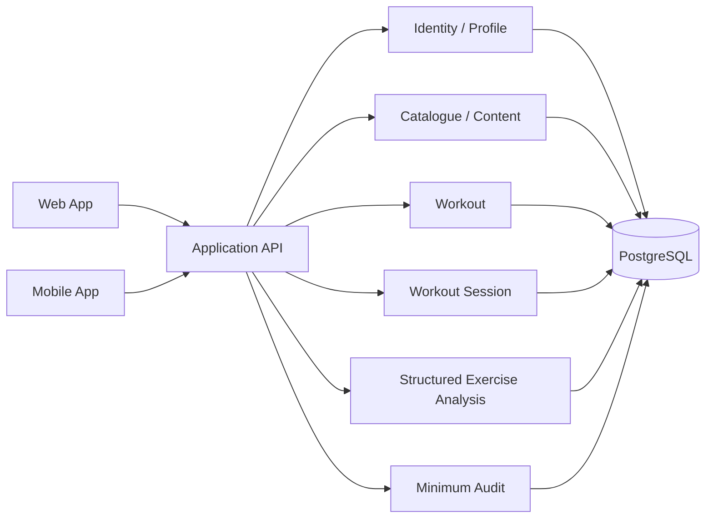

# Backend Architecture

## Purpose

This document defines the lean early-product backend architecture for `M1` only.

The backend is intentionally designed as a modular monolith. It does not introduce microservices, Redis, an event bus, CQRS, workers, or speculative modules before their milestone requires them.

## M1 Scope Only

M1 backend modules are limited to:

- Identity / Profile
- Catalogue / Content
- Workout
- Workout Session
- Structured Exercise Analysis
- Minimum operational Audit

The following are explicitly excluded from early implementation:

- AI Coach
- Subscriptions
- Notifications
- Progress
- Admin platform
- Workers unless a concrete approved job appears
- Redis
- event bus
- microservices

## Architectural Style

Directionally preferred style:

- modular monolith
- transport layer
- application/use-case layer
- domain layer
- infrastructure adapters

This keeps the codebase small while still preserving module boundaries.

## Recommended Direction

- **Backend runtime:** Node.js + TypeScript (`DECIDED`)
- **Framework direction:** plain Fastify (`PROPOSED` leading direction)
- **API style:** versioned REST JSON (`PROPOSED` pending ADR-002)
- **Database:** PostgreSQL (`DECIDED`)
- **Primary persistence direction:** Drizzle (`PROPOSED` leading direction)

## M1 API Contract Architecture

The M1 backend must treat the machine-readable API contract as a first-class architecture asset.

### Contract source of truth

Directionally prefer one committed machine-readable contract source of truth for the M1 API surface. The exact format remains part of ADR-002 implementation planning, but the architecture assumes:

- one canonical contract definition per API version
- explicit ownership by the backend/API boundary
- no hand-maintained drift between backend behavior and client expectations

### Contract ownership

Owns:

- request/response schema definitions
- common error-envelope shape
- enum/value semantics
- pagination and idempotency contract rules
- backward-compatibility governance for the published version

The contract does not own domain implementation logic or persistence models.

### Versioning

Required rules:

- published client-facing contract is versioned
- breaking wire changes require a new major API version path
- additive optional fields are the default compatible change path
- enum values must not be reused for different semantics

### Generated / typed client lifecycle

The architecture supports generated or otherwise typed clients for web/mobile from the committed contract source of truth.

Required lifecycle:

- backend contract changes are reviewed first
- client types are regenerated or revalidated from the canonical contract
- generated clients remain downstream artefacts, not independent sources of truth

### Request / response validation

The backend boundary must validate:

- request shape
- required fields
- bounded payload sizes
- known enum/value sets
- output mapping to explicit response representations

It must not serialize ORM/persistence entities directly as public responses.

### Common error-envelope governance

The backend must expose a single governed error-envelope pattern for M1 routes, including:

- stable machine-readable error code
- user-safe message
- bounded details payload where appropriate
- correlation identifier
- retryability signal where relevant

### Idempotency contract

The API contract must explicitly define idempotency behavior for:

- workout start
- workout completion
- structured analysis submission

Required rules:

- idempotency key is part of the contract for retryable creation/finalization operations
- same actor/route/key with same payload replays the same semantic outcome
- mismatched payload replay is rejected explicitly

### Backward-compatibility rules

M1 compatibility defaults:

- additive optional fields are preferred
- removal or semantic reassignment of published fields is breaking
- published clients must be able to safely ignore unknown optional fields

This is sufficient for the bounded M1 product without introducing extra API infrastructure.

## M1 Logical Architecture

## Module Boundaries

### Identity / Profile

Owns:

- internal user record
- external identity mapping
- profile preferences required by M1
- session ownership checks

Does not own:

- workout domain logic
- exercise catalogue semantics
- direct client trust for identity claims

### Catalogue / Content

Owns:

- canonical exercise entity
- taxonomy
- source references
- instructions/media metadata
- AI support status

Does not own:

- live exercise analysis
- workout execution state

### Workout

Owns:

- workout templates
- sections/exercises/sets ordering
- immutable template revisioning

Does not own:

- active session state machine
- live pose analysis facts

### Workout Session

Owns:

- immutable session snapshot
- session state transitions
- performed set persistence
- correction provenance
- idempotent completion

Does not own:

- full analysis semantics derivation from raw landmarks

### Structured Exercise Analysis

Owns:

- structured client analysis upload
- schema/range/version validation
- rep/issue summary persistence
- version provenance

Does not own:

- re-running live pose analysis on the backend
- raw video ingestion

### Minimum Audit

Owns:

- correlation and basic operational audit relevant to auth/security/content publication events that exist in M1

Does not own:

- a full V1 admin audit platform

## Dependency Rules

- transport may call application services only
- application may depend on domain and infrastructure abstractions
- domain must not import HTTP, ORM, or framework types
- infrastructure may depend on framework/database/provider SDKs
- modules may expose explicit interfaces to each other, not database table leakage as a coupling mechanism

## Transport Layer

Responsibilities:

- route handling
- auth guards
- runtime validation
- representation mapping
- correlation ID propagation
- error envelope formatting

It must not:

- contain business rules hidden in controllers
- serialize ORM objects directly as API contracts

## Application Layer

Responsibilities:

- use cases
- transaction boundaries
- idempotency handling
- ownership checks
- orchestration across repositories/providers

## Domain Layer

Responsibilities:

- entity invariants
- aggregate rules
- canonical state transitions
- stable machine identifiers and provenance policies

## Infrastructure Layer

Responsibilities:

- persistence adapters
- identity provider integration
- object storage integration when M1 media serving requires it
- external observability integration where approved

## Structured Exercise Analysis Contract

The backend accepts structured results only.

It validates:

- actor/session ownership
- schema shape
- version compatibility
- bounded numeric ranges
- idempotent analysis identifiers
- session state compatibility

It does not treat client analysis as authoritative truth. It stores provenance explicitly as client-computed analysis.

## Content / Media Boundary

The M1 logical content-delivery boundary is:

- `Content metadata → Backend / PostgreSQL`
- `Media → Object Storage`
- `Publication → Licence / approval gate`
- `Delivery → CDN / approved delivery mechanism`

The backend owns metadata, publication state, provenance, and licence/approval checks. Media binaries should remain outside PostgreSQL except for metadata references.

## Idempotency

The backend must support idempotency for:

- workout start
- workout completion
- structured analysis submission

Idempotency records are a bounded operational concern for M1 and do not require an M2 outbox.

## M1 Security / Privacy Position

The backend must never require:

- continuous raw video upload
- default landmark-stream upload
- direct trust of client entitlement or identity claims

The API boundary must treat all client input as untrusted, including client-generated analysis.

## What This Architecture Deliberately Defers

This document does not design:

- AI Coach jobs
- notification workers
- progress aggregation services
- admin application
- subscription/webhook systems
- M2 sync conflict engine

Those remain milestone-gated.
