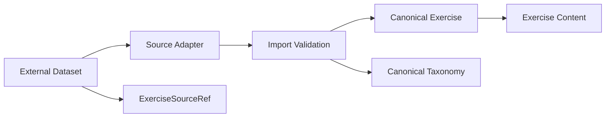
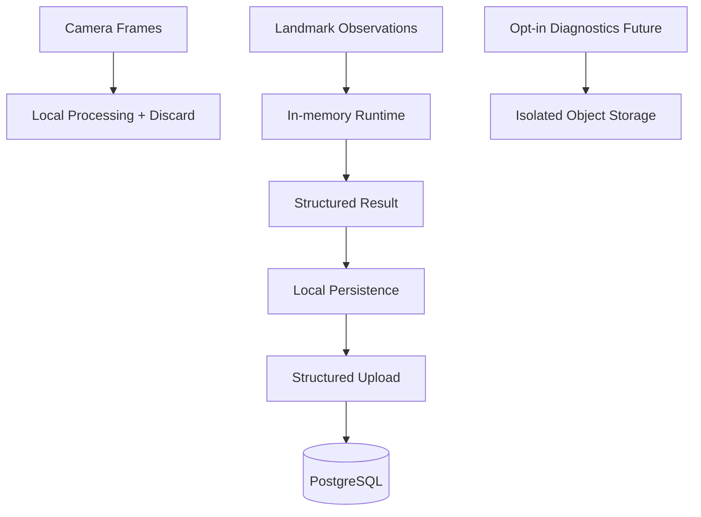

# Data Architecture

## Purpose

This document defines the persistence model across milestones.

The system of record is PostgreSQL beginning in M1. M0 uses no production database.

## Milestone Scope

### M0

- no production database
- no product schema
- local technical files/fixtures/results only as needed for replay and benchmark evidence

### M1

Core entities only:

- canonical Exercise and taxonomy
- source references and approved content metadata
- WorkoutTemplate and immutable workout snapshots
- WorkoutSession / WorkoutSet
- ExerciseAnalysis / RepAnalysis / DetectedFormIssue
- exact version provenance
- idempotent structured-result upload support

### M2

May add:

- richer local/offline sync support
- progress aggregation
- additional notification/device state
- multi-device reconciliation support

### Future

May add:

- subscriptions
- advanced admin
- deletion/export workflows
- expanded operational entities

## System of Record Rules

- PostgreSQL is the M1 system of record.
- PostgreSQL does **not** store raw camera frames.
- PostgreSQL does **not** store continuous per-frame landmark streams.
- Structured analysis is stored as bounded summaries with provenance.

## Core Entity Ownership

### Identity Ownership

Owns the minimum M1 identity/application-account records:

- `User`
- `UserIdentity`
- `UserProfile`

#### `User`

Owns:

- internal immutable application identity
- lifecycle status required for product access
- ownership root for workout/session/history data

Lifecycle:

- created after successful managed-auth mapping
- deactivated or deleted through later privacy workflows
- never replaced by provider identifiers as the domain ownership key

#### `UserIdentity`

Owns:

- external `(issuer, subject)` mapping
- provider-specific identity linkage metadata needed for auth verification

Lifecycle:

- created/updated as part of auth-provider integration
- removed according to account deletion/security policy
- remains separate from domain aggregate ownership

#### `UserProfile`

Owns:

- user preferences and basic product-profile fields needed in M1

Lifecycle:

- mutable user-owned record
- independent of identity-provider schema

### Catalogue / Content Ownership

Owns:

- `Exercise`
- canonical taxonomy entities
- `ExerciseSourceRef`
- instructions/media metadata
- AI support status and supported view metadata references
- content publication/version records required to track approved exercise guidance state

#### Content publication / version records

These records own:

- approved instruction/content revision identity
- publication state
- provenance and reviewer/approval linkage
- compatibility with historical rendering where required

Lifecycle:

- draft/review/published/retired according to content governance
- publication metadata stays separate from raw imported source values

External dataset IDs must never become primary domain IDs.

### Workout Ownership

Owns:

- `WorkoutTemplate`
- ordered template children
- immutable session snapshots

### Session Ownership

Owns:

- `WorkoutSession`
- `WorkoutExerciseSession`
- `WorkoutSet`
- session lifecycle metadata
- correction provenance

### Analysis Ownership

Owns:

- `ExerciseAnalysis`
- `RepAnalysis`
- `DetectedFormIssue`
- exact engine/profile/provider/rules/scoring provenance

## Canonical Taxonomy

Canonical vocabularies include:

- `BodyPart`
- `MuscleGroup`
- `Equipment`
- `MovementPattern`
- `Difficulty`
- `ExerciseType`

Source terminology remains provenance only. Internal terms remain canonical and stable.

## External Dataset Boundary

The external dataset is catalogue seed content only. It is not pose validation evidence.

## Content / Media Logical Boundary

The M1 logical boundary is:

- `Content metadata → Backend / PostgreSQL`
- `Media → Object Storage`
- `Publication → Licence / approval gate`
- `Delivery → CDN / approved delivery mechanism`

This establishes the boundary without selecting additional vendors.

## Immutable Snapshots

Workout history must not depend on mutable template records.

When a session starts, it captures an immutable snapshot containing at minimum:

- template identity and revision reference when applicable
- exercise identities/names as needed for history
- order and set prescriptions
- applicable profile reference where required by the session flow

Later template edits must not mutate in-flight or historical sessions.

## Structured Exercise Analysis

Structured analysis records must preserve:

- client analysis ID
- owning session/set/exercise identity
- candidate view
- counts and incomplete attempts summary
- per-rep summaries
- detected issue summaries
- selected metrics summary
- exact version provenance
- client/server timestamps as applicable

## Version Provenance

Every persisted analysis must identify exact versions for:

- client app
- pose provider
- pose model
- exercise engine
- pose profile
- ruleset
- form score when scoring is active

This is required for reproducibility and safe historical interpretation.

## Idempotency Model

M1 must support idempotent uploads for:

- workout start
- workout completion
- structured analysis submission

Data ownership rules:

- stable client-generated IDs originate on device where required
- server canonical IDs and revisions are persisted explicitly
- idempotency keys are scoped and bounded operational records

### `IdempotencyRecord` ownership

Owns:

- actor/route/key scoping
- request hash or equivalent replay-disambiguation metadata
- bounded result status/provenance needed to return or reject replays safely

Lifecycle:

- created for retryable write/finalization operations
- retained only as long as needed for safe replay handling and operational policy
- removed by bounded cleanup, not treated as business history

### Minimum `AuditLog` ownership

Owns:

- minimum operational/security audit records required in M1
- actor, action category, target reference, correlation ID, timestamp, and redacted context

Lifecycle:

- append-only operational record for the scope introduced in M1
- expanded audit breadth deferred until later admin/security milestones

## Minimum M1 Persistence Direction

### Backend access layer direction

Recommended direction: `Drizzle`.

Why:

- migration workflow stays explicit
- transactions remain close to SQL semantics
- PostgreSQL features and JSONB remain visible
- type safety is strong without large generated client surface
- query behavior remains easier to inspect than heavier abstraction layers

### Comparison summary

#### Drizzle

Best fit for early M1 because it balances:

- migration safety with explicit reviewable SQL generation paths
- transaction ergonomics
- strong PostgreSQL visibility
- manageable type safety
- lower generated-code overhead

#### Prisma

Strong alternative where team productivity outweighs added abstraction, but less preferred here because:

- generated client/model workflow is heavier
- abstraction distance from PostgreSQL is greater
- query transparency is less direct for a lean early architecture

#### Minimal SQL layer

Not preferred initially because it pushes too much migration/typing/reuse discipline into custom code for early M1.

## Mobile Local Persistence Direction

M1 mobile persistence should stay small while leaving room for M2.

Required M1 local store responsibilities:

- durable active-workout checkpoint
- completed-set persistence
- stable client-generated IDs
- structured upload retry state
- process-death recovery
- idempotent completion tracking

Recommended shape:

- relational local store with transactional updates
- explicit tables/records for active session checkpoint and completed result payloads
- no general mutation outbox yet
- fields shaped so future outbox entries can reference stable session/result IDs without rekeying

## Data Boundaries Diagram

## What Is Explicitly Not Stored in PostgreSQL

- raw video frames
- full frame-by-frame landmark streams
- uncontrolled analytics copies of camera-derived data

## Evolution Rule

M1 data architecture must keep identifiers, snapshots, provenance, and result boundaries stable enough that M2 can add richer sync or progress features without rewriting completed M1 session semantics.
