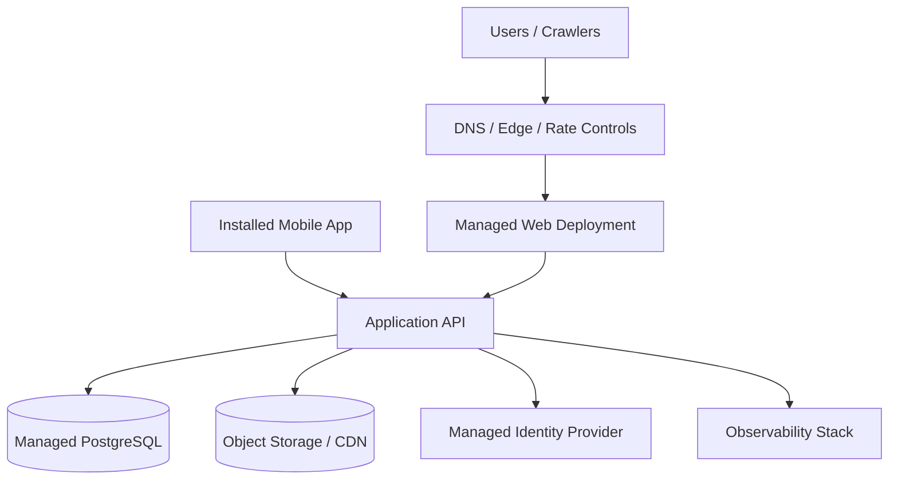

# Deployment Architecture

## Purpose

This document defines a milestone-aware deployment posture.

It intentionally avoids building M1/M2/V1 infrastructure during M0.

## Milestone Posture

### M0

No production deployment architecture is required.

M0 needs only:

- local technical shell execution
- simulator/replay execution
- benchmark/test automation as needed
- no production backend environment

### M1

Requires:

- mobile release workflow
- web deployment
- API deployment
- PostgreSQL environment
- object/media delivery as needed for approved content
- minimum observability and secret management

### M2+

May add:

- background job execution for approved use cases
- extended monitoring and beta control infrastructure

## Reference Early-Stage Topology

Status: `TBD / ADR REQUIRED` via `ADR-011`

Current reference direction only:

This is a reference model, not an approved platform selection.

## Directional Guidance

- keep the early backend as a single deployable application
- keep PostgreSQL private to the application boundary
- do not add Kubernetes
- do not add Redis
- do not add workers unless an actual M1/M2 job requires them
- keep Australian-region considerations explicit for later ADR review

## Environment Model

### Local

Purpose:

- development
- replay
- simulator
- documentation-aligned experiments

### Development

Purpose:

- shared integration once M1 begins
- synthetic/test data only

### Staging

Purpose:

- production-like validation with restricted/sanitized data

### Production

Purpose:

- live users
- real content and operational controls

## Infrastructure Rules

- infrastructure as code is required once production environments exist
- production secrets stay outside the repository
- environment configs must fail closed for security-critical gaps
- production data must not be casually copied into lower environments

## M0 Constraint

Deployment work must not become a backdoor for starting M1 implementation. The only required deployment-adjacent outputs in M0 are benchmark artifacts, local run procedures, and evidence collection paths.
