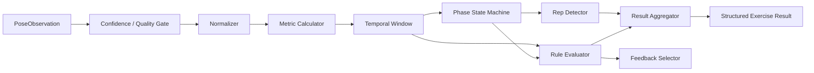
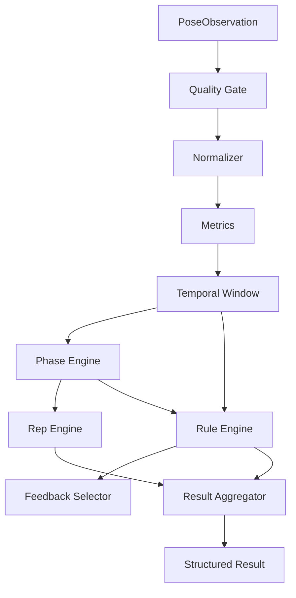

# Exercise Engine Architecture

## Purpose

The Exercise Engine converts a timestamped canonical pose observation stream into deterministic exercise semantics.

For M0, the engine is scoped to Squat only, with no more than two candidate faults.

It is intentionally built from:

- pure functions,
- small deterministic state machines,
- configuration,
- explicit versioned inputs and outputs.

It does not use plugin frameworks, workflow engines, service locators, or generic event buses.

## Pipeline

## Module Breakdown

### 1. Confidence / Quality Gate

**Input:** `PoseObservation`

**Output:** accepted or rejected observation with machine-readable quality status

Responsibilities:

- verify required evidence exists for the active profile
- reject non-finite or impossible values early
- surface tracking-loss and quality statuses
- prevent downstream phase/rep advancement on unusable observations

### 2. Normalizer

**Input:** accepted observation + active profile normalization config

**Output:** canonical normalized coordinates + quality diagnostics

Responsibilities:

- apply mirror/orientation canonicalization downstream of provider metadata
- translate to declared origin
- scale by declared body reference
- apply only profile-declared fallback strategies
- run timestamp-aware smoothing where configured

### 3. Metric Calculator

**Input:** normalized coordinates + metric definitions

**Output:** named metrics with validity, timestamp, and minimum confidence

Responsibilities:

- compute only profile-declared metrics
- return `UNAVAILABLE` for missing/degenerate geometry
- avoid NaN propagation

### 4. Temporal Window

**Input:** metric stream

**Output:** windowed and velocity-aware facts

Responsibilities:

- compute direction/change/range over time windows
- use actual elapsed time
- reject non-monotonic timestamp gaps
- provide stable facts for transitions and rules

### 5. Phase State Machine

**Input:** windowed facts + profile phase definition

**Output:** explicit phase state, transition reason, timestamp, confidence

Responsibilities:

- evaluate transitions in declared priority order
- enforce hysteresis and dwell
- reject illegal transitions
- model tracking-loss pauses according to profile policy

### 6. Rep Detector

**Input:** phase transitions + interruption policy

**Output:** completed or incomplete rep attempts

Responsibilities:

- open a rep only on the declared transition
- complete once only after the declared completion/reset transition
- preserve incomplete attempts when configured
- avoid duplicate counts from threshold chatter

### 7. Rule Evaluator

**Input:** metric facts + phase facts + profile/ruleset definition

**Output:** machine-readable deterministic issue observations

Responsibilities:

- evaluate declarative rules only
- fail closed for coaching when evidence is inadequate
- attach code, severity, confidence, phase/rep, and evidence references
- never execute arbitrary JavaScript

### 8. Feedback Selector

**Input:** rule events + current lifecycle / exercise context

**Output:** at most one primary live cue plus non-verbal state indicators

Responsibilities:

- prioritize system/tracking guidance over form judgment when evidence degrades
- respect cooldown and repetition policy
- select only actionable, phase-appropriate cues

### 9. Result Aggregator

**Input:** completed/incomplete reps + issue observations + versions

**Output:** structured local result

Responsibilities:

- assemble rep summaries
- aggregate issue counts/evidence summaries
- attach exact provider/model/engine/profile/rules versions
- support local persistence and later idempotent upload

## Determinism Rules

The engine must be deterministic for identical:

- ordered observations
- profile version
- ruleset version
- engine version
- selected runtime semantics

That determinism is essential for fixtures, replay, and cross-platform runtime comparisons.

## Metric-Kind Extensibility Rule

Introducing a new metric kind is an **Exercise Engine capability/version change**.

Required compatibility rules:

- existing metric-kind semantics must remain backward compatible for already-supported profiles
- a profile referencing an unsupported metric kind must be rejected as incompatible
- adding a metric kind does not justify a plugin framework or generic extension system

This keeps future exercise expansion explicit and versioned without over-engineering the engine.

## Runtime Ownership

The engine semantics are portable. The hot-path placement is not yet fixed.

Possible placements:

- TypeScript runtime
- TypeScript via lower-overhead transport
- native/worklet hot path with semantic event reduction
- native hot analysis with shared declarative profile

This document defines semantics, not final runtime placement.

## Structured Result Shape

The result must minimally support:

- exercise and view identity
- counts for completed/valid/incomplete/user-corrected when applicable
- per-rep summaries
- issue summaries
- structured metrics summary
- exact version provenance
- coverage/confidence where relevant

M0 does not require a production backend payload, but it does require stable local result semantics.

## Squat-Specific M0 Scope

The reusable engine is built only as far as Squat M0 needs:

- normalization
- squat metrics
- squat phase machine
- squat rep detection
- maximum two candidate faults
- deterministic local feedback

No push-up/lunge/plank/curl logic is authorized.

## Exercise Engine Diagram

## Interface Style

A practical implementation should prefer small functions and explicit state objects, for example:

- `evaluateObservation(...)`
- `normalizeObservation(...)`
- `computeMetrics(...)`
- `advancePhase(...)`
- `updateRepState(...)`
- `evaluateRules(...)`
- `selectFeedback(...)`
- `aggregateResult(...)`

The architecture intentionally avoids a generic engine with speculative extension hooks that current milestones do not need.
