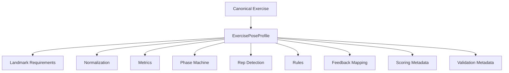

# ExercisePoseProfile Architecture

## Purpose

`ExercisePoseProfile` is the proprietary, versioned contract that makes an exercise/view analysable.

It is a project asset, not a UI file and not a model artifact. It binds:

- canonical exercise identity,
- supported camera view,
- required landmarks,
- normalization strategy,
- metric definitions,
- phase semantics,
- rep detection,
- deterministic rules,
- feedback references,
- scoring metadata,
- validation metadata,
- compatibility metadata.

If no compatible published profile exists, the exercise remains Guide-Only.

## Asset Boundary

The profile defines analysis behavior, but it does not contain:

- arbitrary executable JavaScript,
- React logic,
- provider-specific landmark semantics leaking into rule meanings,
- non-versioned mutable thresholds,
- hidden domain logic outside schema review.

## Lifecycle

The lifecycle follows the SRS:

`DRAFT → DOMAIN_REVIEW → TECHNICAL_VALIDATION → DEVICE_VALIDATION → BETA → PUBLISHED → SUSPENDED | RETIRED`

### Lifecycle meaning

- **DRAFT:** under authoring, not executable in product
- **DOMAIN_REVIEW:** exercise semantics and feedback under review
- **TECHNICAL_VALIDATION:** fixtures/replay/schema/runtime checks under review
- **DEVICE_VALIDATION:** device/benchmark/operating evidence under review
- **BETA:** limited rollout after approval
- **PUBLISHED:** approved for release according to support state
- **SUSPENDED:** remotely disabled due to safety/reliability/quality concerns
- **RETIRED:** no longer used for new analysis, kept for history and provenance

## Schema Responsibility

A profile should define the following sections.

### Identity

- `profileId`
- canonical `exerciseId`
- semantic version
- publication status
- content hash / signature metadata

### View definition

- supported camera view(s)
- orientation expectations
- validated setup guidance references
- profile-specific setup constraints

### Landmark contract

- required landmarks
- optional landmarks
- minimum confidence requirements
- tracking-loss grace policy

### Normalization

- coordinate space
- origin
- scale basis
- allowed fallback strategy
- smoothing/filter identifiers

### Metrics

- named metric IDs
- metric kind
- required points
- coordinate space
- units
- validity rules

### Phases

- explicit states
- initial state
- transition predicates
- dwell/hysteresis requirements
- transition actions

### Rep detection

- open/completion transitions
- duration bounds
- debounce policy
- interruption policy

### Rules

- referenced ruleset items
- rule compatibility and enablement metadata
- view restrictions
- evidence dependencies

### Feedback

- feedback priority model
- interval/cooldown references
- mapping to approved feedback keys

### Scoring

- scoring metadata and version references
- coverage requirements
- dimension structure

### Validation metadata

- fixture set reference
- dataset version reference
- approval identities
- evidence links / provenance fields

## Threshold Discipline

The architecture must not copy numerical examples from the SRS into production configuration.

Where a production value is not yet validated, architecture and profile examples must use:

- `<VALIDATION_REQUIRED>`

This rule applies to:

- confidence thresholds
- tracking grace periods
- metric thresholds
- dwell windows
- score weights
- cooldown intervals
- setup precision values

## Versioning

The profile must be immutable after publication.

Version increments are required when changing:

- any analysis semantics,
- any metric definition,
- phase logic,
- rep logic,
- rule references or interpretation,
- score metadata,
- compatibility ranges,
- setup/validation constraints that affect runtime interpretation.

Historical sessions must retain the original profile version reference.

## Compatibility

A published profile must declare compatibility with:

- exercise engine version range
- supported pose provider(s) and model families where relevant
- runtime manifest expectations

The client must not activate a profile unless compatibility checks pass atomically.

## Publication Model

Profile publication must require:

- schema validation
- fixture validation
- replay validation
- device evidence for the supported path
- domain review
- integrity protection
- rollout and suspension control

## Rollback

Rollback must be profile-version based.

Required rollback behavior:

- a new bad profile cannot overwrite old history
- suspension must disable new use safely
- last-known-good profile remains available when compatible
- manual/Guide-Only fallback remains available when no safe profile is active

## Feature Suspension

The architecture supports feature suspension at the profile level.

Suspension should disable:

- new Form Check starts for that exercise/view/profile combination

Suspension should not disable:

- guide/manual mode for the exercise
- historical data readability

## Relationship Diagram

## Example Schema Shape

A production schema should remain declarative and validateable, but any unresolved numeric value should remain represented as `<VALIDATION_REQUIRED>` until approved evidence exists.

## Ownership and Review

Profile changes affect movement semantics and therefore require review from:

- engineering/runtime owner
- exercise-domain reviewer
- validation owner
- product owner where user-visible semantics/copy are affected

## M0 Scope

M0 requires exactly one Squat profile candidate with one validated candidate view direction for technical evaluation only. It does not authorize a library of production-ready profiles.
