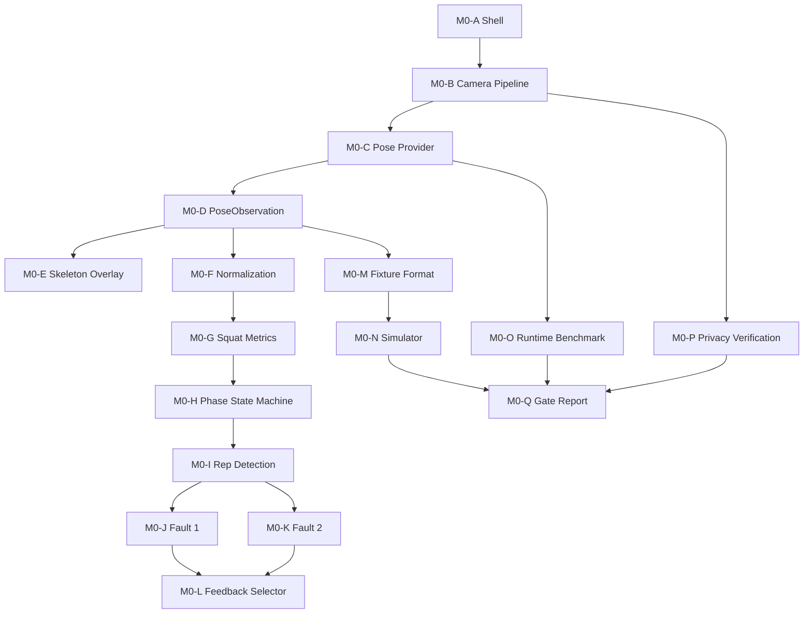

# M0 Technical Plan

## Purpose

`M0` is the technical validation milestone for **Bodyweight Squat only**.

It is not a product MVP. It does not include:

- production backend
- production auth
- website
- catalogue import
- product database
- multi-exercise AI
- AI Coach
- subscriptions
- notifications
- complete progress/history product features

## M0 Success Statement

M0 must prove this runtime path:

`Camera → Pose → PoseObservation → Skeleton → Normalization → Squat metrics → Squat phase → Rep count → maximum two candidate faults → Local feedback → Fixture replay → Simulator → Benchmark`

It must also support:

- privacy verification that raw video does not leave the device by default
- `ADR-016` benchmark evidence
- `M0-GATE-001` review package
- explicit architecture evidence artefacts under `docs/architecture/evidence/m0/`

## Implementation Order

1. technical shell and camera boundary
2. pose provider candidate
3. canonical `PoseObservation`
4. skeleton overlay
5. normalization
6. squat metrics
7. squat phase state machine
8. rep detection
9. fault candidate 1
10. fault candidate 2
11. feedback selector
12. fixture format
13. simulator and replay
14. runtime benchmark
15. privacy verification
16. M0 gate report

## M0 Runtime Diagram

## M0 Work Units

## M0-A — Technical Shell

- **Dependencies:** none
- **SRS requirements:** FR-MOB-001, FR-MOB-004, FR-MOB-005, FR-MOB-007, FR-MOB-009, FR-MOB-010, FR-AIFC-001 baseline state ownership
- **ADR dependencies:** ADR-012
- **Output:** minimal React Native technical shell with space for native camera/pose integration and lifecycle UI
- **Tests:** shell boots on target iOS/Android development path; no product backend/auth dependencies
- **Completion evidence:** run notes for the chosen development workflow and proof that native code integration path is available

## M0-B — Camera Pipeline

- **Dependencies:** M0-A
- **SRS requirements:** FR-CAMERA-001 through FR-CAMERA-009, FR-AIFC-001 through FR-AIFC-008 where camera/lifecycle relevant
- **ADR dependencies:** ADR-012, ADR-016
- **Output:** permissioned camera preview, monotonic frame metadata path, bounded latest-frame handling, recoverable interruption handling
- **Tests:** permission denial/manual fallback, backgrounding interruption, no unbounded queue growth, preview lifecycle tests
- **Completion evidence:** physical-device demo of setup/preview/permission/manual fallback

## M0-C — Pose Provider

- **Dependencies:** M0-B
- **SRS requirements:** FR-POSE-001 through FR-POSE-009
- **ADR dependencies:** ADR-005, ADR-012, ADR-016
- **Output:** native pose provider candidate integrated into the camera path with provider/model/delegate metadata and health counters
- **Tests:** provider load failure path, landmark availability, monotonic output sequencing, health-counter instrumentation
- **Completion evidence:** device run producing pose observations with exact provider metadata

## M0-D — PoseObservation

- **Dependencies:** M0-C
- **SRS requirements:** FR-POSE-002 through FR-POSE-007, FR-TRANSPORT-002, FR-VERSION-001
- **ADR dependencies:** ADR-005, ADR-016
- **Output:** canonical `PoseObservation` contract and adapter mapping from provider output
- **Tests:** canonical mapping fixtures, orientation/mirror metadata tests, provider conformance checks
- **Completion evidence:** replayable sample observation files or captured structured observations in canonical shape

## M0-E — Skeleton Overlay

- **Dependencies:** M0-D
- **SRS requirements:** FR-MOB-009, FR-GUIDE-011 technical subset, NFR-UX-008 coaching-surface clarity
- **ADR dependencies:** ADR-012, ADR-016
- **Output:** overlay visualization driven by bounded observation updates, independently hideable from analysis
- **Tests:** overlay toggle, dropped-observation tolerance, visible alignment with observation stream
- **Completion evidence:** on-device overlay demo during live pose capture

## M0-F — Normalization

- **Dependencies:** M0-D
- **SRS requirements:** FR-NORM-001 through FR-NORM-006
- **ADR dependencies:** ADR-007, ADR-016
- **Output:** declared-origin, declared-scale normalization path with quality diagnostics
- **Tests:** unit tests for translation, scale, mirror, rotation, missing joints, zero-length anchors
- **Completion evidence:** deterministic fixture outputs and reviewable normalization diagnostics

## M0-G — Squat Metrics

- **Dependencies:** M0-F
- **SRS requirements:** FR-ANGLE-001 through FR-ANGLE-004, FR-ANGLE-006
- **ADR dependencies:** ADR-007, ADR-016
- **Output:** named squat metrics required by the active profile candidate, such as knee/hip/torso and motion facts
- **Tests:** pure geometry fixtures, timestamp-based velocity checks, degenerate input handling
- **Completion evidence:** deterministic metric reports for approved squat fixtures

## M0-H — Squat Phase State Machine

- **Dependencies:** M0-G
- **SRS requirements:** FR-PHASE-001 through FR-PHASE-005
- **ADR dependencies:** ADR-007, ADR-016
- **Output:** deterministic squat state machine with legal transitions and tracking-loss handling policy
- **Tests:** complete-sequence, jitter, illegal-transition, low-confidence, tracking-loss fixtures
- **Completion evidence:** fixture traces showing stable phase transitions without chatter-driven corruption

## M0-I — Rep Detection

- **Dependencies:** M0-H
- **SRS requirements:** FR-REP-001 through FR-REP-003, FR-REP-005
- **ADR dependencies:** ADR-007, ADR-016
- **Output:** completed and incomplete rep detection built on phase transitions
- **Tests:** one-complete-rep, no-duplicate-noise, incomplete-on-loss, debounce behavior
- **Completion evidence:** deterministic replay report showing exactly one counted rep for the canonical sequence and incomplete handling for interruption cases

## M0-J — Candidate Fault 1

- **Dependencies:** M0-I
- **SRS requirements:** FR-RULE-001 through FR-RULE-004, FR-FAULT-001 through FR-FAULT-005
- **ADR dependencies:** ADR-007
- **Output:** first deterministic squat candidate fault with machine-readable evidence and confidence behavior
- **Tests:** positive, negative, boundary, low-confidence, noise fixtures
- **Completion evidence:** rule report proving the fault triggers only on approved evidence conditions

## M0-K — Candidate Fault 2

- **Dependencies:** M0-I
- **SRS requirements:** FR-RULE-001 through FR-RULE-004, FR-FAULT-001 through FR-FAULT-005
- **ADR dependencies:** ADR-007
- **Output:** second deterministic squat candidate fault with machine-readable evidence and confidence behavior
- **Tests:** positive, negative, boundary, low-confidence, noise fixtures
- **Completion evidence:** rule report proving bounded, deterministic behavior for the second candidate signal

## M0-L — Feedback Selector

- **Dependencies:** M0-J, M0-K
- **SRS requirements:** FR-FEEDBACK-001 through FR-FEEDBACK-004, FR-FEEDBACK-006, FR-FEEDBACK-007
- **ADR dependencies:** ADR-007, ADR-016
- **Output:** one-primary-cue selection path with tracking-loss and system guidance priority
- **Tests:** simultaneous-cue prioritization, tracking-loss override, cooldown fixture behavior
- **Completion evidence:** replay outputs showing no more than one primary corrective cue at a time

## M0-M — Fixture Format

- **Dependencies:** M0-D
- **SRS requirements:** NFR-TEST-001, FR-TRANSPORT-002, FR-PROFILE-001/002 technical subset
- **ADR dependencies:** ADR-007, ADR-016
- **Output:** canonical fixture format for replaying observations and expected outputs
- **Tests:** fixture schema validation, expected-output compatibility, version tagging
- **Completion evidence:** committed fixture specification and at least the minimal squat fixture set categories

## M0-N — Simulator and Replay

- **Dependencies:** M0-M, M0-H, M0-I, M0-J, M0-K, M0-L
- **SRS requirements:** NFR-TEST-001 through NFR-TEST-004 technical subset, FR-TRANSPORT-002
- **ADR dependencies:** ADR-007, ADR-016
- **Output:** headless replay path and local interactive simulator for deterministic evaluation
- **Tests:** same input same output repeatability, speed/step-through replay correctness
- **Completion evidence:** replay report from the same fixture set across repeated runs

## M0-O — Runtime Benchmark

- **Dependencies:** M0-C, M0-D, M0-N
- **SRS requirements:** FR-TRANSPORT-001 through FR-TRANSPORT-006, NFR-PERF-004 through NFR-PERF-008, M0-ENG-001 through M0-ENG-008
- **ADR dependencies:** ADR-005, ADR-012, ADR-016, ADR-014 provisional device assumptions
- **Output:** benchmark plan and measured comparison of viable runtime candidates, recorded in `docs/architecture/evidence/m0/runtime-benchmark.md`
- **Tests:** candidate benchmark runs on representative iOS/Android devices using equivalent fixtures/sequences
- **Completion evidence:** benchmark report with p50/p95 latency, FPS, drops, responsiveness, overlay smoothness, and thermal trend; no fabricated results

## M0-P — Privacy Verification

- **Dependencies:** M0-B, M0-C, M0-D
- **SRS requirements:** NFR-PRIVACY-001, NFR-PRIVACY-002, NFR-PRIVACY-004 technical subset, AC-PRIV-001
- **ADR dependencies:** ADR-006, ADR-008
- **Output:** evidence that raw video does not leave the device by default and no prohibited storage path exists in the M0 prototype, recorded in `docs/architecture/evidence/m0/privacy-verification.md`
- **Tests:** instrumented network/storage inspection during Form Check path
- **Completion evidence:** reviewable privacy verification notes proving zero raw-frame upload/storage in the default architecture

## M0-Q — M0 Gate Report

- **Dependencies:** M0-N, M0-O, M0-P
- **SRS requirements:** `M0-GATE-001`, M0-ENG-001 through M0-ENG-008
- **ADR dependencies:** ADR-005, ADR-012, ADR-016 and any accepted supporting decisions
- **Output:** final M0 evidence package and go/no-go recommendation for architecture review, assembled in `docs/architecture/evidence/m0/m0-gate-report.md`
- **Tests:** gate completeness review against the SRS checklist
- **Completion evidence:** a report showing pass/fail state for runtime, privacy, determinism, maintainability, and benchmark evidence

## Completion Rule

M0 is complete only when:

- the full squat technical path works,
- replay/simulator evidence exists,
- privacy verification passes,
- `ADR-016` runtime evidence is documented,
- `M0-GATE-001` review package is complete.

If any of those fail, the architecture is revisited before any additional AI-supported exercise begins.
