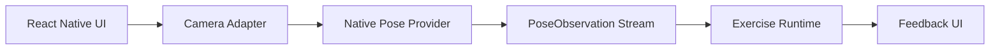
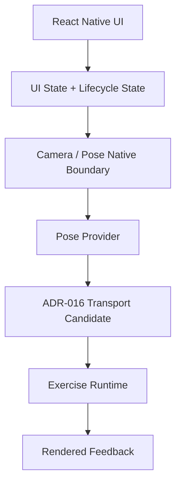

# Mobile Architecture

## Purpose

This document defines the M0 mobile runtime boundary and the M1-compatible path forward for the React Native mobile application.

The architecture preserves the required boundary:

`React Native UI → Camera Adapter → Pose Provider → PoseObservation → Exercise Runtime → Feedback UI`

It also preserves the SRS rule that React components do **not** own the high-frequency pose pipeline.

## Recommended Direction

- **React Native + TypeScript:** `DECIDED`
- **Expo Development Builds + local Expo Module:** `PROPOSED` leading direction for M0
- **Bare React Native:** fallback only if benchmark evidence shows Expo workflow materially blocks camera, provider, overlay, or transport/runtime experiments

This is not an Expo Go architecture. Expo Go is insufficient for the required native pose pipeline because M0 must permit native Swift/Kotlin code and runtime experiments.

## Logical Runtime Layers

### 1. React Native UI layer

Owns:

- screen composition
- navigation
- user controls
- lifecycle screens and guidance
- active set presentation
- feedback rendering
- manual fallback controls

Does not own:

- per-frame landmark transport
- normalization
- metrics
- phase/rep hot path

## Exercise Guidance Capability

Exercise Guidance is a first-class M1 mobile capability bridging content and execution mode.

Mobile guidance owns:

- exercise overview flow
- approved demonstration replay entry points
- ordered instructions and technique cues
- supported-view and phone-placement guidance
- transition into either `Guide Only` execution or AI Form Check setup

Guidance does not own:

- live pose inference
- phase/rep/rule logic
- profile semantics

Required flow relationship:

- `Exercise Content → Guidance → Guide Only`
- `Exercise Content → Guidance → AI Form Check → Camera Setup / Calibration / Active Set`

### 2. Camera adapter layer

Owns:

- permission orchestration
- preview surface
- lens/orientation metadata
- frame acceptance policy
- lifecycle handling
- interruption handling

Does not own:

- rep counting
- scoring
- coaching semantics

### 3. Native pose provider layer

Owns:

- model loading
- frame-to-landmark estimation
- delegate selection
- provider health counters
- machine-readable tracking quality signals

### 4. Exercise runtime layer

Owns:

- `PoseObservation` consumption
- normalization
- metric calculation
- phase transitions
- rep detection
- rule evaluation
- result aggregation
- feedback selection

### 5. Feedback UI layer

Owns:

- rendering one primary cue
- large rep/status display
- skeleton toggle
- pause/stop/manual fallback controls
- tracking-loss guidance display

## State Separation

The mobile app must maintain three separate state domains.

### UI state

Examples:

- visible screen
- overlay toggle
- pause button state
- current tab
- modal visibility

This is user-interaction state only.

### AI Form Check lifecycle state

The lifecycle state machine is separate and explicit:

- `UNAVAILABLE`
- `READY_TO_SETUP`
- `REQUESTING_PERMISSION`
- `POSITIONING`
- `CALIBRATING`
- `READY`
- `COUNTDOWN`
- `ACTIVE`
- `TRACKING_LOST`
- `PAUSED`
- `SET_COMPLETE`
- `ERROR`
- `MANUAL_FALLBACK`

This state owns camera/setup/calibration execution flow.

### Exercise phase state

Examples for Squat:

- `STANDING`
- `DESCENDING`
- `BOTTOM`
- `ASCENDING`

This state belongs to the exercise runtime only. It must never be reused as a lifecycle state.

## Native Boundary Responsibilities

### Swift / Kotlin responsibilities

- camera frame acquisition plumbing when required by selected camera path
- orientation and mirror metadata capture
- latest-frame backpressure gate
- native provider/model integration
- provider callbacks / transport to runtime candidate
- provider health counters
- raw frame disposal after use
- thermal/interruption hooks where platform APIs expose them

### TypeScript responsibilities

- screen/UI composition
- lifecycle orchestration and user-visible state
- exercise runtime semantics if the selected `ADR-016` option keeps semantics in TS
- structured result assembly for local persistence

## Camera Lifecycle

The camera lifecycle follows the SRS constraints:

1. camera permission requested only when user enters a camera feature
2. preview starts only in setup/active camera contexts
3. accepted frame gets monotonic timestamp and orientation metadata
4. superseded frames are dropped instead of queued indefinitely
5. interruption/background/thermal events pause unsafe processing
6. terminal states release frame resources and stop inference

## Model Lifecycle

The pose provider must:

- load only the selected compatible model bundle
- verify compatibility before start
- fail safely to manual mode on repeated load failure
- record provider/model/delegate in results and diagnostics
- allow provider replacement without changing `ExercisePoseProfile` semantics

## App Lifecycle / Backgrounding

- entering background pauses active camera processing
- unsafe camera work does not continue in background
- active set state is checkpointed or ended according to lifecycle rules
- resume path must be explicit; it must not invent missed reps while suspended

## Permissions

- request only when user invokes Form Check
- show purpose text before OS prompt
- denial routes to manual fallback without losing the workout set
- Guide-Only exercises must not request camera permission at all

## Skeleton Overlay

The skeleton overlay is supplementary visualization, not the source of truth.

It should:

- render at a bounded update rate
- tolerate dropped observations without freezing the whole UI
- not become the driver of phase/rep logic
- be hideable without disabling analysis

## Frame Backpressure

Backpressure is mandatory.

Required policy:

- keep latest useful frame/observation only
- drop superseded frames instead of building backlog
- no unbounded camera or observation queue
- benchmark queue depth and dropped-frame behavior in M0

## Tracking-Loss Handling

When required evidence degrades:

- remove stale corrective cues
- suspend phase/rep advancement
- show setup/reposition guidance
- require stable reacquisition before returning to `ACTIVE`
- preserve set continuity unless the user chooses manual completion/end

## Error Handling

The app must differentiate:

- unsupported capability
- permission denial/restriction
- recoverable setup failure
- model/provider load failure
- camera interruption
- thermal pressure
- runtime transport/engine failure

Only recoverable issues should loop back to retry paths. All terminal AI failures must still preserve manual fallback.

## Manual Fallback

Manual mode is a product invariant, not an exception path.

It must remain available after:

- permission denial
- unsupported device
- profile incompatibility
- repeated calibration failure
- tracking-loss frustration
- provider/runtime error

## Mobile / Native Boundary Diagram

## M0 Deliverable Focus

The mobile architecture for M0 stops at:

- technical shell
- camera preview/setup
- pose provider candidate
- overlay
- exercise runtime
- local result / benchmark outputs

It does **not** require auth, sync, production navigation, or full product screens.
