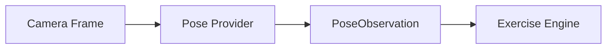
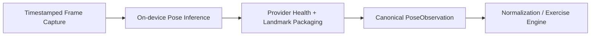

# Pose Engine Architecture

## Purpose

The Pose Engine owns only this transformation:

`camera frame → body landmark estimate`

It does **not** count reps, determine exercise phase, score form, or generate coaching sentences.

## Boundary



The Pose Engine ends at the canonical `PoseObservation` contract.

## M0 Candidate

### MediaPipe Pose Landmarker

Status: `PROPOSED`

Reason:

- official Android/iOS support
- live-stream mode
- asynchronous result callbacks
- on-device landmarking
- image and world landmark outputs
- 33-landmark body model suitable for the initial Squat profile candidate

This remains a candidate, not a fixed production dependency, until `ADR-005` evidence is accepted.

## Provider-Neutral Contract

The canonical contract starts from the SRS and is preserved here unchanged in meaning.

```ts
type PoseObservation = {
  frameId: number;
  timestampMs: number;
  imageSize: { width: number; height: number };
  rotationDegrees: 0 | 90 | 180 | 270;
  mirrored: boolean;
  people: Array<{
    trackingId?: string;
    imageLandmarks: Landmark[];
    worldLandmarks?: Landmark[];
    posePresence: number;
  }>;
  provider: {
    name: string;
    modelVersion: string;
    delegate: "CPU" | "GPU" | "NPU" | "UNKNOWN";
    inferenceMs: number;
  };
};

type Landmark = {
  name: LandmarkName;
  x: number;
  y: number;
  z?: number;
  visibility?: number;
  presence?: number;
};
```

## Provider Responsibilities

A compliant pose provider must supply:

- monotonic timestamp
- image dimensions
- rotation metadata
- mirror metadata
- canonical landmark enum mapping
- pose confidence / presence information
- provider/model/delegate identifiers
- inference timing

A provider must not supply exercise semantics as if they were pose facts.

## Canonicalization Rules

The provider adapter layer is responsible for converting provider-specific output into one canonical observation shape.

Required conversions:

- map provider landmark names into canonical internal names
- document coordinate meaning once
- apply rotation/mirror metadata consistently
- expose world coordinates only as estimated spatial data, never as clinical truth
- keep provider identity/version explicit in every observation stream

## Pose Engine Pipeline



## Quality and Tracking Signals

The provider must support downstream evaluation of:

- required landmark availability
- confidence/presence quality
- multiple-person ambiguity where detectable
- load failure
- tracking degradation
- dropped/accepted frame counts

These are health signals, not exercise judgments.

## Replacement Strategy

The architecture must allow future provider replacement by:

- ONNX Runtime Mobile
- native platform ML
- custom model

The following must remain portable across provider replacement:

- `PoseObservation` contract
- `ExercisePoseProfile` schema
- phase/rep/rule semantics
- fixture suite
- structured result schema

## Pose Engine Constraints

- inference runs off UI/JS main thread
- latest-frame policy is bounded
- raw frames remain on device and are discarded after immediate use
- provider replacement cannot silently alter analysis semantics
- provider model files must be versioned and integrity checked

## What the Pose Engine Does Not Own

The pose engine does not own:

- normalization fallback policy
- exercise metrics
- phase transitions
- rep counting
- rule evaluation
- feedback copy
- scoring

Those all belong downstream to the exercise-analysis architecture.

## ADR-016 Boundary

The provider emits canonical `PoseObservation`, but `ADR-016` still decides where the hot path after that observation runs.

Candidate options:

- **Option A:** native pose → standard RN bridge → TypeScript exercise engine
- **Option B:** native pose → JSI/equivalent → TypeScript exercise engine
- **Option C:** native/worklet hot path → semantic events → JS app
- **Option D:** native pose + native hot exercise engine + shared declarative profile

No final choice is made in this document.

## Benchmark Inputs for ADR-016

Every viable runtime candidate must be compared using equivalent:

- observation fixtures
- profile semantics
- expected phase/rep/rule outputs
- representative devices
- overlay behavior expectations

Measure at minimum:

- effective observation FPS
- p50/p95 observation-to-result latency
- JS responsiveness
- serialization overhead
- allocations / GC where observable
- overlay smoothness
- thermal trend
- maintainability and parity cost

## Pose Provider Conformance

A provider is release-eligible only if it passes:

- canonical landmark mapping tests
- timestamp/orientation metadata tests
- fixture replay conformance
- provider health signal coverage
- benchmark/reporting requirements for the active milestone

## M0 Position

For M0, the pose architecture supports exactly one user, one camera stream, one pose provider candidate, one exercise profile candidate, and local-only analysis output. Multi-person tracking, backend live inference, and browser camera inference are intentionally excluded.
