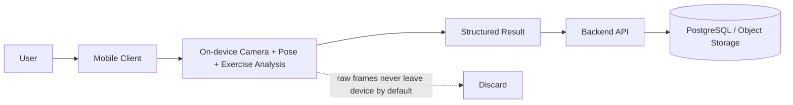
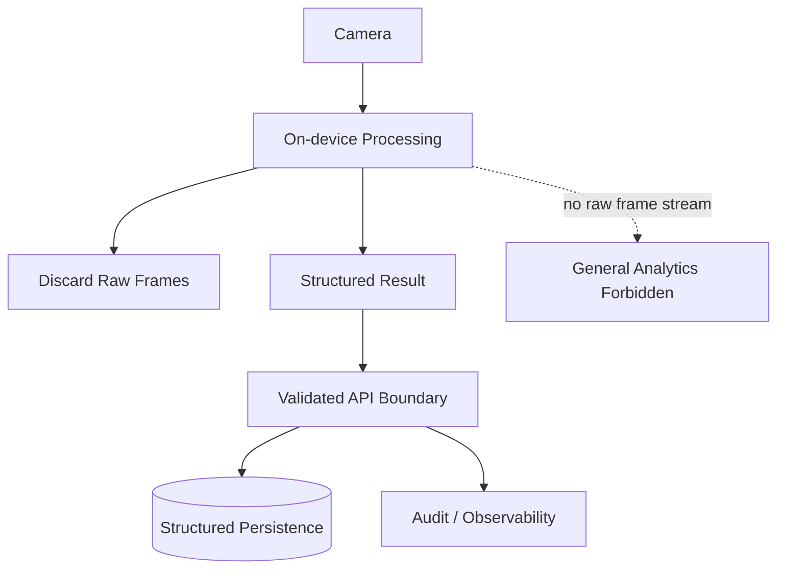

# Security and Privacy Architecture

## Architectural Invariant

The mandatory privacy invariant is:

`Camera frame → local processing → discard`

Default backend behavior receives only structured results.

There is no continuous raw-video upload and no default raw landmark-stream upload.

## Trust Boundaries

### Client boundary

The client is useful but untrusted.

Untrusted inputs include:

- client-reported analysis
- client-reported entitlements
- client-provided identifiers where not ownership-bound
- client runtime flags

### Backend boundary

The backend validates:

- identity
- ownership
- schema shape
- version compatibility
- bounded numeric ranges
- state transitions

### Publication boundary

Profile/model/content publication paths require stronger controls than ordinary user requests.

## Camera Permission

- camera access is just-in-time and purpose-specific
- Guide-Only exercises never trigger camera permission
- permission denial must preserve manual execution
- permission status is revocable and must not block non-camera product capability unnecessarily

## Local Processing

The mobile runtime must process camera frames locally for M0/M1 Form Check.

Required behaviors:

- live pose inference runs on device
- raw frames are discarded after immediate inference/render use
- pose observations stay in memory by default during the set
- terminal lifecycle states release frame resources

## Raw Camera Data Restrictions

The following are prohibited by default:

- continuous raw video upload
- PostgreSQL storage of raw frames
- analytics/logging of raw frames
- PostgreSQL storage of per-frame landmark streams
- general analytics/logging of full landmark streams

## Structured Result Upload

What may leave the device by default:

- set/session/result identifiers
- bounded structured analysis summaries
- version provenance
- issue summaries
- metric summaries
- retry state metadata

## Client Analysis Is Untrusted

The backend must treat client-computed analysis as product data with provenance, not as an unquestionable measurement.

Validation must include:

- session and set ownership
- expected version fields
- bounded numerical values
- idempotency behavior
- session-state compatibility

## Token Handling

### Mobile

- refresh credentials use OS-protected secure storage
- tokens do not live in debug persistence or generic unencrypted storage

### Web

- provider-integrated secure browser session handling should be preferred where supported
- authorization must be enforced server-side, not inferred from UI state

## Media Licensing and Content Privacy

Public product demonstrations and marketing routes must use:

- synthetic or licensed media
- approved attribution where required
- no real user camera content unless a future explicit consent and policy path exists

## Optional Future Diagnostic Data

Future diagnostic data remains optional and gated.

If ever introduced, it requires:

- separate informed opt-in
- purpose limitation
- isolated storage
- access controls and audit
- retention/deletion policy
- separate review for raw video

The current architecture does not require building this pipeline now.

## Feature Kill Switch

The architecture must support disabling AI judgement while preserving guide/manual mode.

Kill switches should be able to disable:

- a pose profile
- a ruleset
- a model/profile compatibility path
- an exercise AI support state

They should not require a full product shutdown.

## Model / Profile Integrity

The runtime must check integrity and compatibility for:

- model artifacts
- profile bundles
- ruleset bundles
- runtime compatibility ranges

Invalid or incompatible artifacts must fail safely to Guide-Only/manual mode.

## Security Controls by Milestone

### M0

Focus:

- local raw-frame privacy verification
- artifact integrity path design
- provider/runtime benchmark safety boundaries

### M1

Focus:

- auth/session security
- input validation
- ownership enforcement
- secret management
- content/media gating
- structured-result upload validation

### V1+

Focus:

- export/deletion workflows
- formal incident/recovery runbooks
- elevated admin controls and MFA
- complete production security hardening gates

## Privacy / Trust Diagram

## Non-Negotiable Rule

Security, privacy, accessibility, and correctness are not negotiable in the name of simplification. Ponytail minimalism applies to architecture size, not to weakening privacy or trust boundaries.
