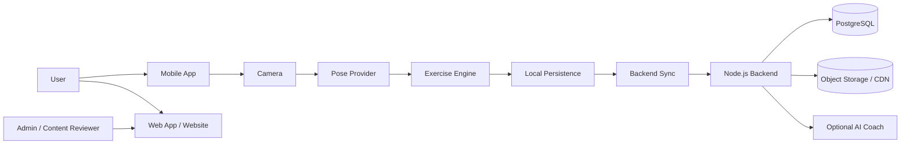
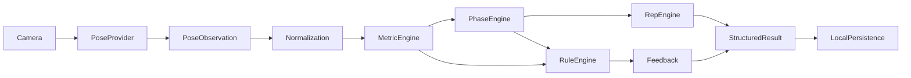

# System Overview

## Scope and Baseline

This document translates `docs/SRS.md` into an architecture baseline for `M0`, `M1`, `M2`, and `V1` without changing requirement meaning.

### Preserved SRS categories

- **DECIDED decisions:** React Native + TypeScript for mobile shell, React + TypeScript for web, Node.js + TypeScript for backend, PostgreSQL for M1 system of record, on-device live inference by default, structured-result upload only, no default raw-video upload/storage.
- **PROPOSED decisions:** Expo development builds, MediaPipe Pose Landmarker, one Next.js deployment for M1 public + authenticated web, plain Fastify or NestJS + Fastify, Drizzle or Prisma, SQLite-compatible local mobile persistence.
- **TBD / ADR REQUIRED:** `ADR-016` runtime placement, final camera integration choice, cloud deployment, final auth vendor, supported device matrix, production thresholds, retention windows, and other explicit SRS TBDs.

No unresolved value is invented in this baseline.

## Milestone Boundaries

### M0 — AI Technical Validation

M0 exists only to prove the technical viability of on-device Squat Form Check.

Included:

- React Native technical shell
- camera permission and preview
- pose provider candidate
- canonical `PoseObservation`
- skeleton overlay
- normalization
- squat metrics
- squat phase state machine
- rep counting
- maximum two candidate squat faults
- local deterministic feedback
- fixtures, replay, simulator, benchmark
- privacy verification
- `ADR-016` runtime benchmark

Excluded:

- production backend
- production auth
- product database
- website
- workout builder/history product features
- catalogue import pipeline
- AI Coach
- subscriptions
- notifications
- additional AI exercises
- robust offline sync

## M1 Adds

M1 adds:

- managed auth
- profile/basic user account
- PostgreSQL-backed backend
- canonical exercise catalogue and taxonomy
- **Exercise Guidance as a first-class product capability** for Guide-Only and Squat
- workout builder/manual execution/session checkpoint/history
- structured result upload and deterministic summary
- basic mobile app, basic web app, minimum website routes
- minimum CI/CD, monitoring, privacy/content/security controls

M1 does **not** require additional AI exercises.

### M2 — Private Beta

M2 may add:

- robust offline sync evolution
- progress trends
- notifications
- optional voice coaching
- optional structured generative summary
- additional AI exercises, one exercise/view at a time after independent validation

### V1 — Public Release

V1 adds:

- public-release privacy workflows
- export/deletion
- formal accessibility, security, observability, and recovery gates
- production support and kill-switch operations

## Cross-Milestone System Diagram

This is a long-term structure diagram, not a command to build every box during M0.

## Mandatory Boundary Model

### Guidance Relationship

Exercise Guidance is a first-class M1 capability that sits between exercise content and workout execution mode selection.

Required relationship:

- `Exercise Content → Guidance → Guide Only`
- `Exercise Content → Guidance → AI Form Check → Camera Setup / Calibration / Active Set`

Guidance therefore owns the transition from content understanding into either manual execution or camera-assisted execution, without collapsing content, pose, and analysis responsibilities into one layer.

### Boundary 1 — Exercise Content

Owns:

- exercise identity
- guidance copy
- licensed media
- taxonomy
- AI support status
- supported views

Does not own:

- landmark estimation
- rep counting
- live form rules
- AI-generated coaching

### Boundary 2 — Pose Detection

Owns:

- camera frame intake
- pose model execution
- body landmark estimation
- provider health counters

Does not own:

- phase detection
- rules
- scoring
- coaching copy

### Boundary 3 — Exercise Analysis

Owns:

- `PoseObservation` consumption
- normalization
- metrics
- phases
- rep detection
- deterministic faults
- feedback selection
- structured local result

Does not own:

- exercise catalogue content
- raw pose model operation
- LLM text generation

### Boundary 4 — AI Coach

Owns:

- optional post-workout summarization from structured facts

Does not own:

- live pose inference
- phase/rep/rule loop
- factual movement detection

## M0 Runtime View

M0 stops at local persistence and benchmark/report outputs. Backend sync and history are future for M1.

## SRS Concepts Preserved Here

This baseline explicitly preserves and routes the following SRS concepts:

- `M0`, `M1`, `M2`, `V1`
- `M0-GATE-001`
- Exercise Guidance requirements
- AI Form Check lifecycle
- `PoseObservation`
- `ExercisePoseProfile`
- pose engine boundary
- exercise engine boundary
- rule engine
- phase engine
- rep engine
- form feedback
- validation dataset workflow
- privacy constraints
- raw-camera-data restrictions
- dataset licensing constraints
- implementation-agent rules

## What Does Not Exist Yet

At the end of this architecture pass, the following are still intentionally absent:

- product application source code
- production backend modules
- production database schema
- production auth integration
- website pages
- additional exercise profiles
- AI Coach integration
- progress dashboards
- subscriptions/admin platforms
- M2 sync engine

That absence is intentional and aligns with the SRS and Ponytail/YAGNI principles.
