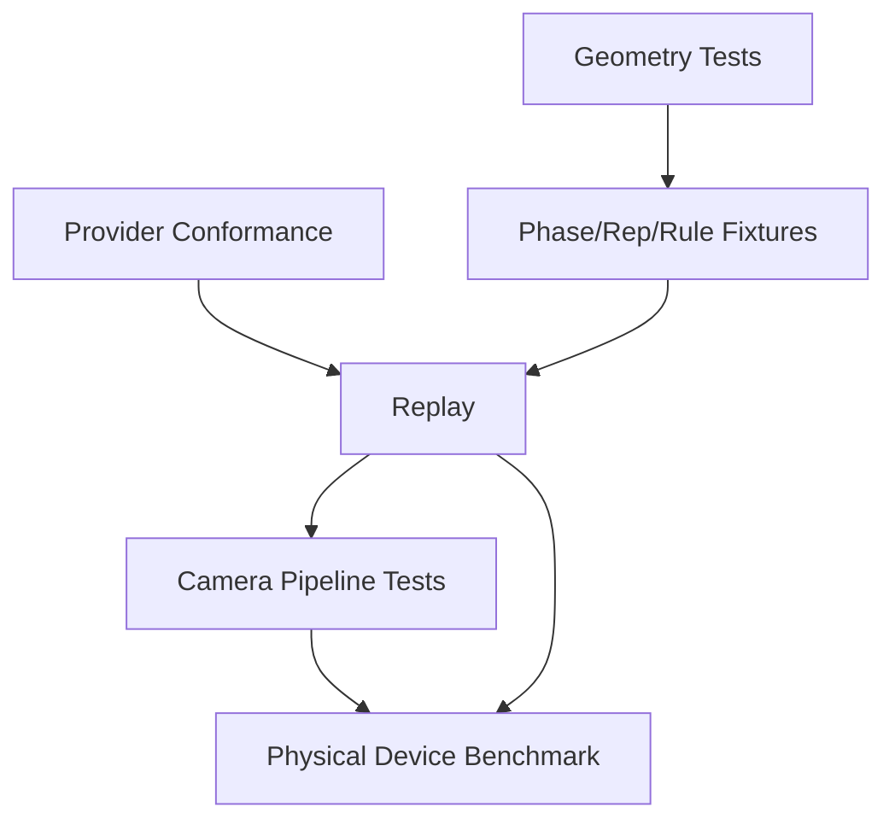

# Testing and Validation Architecture

## Purpose

This document defines the architecture of proof for the pose and exercise runtime.

It must support:

- unit tests
- fixture replay
- simulator
- recorded validation
- physical-device benchmarks

## Testing Pyramid for This Project

### M0 hierarchy

1. geometry unit tests
2. phase/rep/rule fixture tests
3. pose provider conformance
4. replay
5. camera pipeline
6. physical-device runtime benchmark

This order keeps development loops fast and deterministic while reserving expensive device work for evidence gates.

## Why Live Physical Movement Is Not Required Every Cycle

Most M0 logic is deterministic once observations are captured.

The following can be tested without standing in front of a camera each time:

- angle and geometry calculations
- normalization behavior
- phase transitions
- rep completion/incompletion
- rule boundaries
- tracking-loss behavior
- replay equivalence across runtime candidates

Live device movement remains necessary for:

- camera integration
- pose provider behavior
- latency and thermal evidence
- overlay smoothness
- real operating-envelope checks

## Evidence Layers

### 1. Geometry unit tests

Purpose:

- verify angle, distance, normalization, and velocity math
- catch mirror/orientation/scale regressions early

Typical targets:

- zero-length vectors
- missing anchors
- mirroring
- translation/scaling invariance
- timestamp-based velocity

### 2. Phase / rep / rule fixtures

Purpose:

- prove deterministic semantic behavior from canonical observation sequences

Fixture categories:

- positive
- negative
- boundary
- noisy-threshold
- low-confidence
- tracking-loss
- incomplete attempt

### 3. Pose provider conformance

Purpose:

- ensure provider output maps correctly into canonical `PoseObservation`
- ensure timestamp/orientation/landmark metadata are complete

### 4. Replay

Purpose:

- run prerecorded observation sequences through runtime candidates
- compare outputs across implementations
- support CI and benchmark reproducibility

### 5. Camera pipeline testing

Purpose:

- verify permission flow
- preview lifecycle
- interruption/background behavior
- no unbounded queue growth
- correct manual fallback handling

### 6. Physical-device benchmark

Purpose:

- measure actual observation FPS
- observation-to-result latency
- JS responsiveness
- overlay smoothness
- dropped-frame behavior
- thermal trend
- crash/recovery behavior

## Simulator Architecture

The simulator is a first-class M0 architecture component.

It should support:

- replay of landmark sequences at original speed
- faster-than-real-time replay
- step-through mode
- skeleton/metric/phase visibility
- switching runtime/profile/rules versions
- noise/dropout/mirror/scale transformations where relevant
- deterministic report export

The simulator must not require live camera use.

## Fixture Format

Fixtures should capture at minimum:

- schema version
- ordered timestamps
- canonical or provider landmarks
- confidence/presence values
- view metadata
- source classification (synthetic / consented engineering replay)
- expected phase/rep/fault outcomes

M0 should keep fixtures small and specific to Squat.

## Validation Dataset Separation

The following assets are separate:

### Exercise catalogue dataset

Purpose:

- exercise content seed
- taxonomy import
- source provenance

Not valid for:

- pose validation evidence
- rule threshold approval
- phase/rep truth

### Pose validation dataset

Purpose:

- consented recordings and/or landmark sequences
- rep labels
- phase labels
- fault labels
- observability/ambiguity labels
- reviewer decisions
- dataset versions

This dataset supports deterministic rule validation now and could support learned temporal models later.

## Validation Workflow Requirements

A valid dataset workflow must define:

- capture protocol
- labeling protocol
- adjudication process
- holdout separation
- participant/device/environment diversity tracking
- consent/access/retention metadata
- version manifests and reproducibility

M0 uses only controlled technical replay evidence. M1 Squat product claims require the governed validation workflow.

## M0 Dependency Graph

## Benchmark Evidence

Benchmark outputs should include:

- candidate runtime
- device tier / platform
- effective observation FPS
- p50/p95 latency
- dropped frames / queue depth
- JS responsiveness notes
- overlay behavior
- thermal trend
- crash/recovery observations

No benchmark result may be fabricated in architecture documentation.

## Evidence Artefacts

M0 benchmark and gate evidence must be treated as first-class deliverables under:

- `docs/architecture/evidence/m0/runtime-benchmark.md`
- `docs/architecture/evidence/m0/squat-fixture-report.md`
- `docs/architecture/evidence/m0/privacy-verification.md`
- `docs/architecture/evidence/m0/m0-gate-report.md`

Minimum ownership expectations:

- `runtime-benchmark.md` records candidate runtime comparison, device context, latency/FPS/drop/overlay/thermal evidence, and the qualitative assessment used by `ADR-016`.
- `squat-fixture-report.md` records deterministic replay, phase/rep/rule fixture outcomes, and any conformance mismatches across runtime candidates.
- `privacy-verification.md` records the proof that raw video does not leave the device by default and that prohibited storage paths are absent in the M0 prototype.
- `m0-gate-report.md` assembles the benchmark, fixture, privacy, and maintainability evidence required to evaluate `M0-GATE-001`.

These are evidence outputs, not new runtime infrastructure.

## M0 Gate Position

`M0-GATE-001` depends on:

- deterministic replay evidence
- runtime benchmark evidence
- privacy verification
- Squat technical validation for the selected runtime path
- the reviewable evidence artefacts listed above

Passing tests alone is insufficient if thermal, latency, maintainability, or privacy constraints fail.
