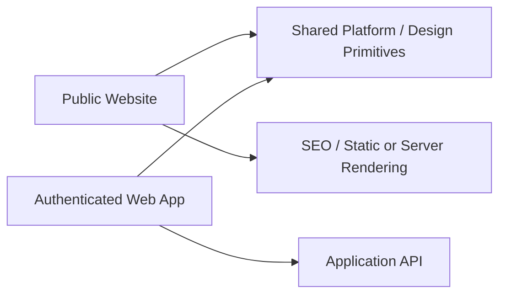
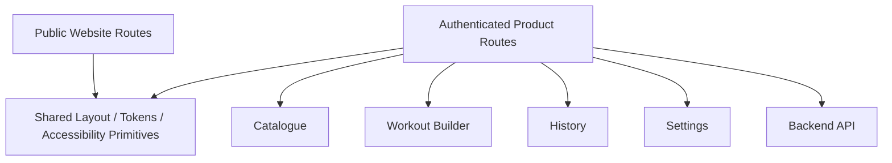

# Web Architecture

## Purpose

This document defines the M1 web architecture for:

- the public website
- the authenticated web product
- Exercise Guidance as a first-class web-visible capability for discovery and preparation

It intentionally does not architect M2 progress or AI Coach features prematurely.

## Recommended Direction

Directionally prefer:

- one `Next.js` application for M1
- strict boundary between public and authenticated surfaces
- shared design primitives only where they reduce duplication without coupling unrelated milestone scope

Split deployments are deferred unless measurable reasons emerge.

## Why One Application First

A single Next.js application is the simplest reasonable M1 path because it can support:

- crawlable public routes
- authenticated routes
- shared navigation and visual primitives
- one deployment pipeline
- one route-aware contract client layer

The architecture must still prevent public routes from shipping authenticated dashboard code in their client bundles.

## Boundary Model

## Public Surface

M1 public routes include:

- `/`
- `/features`
- `/form-check`
- `/exercises`
- `/how-it-works`
- `/download`
- `/privacy`
- `/terms`

Optional detail routes can be added only where approved content exists.

Public routes own:

- marketing copy
- product explanation
- exercise discovery pages
- privacy/terms
- app download routing

Public routes do not own:

- authenticated history
- workout builder state
- live form analysis

## Authenticated Surface

M1 authenticated boundaries include:

- sign-in / auth callback surfaces
- dashboard with one primary start/resume action
- exercise catalogue and details
- workout builder
- history
- settings/profile

Excluded from M1 web architecture:

- M2 progress trend dashboards
- browser camera Form Check unless separately promoted through ADR and validation
- AI Coach surfaces

## Route Ownership

### Public routes

Requirements:

- crawlable core content
- no auth requirement
- usable without non-essential client-side JavaScript where possible
- reduced-motion/accessibility support

### Authenticated routes

Requirements:

- use same versioned API contract as mobile
- no bypass around domain authorization
- explicit ownership and session protections

## Exercise Catalogue Boundary

The catalogue pages must distinguish:

- `AI Form Check` supported exercises
- `Guide Only` exercises

Catalogue presence must never imply AI support.

## Exercise Guidance Boundary

Exercise Guidance is a first-class M1 web capability for:

- content understanding before execution
- explanation of supported views and setup for AI-capable exercises
- preserving Guide-Only usability when AI is absent or suspended

Required relationship:

- `Exercise Content → Guidance → Guide Only`
- `Exercise Content → Guidance → AI Form Check` as a handoff to the mobile camera flow, not as browser camera execution by default

## Workout Builder Boundary

The web builder owns:

- template composition
- ordered sections/exercises/sets
- target reps/duration/rest/load/RPE/notes

It does not own:

- live camera analysis
- session pose runtime

## Web State Ownership

State should remain divided by responsibility:

- server resources
- route state
- form state
- sparse cross-route UI state

Persistent domain state must not live only in ephemeral UI stores.

## M1 Logical Diagram

## Deployment Posture

A single Next.js deployment is preferred initially, but only if:

- public performance remains acceptable
- route-level bundle separation stays clean
- security boundaries remain enforceable
- content workflows do not require isolated cadence

If those assumptions fail, ADR-001 can revisit a split.

## What This Architecture Defers

This document intentionally defers:

- separate CMS strategy
- advanced SEO/content program
- pricing/subscription flows
- M2 trends/progress architecture
- browser camera analysis

The goal is a small, reviewable M1 boundary only.
