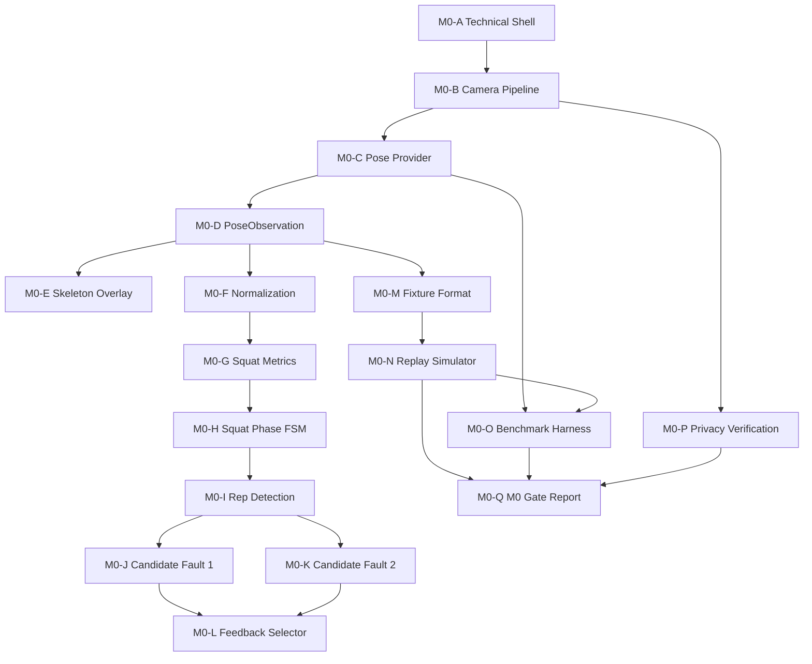

# M0 Dependencies

## High-level Dependency Graph

## Module Dependency Rules

- `M0-D PoseObservation` is the stable semantic boundary.
- `M0-F` through `M0-L` may depend on `PoseObservation`, but not on UI components.
- `M0-N` depends on fixtures and runtime semantics, not on benchmark results.
- `M0-O` depends on replay and the provider candidate.
- `M0-Q` depends on benchmark, privacy, and replay evidence.

## Runtime Dependency Rules

- Camera owns frame acquisition and backpressure.
- Pose provider owns inference only.
- Exercise runtime owns normalization, metrics, phase, rep, rules, and feedback.
- UI owns presentation only.

## Testing Dependency Rules

- geometry tests precede fixtures
- fixtures precede replay
- replay precedes benchmark comparison
- privacy verification can run alongside replay/benchmark once the camera path exists
- gate review requires all evidence inputs
